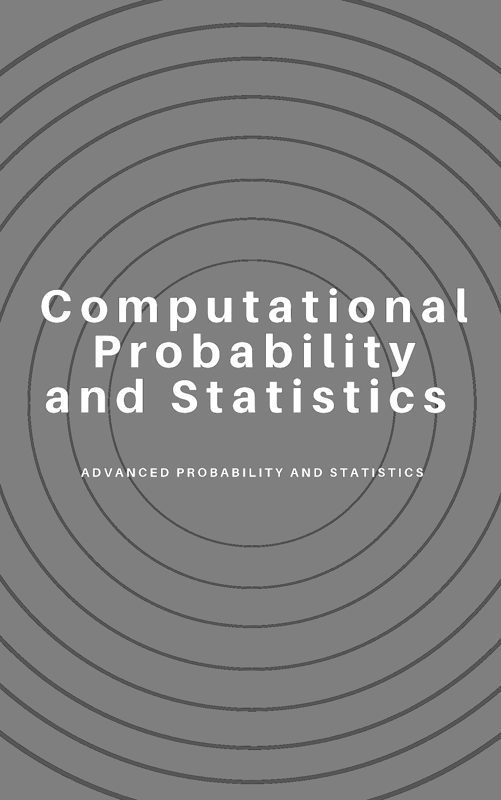

--- 
title: "Solutions for Computational Probability and Statistics"
author: 
- Ken Horton
- Kris Pruitt
- Bradley Warner
date: "`r Sys.Date()`"
header-includes:
   - \usepackage{multirow}
   - \usepackage{multicol}
site: bookdown::bookdown_site
documentclass: book
bibliography: [book.bib, packages.bib]
biblio-style: apalike
link-citations: yes
cover-image: "figures/CoverSol2.png"
description: "This is a set of solutions used for Math 377 starting in the fall of 2020."
---
```{r include=FALSE, cache=FALSE}
library(knitr)
library(kableExtra)
library(mosaic)
library(openintro)
library(ISLR)
library(tidyverse)
library(broom)
```

# Preface {-}


```{r echo=FALSE}

```
  

Contained in this volume are the solutions to homework problems in the Computational Probability and Statistics book.  


## Book Structure and How to Use It

This solution manual is setup to match the structure of the accompanying book. 

The learning outcomes for this course are to use computational and mathematical statistical/probabilistic concepts for:

a.	Developing probabilistic models 
b.	Developing statistical models for inference and description
c.	Advancing practical and theoretical analytic experience and skills


## Packages

These notes make use of the following packages in R **knitr** [@R-knitr], **rmarkdown** [@R-rmarkdown], **mosaic** [@R-mosaic], **mosaicCalc** [@R-mosaicCalc], **tidyverse** [@R-tidyverse], **ISLR** [@R-ISLR], **vcd** [@R-vcd], **ggplot2** [@R-ggplot2], **MASS** [@R-MASS], **openintro** [@R-openintro], **broom** [@R-broom], **infer** [@R-infer],  **ISLR** [@R-ISLR], **kableExtra** [@R-kableExtra], **DT** [@R-DT].


```{r echo=FALSE}
knitr::include_graphics("./figures/by-nc-sa.png")  
``` 


This book is licensed under the [Creative Commons Attribution-NonCommercial-ShareAlike 4.0 International License](http://creativecommons.org/licenses/by-nc-sa/4.0/).

```{r include=FALSE}
# automatically create a bib database for R packages
knitr::write_bib(c(
  .packages(), 'bookdown', 'knitr', 'rmarkdown','mosaic','mosaicCalc','vcd','ISLR','tidyverse','ggplot2','MASS','openintro','broom','infer','ISLR','kableExtra','DT'
), 'packages.bib')
```

## File Creation Information 

  * File creation date: `r Sys.Date()`
  * Windows version: `r win.version()`
  * `r R.version.string`


```{r warning=FALSE,message=FALSE,include=FALSE}
library(knitr)
library(kableExtra)
library(mosaic)
library(openintro)
library(ISLR)
library(tidyverse)
library(broom)
```


<!--chapter:end:index.Rmd-->

```{r include=FALSE, cache=FALSE}
library(knitr)
library(kableExtra)
library(mosaic)
library(openintro)
library(ISLR)
library(tidyverse)
library(broom)
```
# (PART) Descriptive Statistical Modeling {-} 

# Case Study {#CS1}

## Objectives

1) Use R for basic analysis and visualization.  
2) Compile a report using `knitr`.

```{r results='hide',echo=FALSE,eval=FALSE}
migraine_study <- data.frame(group =c(rep('treatment', 43), rep('control', 46)), pain_free = c(rep(c('yes', 'no'), c(10, 33)), rep(c('yes', 'no'), c(2, 44))))
```

## Homework    

Load `tidyverse`,`mosaic`, and `knitr` packages.  

```{r message=FALSE,eval=FALSE}
library(tidyverse)
library(mosaic)
library(knitr)
```

### Problem 1  

**Stent study continued** Complete a similar analysis for the stent data but this time for the one year data. In particular

  a. Read the data into your working directory.
  
```{r message=FALSE}
stent_study <-read_csv('data/stent_study.csv')
```
  


  b. Complete similar steps as in the class notes.  
    i. Use `inspect` on the data.
    ii. Create a table of `outcome365` and `group`. Comment on the results.
    iii. Create a barchart of the data.

```{r}
inspect(stent_study)
```


```{r}
tally(outcome365~group,data=stent_study,format="proportion",margins = TRUE)
```

Patients in the treatment group had a higher proportion of strokes than those in the control group after one year. The treatment does not appear to help the rate of strokes and in fact may hurt it.


```{r}
stent_study %>%
  gf_props(~group,fill=~outcome365,position='fill') %>%
  gf_labs(title="Impact of Stents of Stroke",
  subtitle='Experiment with 451 Patients',
  x="Experimental Group",
  y="Number of Events")
```

### Problem 2 

**Migraine and acupuncture**  A migraine is a particularly painful type of headache, which patients sometimes wish to treat with acupuncture. To determine whether acupuncture relieves migraine pain, researchers conducted a randomized controlled study where 89 females diagnosed with migraine headaches were randomly assigned to one of two groups: treatment or control. 43 patients in the treatment group received acupuncture that is specifically designed to treat migraines. 46 patients in the control group received placebo acupuncture (needle insertion at nonacupoint locations). 24 hours after patients received acupuncture, they were asked if they were pain free.^[G. Allais et al. [“Ear acupuncture in the treatment of migraine attacks:  a randomized trial on the efficacy of appropriate versus inappropriate acupoints”.](http://www.ncbi.nlm.nih.gov/pubmed/21533739) In: Neurological Sci. 32.1 (2011), pp. 173–175.]


The data is in the file `migraine_study.csv` in the folder `data`.

Complete the following work:

  a. Read the data an object called `migraine_study`.  
  
```{r message=FALSE}
migraine_study <- read_csv("data/migraine_study.csv")
```
  
```{r}
head(migraine_study)
```
  

  b. Create a table of the data.
  
```{r}
tally(pain_free~group,data=migraine_study,format="proportion",margin=TRUE)
```
   
  
  c. Report the percent of patients in the treatment group who were pain free 24 hours after receiving acupuncture.
  
  There are 23.2% of the treatment group pain free.
  
  d. Repeat for the control group.
  
  There are only 4.3% of the control group pain free.
  
  e. At first glance, does acupuncture appear to be an effective treatment for migraines? Explain your reasoning.
  
  Yes, a substantial increase in the percentage of patients pain free after acupuncture versus those with no acupuncture, so it appears to be effective.
  
  f. Do the data provide convincing evidence that there is a real pain reduction for those patients in the treatment group? Or do you think that the observed difference might just be due to chance?
  
  Either of these is acceptable: 
 i. We could get slightly different group estimates even if there is no real difference. Though the difference is big, I'm skeptical the results show a real difference and think this might be due to chance.  
 ii. The difference in these rates looks pretty big, and so I suspect acupuncture is having a positive impact on pain.


3. Compile, `knit`, this report into a pdf.

Complete on your computer or server.


<!--chapter:end:01-Data-Case-Study-Solutions.Rmd-->

```{r include=FALSE, cache=FALSE}
library(knitr)
library(kableExtra)
library(mosaic)
library(openintro)
library(ISLR)
library(tidyverse)
library(broom)
```
# Data Basics {#DB}

## Objectives  

1) Define and use properly in context all new terminology to include but not limited to case, observational unit, variables, data frame, associated variables, independent, and discrete and continuous variables.   
2) Identify and define the different types of variables.  
3) From reading a study, explain the research question.  
4) Create a scatterplot in `R` and determine the association of two numerical variables from the plot.

## Homework    

**Identify study components** 

Identify (i) the cases, (ii) the variables and their types, and (iii) the main research question in the studies described below.

### Problem 1  

Researchers collected data to examine the relationship between pollutants and preterm births in Southern California. During the study air pollution levels were measured by air quality monitoring stations. Specifically, levels of carbon monoxide were recorded in parts per million, nitrogen dioxide and ozone in parts per hundred million, and coarse particulate matter (PM$_{10}$) in $\mu g/m^3$. Length of gestation data were collected on 143,196 births between the years 1989 and 1993, and air pollution exposure during gestation was calculated for each birth. The analysis suggested that increased ambient PM$_{10}$ and, to a lesser degree, CO concentrations may be associated with the occurrence of preterm births.^[B. Ritz et al. [“Effect of air pollution on preterm birth among children born in Southern California
between 1989 and 1993”](http://journals.lww.com/epidem/Abstract/2000/09000/Effect_of_Air_Pollution_on_Preterm_Birth_Among.4.aspx).  In:  Epidemiology 11.5 (2000), pp. 502–511.]


i. The cases are 143,196 eligible study subjects who were born in Southern California
between 1989 and 1993.

ii. The variables are measurements of carbon monoxide (CO), nitrogen dioxide, ozone, and particulate matter less than 10$\mu m$ (PM10) collected at air-quality-monitoring stations as well as length of gestation. All of these variables are continuous numerical variables.  

iii. The research question was **Is there an association between air pollution exposure and preterm births?**  

### Problem 2 

The Buteyko method is a shallow breathing technique developed by Konstantin Buteyko, a Russian doctor, in 1952. Anecdotal evidence suggests that the Buteyko method can reduce asthma symptoms and improve quality of life. In a scientific study to determine the effectiveness of this method, researchers recruited 600 asthma patients aged 18-69 who relied on medication for asthma treatment. These patients were split into two research groups: one practiced the Buteyko method and the other did not. Patients were scored on quality of life, activity, asthma symptoms, and medication reduction on a scale from 0 to 10. On average, the participants in the Buteyko group experienced a significant reduction in asthma symptoms and an improvement in quality of life.^[J. McGowan. "Health Education: Does the Buteyko Institute Method make a difference?" In: Thorax 58 (2003).]


i. The cases are 600 adult patients aged 18-69 years diagnosed and currently treated for asthma.  
ii. The variables were whether or not the patient practiced the Buteyko method (categorical) and measures of quality of life, activity, asthma symptoms and medication reduction of the patients (categorical, ordinal). It may also be reasonable to treat the ratings on a scale of 1 to 10 as discrete numerical variables.  
iii. The research question was **Do asthmatic patients who practice the Buteyko method experience improvement in their condition?**


<!--chapter:end:02-Data-Basics-Solutions.Rmd-->

```{r include=FALSE, cache=FALSE}
library(knitr)
library(kableExtra)
library(mosaic)
library(openintro)
library(ISLR)
library(tidyverse)
library(broom)
```
# Overview of Data Collection Principles {#ODCP}

## Objectives

1) Define and use properly in context all new terminology.  
2) From a description of a research project, at a minimum be able to describe the population of interest, the generalizability of the study, the response and predictor variables, differentiate whether it is observational or experimental, and determine the type of sample. 


## Homework  

### Problem 1  

**Generalizability and causality** 
Identify the population of interest and the sample in the studies described below, these are the same studies from the prevous lesson. Also comment on whether or not the results of the study can be generalized to the population and if the findings of the study can be used to establish causal relationships.


a. Researchers collected data to examine the relationship between pollutants and preterm births in Southern California. During the study air pollution levels were measured by air quality monitoring stations. Specifically, levels of carbon monoxide were recorded in parts per million, nitrogen dioxide and ozone in parts per hundred million, and coarse particulate matter (PM$_{10}$) in $\mu g/m^3$. Length of gestation data were collected on 143,196 births between the years 1989 and 1993, and air pollution exposure during gestation was calculated for each birth. The analysis suggested that increased ambient PM$_{10}$ and, to a lesser degree, CO concentrations may be associated with the occurrence of preterm births.^[B. Ritz et al. [“Effect of air pollution on preterm birth among children born in Southern California
between 1989 and 1993”](http://journals.lww.com/epidem/Abstract/2000/09000/Effect_of_Air_Pollution_on_Preterm_Birth_Among.4.aspx).  In:  Epidemiology 11.5 (2000), pp. 502–511.]

>The population of interest is all births. The sample consists of the 143,196 births between 1989 and 1993 in Southern California. If births in this time span at the geography can be considered to be representative of all births, then the results are generalizable to the population of Southern California. However, since the study is observational the findings cannot be used to establish causal relationships.


b. The Buteyko method is a shallow breathing technique developed by Konstantin Buteyko, a Russian doctor, in 1952. Anecdotal evidence suggests that the Buteyko method can reduce asthma symptoms and improve quality of life. In a scientific study to determine the effectiveness of this method, researchers recruited 600 asthma patients aged 18-69 who relied on medication for asthma treatment. These patients were split into two research groups: one practiced the Buteyko method and the other did not. Patients were scored on quality of life, activity, asthma symptoms, and medication reduction on a scale from 0 to 10. On average, the participants in the Buteyko group experienced a significant reduction in asthma symptoms and an improvement in quality of life.^[J. McGowan. "Health Education: Does the Buteyko Institute Method make a difference?" In: Thorax 58 (2003).]

>The population is all 18-69 year olds diagnosed and currently treated for asthma. The sample is the 600 adult patients aged 18-69 years diagnosed and currently treated for asthma. Since the sample is not random (voluntary) the results cannot be generalized to the population at large. However, since the study is an experiment, the findings can
be used to establish causal relationships.

\pagebreak

### Problem 2  

**GPA and study time** 
A survey was conducted on 55 undergraduates from Duke University who took an introductory statistics course in Spring 2012. Among many other questions, this survey asked them about their GPA and the number of hours they spent studying per week. The scatterplot below displays the relationship between these two variables.

```{r echo=FALSE}
gpa %>%
  gf_point(gpa ~ studyweek,xlab = "Study hours/week",ylab="GPA",cex=1) %>%
  gf_theme(theme_classic())
```


a. What is the explanatory variable and what is the response variable?
b. Describe the relationship between the two variables. Make sure to discuss unusual observations, if any.
c. Is this an experiment or an observational study?
d. Can we conclude that studying longer hours leads to higher GPAs?

>Solutions 

a. The explanatory variable is the number of study hours per week, and the response variable is GPA.
b. There is a somewhat weak positive relationship between the two variables, though the data become more sparse as the number of study hours increases. One responded reported a GPA above 4.0, which is clearly a data error. Also, there are a few respondents who reported unusually high study hours (60 and 70 hours/week). It should also be
noted that the variability in GPA is much higher for students who study less than those who study more, also might be due to the fact that there aren't many respondents who reported studying higher hours.
c. This is an observational study.
d. Since this is an observational study, we cannot conclude that there is a causal relationship between the two variables even though there appears to be an association.  


\pagebreak

### Problem 3  

**Income and education** 

The scatterplot below shows the relationship between per capita income (in thousands of dollars) and percent of population with a bachelor's degree in 3,143 counties in the US in 2010.

```{r echo=FALSE}
plot(county_complete$per_capita_income_2017/1000 ~ county_complete$bachelors_2017, xlab="Percent with Bachelor's degree", ylab="Per capita income (in thousands)", pch=20, col=fadeColor("#3E9BC0",66), cex.lab = 1, axes = FALSE)
axis(1, at = seq(10,70,20))
axis(2)
```

a. What are the explanatory and response variables?
b. Describe the relationship between the two variables. Make sure to discuss unusual observations, if any.
c. Can we conclude that having a bachelor's degree increases one's income?  

>Solutions  

a. The explanatory variable is percent of population with a bachelor's degree and the response variable is per capita income (in thousands).
b. There is a strong positive linear relationship between the two variables. As the percentage of population with a bachelor's degree increases the per capita income increases as well. There are very few counties where more than 60% of the population have a bachelor's degree and very few countries that have a more than $50,000 in per capita income.
c. This is an observational study so we cannot make a causal statement based on the results. However, we can say that having a higher percentage of population with bachelor's degree is associated with a higher per capita income.


<!--chapter:end:03-Overview-of-Data-Collection-Principles-Solutions.Rmd-->

```{r include=FALSE, cache=FALSE}
library(knitr)
library(kableExtra)
library(mosaic)
library(openintro)
library(ISLR)
library(tidyverse)
library(broom)
```
# Studies {#STUDY}

## Objectives

1) Define and use properly in context all new terminology.  
2) Given a study description, be able to identify and explain the study using correct terms.  
3) Given a scenario, describe flaws in reasoning and propose study and sampling designs.  

## Homework  

### Problem 1  

**Propose a sampling strategy**  
A large college class has 160 students. All 160 students attend the lectures together, but the students are divided into 4 groups, each of 40 students, for lab sections administered by different teaching assistants. The professor wants to conduct a survey about how satisfied the students are with the course, and he believes that the lab section a student is in might affect the student's overall satisfaction with the course.

a. What type of study is this?  Observational study.
b. Suggest a sampling strategy for carrying out this study. Stratified sample, sample randomly within each section.

### Problem 2  

**Flawed reasoning**  
Identify the flaw in reasoning in the following scenarios. Explain what the individuals in the study should have done differently if they wanted to make such strong conclusions.

a. Students at an elementary school are given a questionnaire that they are required to return after their parents have completed it. One of the questions asked is, *Do you find that your work schedule makes it difficult for you to spend time with your kids after school?* Of the parents who replied, 85% said *no*. Based on these results, the school officials conclude that a great majority of the parents have no difficulty spending time with their kids after school. 

>Solution  
Non-responders may have a different response to this question. The parents who returned the surveys are probably those who do not have difficulty spending time with their kids after school. Parents who work might not have returned the surveys since they probably have a busier schedule.


b. A survey is conducted on a simple random sample of 1,000 women who recently gave birth, asking them about whether or not they smoked during pregnancy. A follow-up survey asking if the children have respiratory problems is conducted 3 years later, however, only 567 of these women are reached at the same address. The researcher reports that these 567 women are representative of all mothers.

> Solution  
It is unlikely that the women who were reached at the same address 3 years later are a random sample. These missing responders are probably renters (as opposed to homeowners) which means that they might be in a lower socio-economic status than the respondents.

\pagebreak

### Problem 3

**Sampling strategies**  
A Math 377 student who is curious about the relationship between the amount of time students spend on social networking sites and their performance at school decides to conduct a survey. Four research strategies for collecting data are described below. In each, name the sampling method proposed and any bias you might expect.

a. He randomly samples 40 students from the study's population, gives them the survey, asks them to fill it out and bring it back the next day.  
b. He gives out the survey only to his friends, and makes sure each one of them fills out the survey.    
c. He posts a link to an online survey on his Facebook wall and asks his friends to fill out the survey.   
d. He stands outside the QRC and asks every third person that walks out the door to fill out the survey.

>Solution  
a. Simple random sample. Non-response bias, if only those people who have strong opinions about the survey responds his sample may not be representative of the population.  
b. Convenience sample. Under coverage bias, his sample may not be representative of the population since it consists only of his friends. It is also possible that the study will have non-response bias if some choose to not bring back the survey.  
c. Convenience sample. This will have a similar issues to handing out surveys to friends.  
d. Convenience sample. Same.


\pagebreak

### Problem 4 

**Vitamin supplements** 
In order to assess the effectiveness of taking large doses of vitamin C in reducing the duration of the common cold, researchers recruited 400 healthy volunteers from staff and students at a university. A quarter of the patients were assigned a placebo, and the rest were evenly divided between 1g Vitamin C,  3g Vitamin C, or 3g Vitamin C plus additives to be taken at onset of a cold for the following two days. All tablets had identical appearance and packaging. The nurses who handed the prescribed pills to the patients knew which patient received which treatment, but the researchers assessing the patients when they were sick did not. No significant differences were observed in any measure of cold duration or severity between the four medication groups, and the placebo group had the shortest duration of symptoms.

a. Was this an experiment or an observational study? Why?  
b. What are the explanatory and response variables in this study?  
c. Were the patients blinded to their treatment?  
d. Was this study double-blind?  
e. Participants are ultimately able to choose whether or not to use the pills prescribed to them. We might expect that not all of them will adhere and take their pills. Does this introduce a confounding variable to the study? Explain your reasoning.  

>Solution  
a. Experiment, since the researchers randomly assigned different treatments to the participants.  
b. Response variable: Duration of the cold.  
Explanatory variable: Treatment, with 4 levels; placebo, 1g, 3g, 3g with additives.  
c. The patients were blinded as they did not know which treatment they received.  
d. The study was double-blind with respect to the researchers evaluating the patients, but the nurses who briely interacted with patients during the distribution of the medication were not blinded. (It was partially double-blind.)  
e. Since the patients were randomly assigned to the treatment groups and they are blinded we would expect about an equal number of patients in each group to not adhere to the treatment. While this means that final results of the study will be based on fewer number of participants, non-adherence does not introduce a confounding variable to
the study.  

### Problem 5  

**Exercise and mental health**  
A researcher is interested in the effects of exercise on mental health and she proposes the following study: Use stratified random sampling to ensure representative proportions of 18-30, 31-40 and 41-55 year olds from the population. Next, randomly assign half the subjects from each age group to exercise twice a week, and instruct the rest not to exercise. Conduct a mental health exam at the beginning and at the end of the study, and compare the results.

a. What type of study is this?  
b. What are the treatment and control groups in this study?  
c. Does this study make use of blocking? If so, what is the blocking variable?  
d. Does this study make use of blinding?  
e. Comment on whether or not the results of the study can be used to establish a causal relationship between exercise and mental health, and indicate whether or not the conclusions can be generalized to the population at large.  
f. Suppose you are given the task of determining if this proposed study should get funding. Would you have any reservations about the study proposal?

>Solution  
a. This is an experiment since we assigned subjects to the exercise program.  
b. The treatment is exercise twice a week and control is no exercise.  
c, Yes, the blocking variable is age.  
d. No, the study is not blinded since the patients will know whether or not they are exercising.  
e. Since this is an experiment, we can make a causal statement. Since the sample is random, the causal statement can be generalized to the population at large. However, we should be cautious about making a causal statement because of a possible placebo effect.  
f. It would be very difficult, if not impossible, to successfully conduct this study since randomly sampled people cannot be required to participate in a clinical trial.  


<!--chapter:end:04-Studies-Solutions.Rmd-->

```{r include=FALSE, cache=FALSE}
library(knitr)
library(kableExtra)
library(mosaic)
library(openintro)
library(ISLR)
library(tidyverse)
library(broom)
```
# Numerical Data {#NUMDATA}


## Objectives

1) Define and use properly in context all new terminology.  
2) Generate in `R` summary statistics for a numeric variable including breaking down by cases.  
3) Generate in `R` appropriate graphical summaries of numerical variables.  
4) Be able to interpret and explain output both graphically and numerically.  


## Homework  

### Problem 1  

**Mammals exploratory**  

Data were collected on 39 species of mammals distributed over 13 orders.  The data is in the `openintro` package as `mammals`

a. Using help, report the units for the variable `BrainWt`.  
```{r eval=FALSE}
?mammals
```


b. Using `inspect` how many variables are numeric?  

```{r warning=FALSE}
inspect(mammals)
```

c. What type of variable is `danger`?

Categorical

d. Create a histogram of `total_sleep` and describe the distribution.  

```{r warning=FALSE}
gf_histogram(~total_sleep,data=mammals,binwidth = 2)
```

```{r warning=FALSE}
gf_dens(~total_sleep,data=mammals)
```

The distribution is unimodal and skewed to the right. It appears it is centered around the value of 11.

e. Create a boxplot of `life_span` and describe the distribution.  

```{r warning=FALSE}
gf_boxplot(~life_span,data=mammals)
```


f. Report the mean and median life span of a mammal.  

```{r}
mean(~life_span,data=mammals,na.rm=TRUE)
```

```{r}
median(~life_span,data=mammals,na.rm=TRUE)
```

g. Calculate the summary statistics for `LifeSpan` broken down by `Danger`.

```{r}
favstats(life_span~danger,data=mammals)
```

### Problem 2  

**Mammals life spans**  

Continue using the `mammals` data set.

a. Create side-by-side boxplots for `life_span` broken down by `exposure`. Note: you will have to change `exposure` to a `factor()`. Report on any findings.  

```{r warning=FALSE}
mammals %>%
gf_boxplot(life_span~factor(exposure))
```

Mammals who are more exposed have a longer life span. There must be a confounding variable, maybe the size of the animal or the `danger` variable.


b. What happened to the median and third quartile in exposure group 4?

```{r}
favstats(life_span~factor(exposure),data=mammals)
```

The median and third quartile are equal in exposure group 4. There are a large number of the observed mammals with the same life span in this group.

c. Create faceted histograms. What are the shortcomings of this plot?

```{r warning=FALSE}
gf_histogram(~life_span,color=~factor(exposure),data=mammals)
```

This is awful.

```{r warning=FALSE}
gf_histogram(~life_span|factor(exposure),data=mammals)
```

Not enough data for each histogram; some of the histograms provide little to no information. Let's do denisty plots.

```{r warning=FALSE}
gf_dens(~life_span,color=~factor(exposure),data=mammals)
```

```{r warning=FALSE}
gf_dens(~life_span|factor(exposure),data=mammals)
```

Which do you think is the best graph?

d. Create a new variable `exposed` that is a factor with level `Low` if exposure is `1` or `2` and `High` otherwise.

```{r}
mammals <- mammals %>%
  mutate(exposed=factor(ifelse((exposure==1)|(exposure==2),"Low","High")))
```


```{r warning=FALSE}
inspect(mammals)
```


e. Repeat part c with the new variable.

```{r warning=FALSE}
gf_dens(~life_span,color=~exposed,data=mammals)
```

### Problem 3  

**Mammals life spans continued**  

a. Create a scatterplot of life span versus length of gestation.  

```{r warning=FALSE}
mammals %>%
gf_point(life_span~gestation)
```


b. What type of an association is apparent between life span and length of gestation?   

It is a weak positive association.

c. What type of an association would you expect to see if the axes of the plot were reversed, i.e. if we plotted length of gestation versus life span?  

The same as this is observational data there is no reason to beliee is a causal relationship just by looking at the data. Switching the axis will preserve the association.

d. Create the new scatterplot suggested in c.  

```{r warning=FALSE}
mammals %>%
gf_point(gestation~life_span)
```

e. Are life span and length of gestation independent? Explain your reasoning. 

No there is an association and it appears to be linear. If the plot looked like a "shotgun" blast, we would consider the variables to be independent. However, remember there may be confounding variables that could impact the association between these variables.


<!--chapter:end:05-Numerical-Data-Solutions.Rmd-->

```{r include=FALSE, cache=FALSE}
library(knitr)
library(kableExtra)
library(mosaic)
library(openintro)
library(ISLR)
library(tidyverse)
library(broom)
```
# Categorical Data {#CATDATA}


## Objectives

1) Define and use properly in context all new terminology. 
2) Generate in `R` tables for categorical variable(s).  
3) Generate in `R` appropriate graphical summaries of categorical and numerical variables.  
4) Be able to interpret and explain output both graphically and numerically.


```{r echo=FALSE,results='hide',message=FALSE}
library(vcd)
library(vcdExtra)
```


## Homework

Make sure your plots have a title and the axes are labeled.

### Problem 1 

**Views on immigration**

910 randomly sampled registered voters from Tampa, FL were asked if they thought workers who have illegally entered the US should be (i) allowed to keep their jobs and apply for US citizenship, (ii) allowed to keep their jobs as temporary guest workers but not allowed to apply for US citizenship, or (iii) lose their jobs and have to leave the country.

The data is in the `openintro` package in the `immigration` data object.

a. How many levels of *political* are there?  

```{r}
levels(immigration$political)
```

```{r warning=FALSE}
inspect(immigration)
```

There are three levels for `political` and they are conservative, liberal, and moderate.

b. Create a table using `tally`.  

```{r}
round(tally(~response+political,data=immigration,format="percent",margins = TRUE),2)
```


c. What percent of these Tampa, FL voters identify themselves as conservatives?  

From the table, 40.88% of voters identified themselves as conservatives.

d. What percent of these Tampa, FL voters are in favor of the citizenship option?  

Again, from the table 30.55% of the voters favor the citizenship option.

e. What percent of these Tampa, FL voters identify themselves as conservatives and are in favor of the citizenship option?  

From the table, 6.26% of the voters are conservative and favor the citizenship option.


f. What percent of these Tampa, FL voters who identify themselves as conservatives are also in favor of the citizenship option? What percent of moderates and liberal share this view?

We need a different table for this question.

```{r}
round(tally(response~political,data=immigration,format="percent",margins = TRUE),2)
```

Of the conservative voters, 15.32% are in favor of the citizenship option. The numbers are 57.71% for liberals and 33.06% for moderates. 


g. Create a stacked bar chart.  

```{r warning=FALSE}
immigration %>%
  gf_props(~political,fill=~response,position="fill") %>%
  gf_labs(title="Tampa Florida Voter Views on Illegal Immigrant Workers",
          subtitle="Broken down by political views",x="Political View",y="Proportion") %>%
  gf_theme(theme_bw())
```


h. Using your plot, do political ideology and views on immigration appear to be independent? Explain your reasoning.

The percentages of Tampa, FL conservatives, moderates, and liberals who are in favor of illegal immigrants working in the US staying and applying for citizenship are quite different from one another. Therefore, the two variables appear to be dependent.

\pagebreak

### Problem 2  

2. **Views on the DREAM Act** The same survey from Exercise 1 also asked respondents if they support the DREAM Act, a proposed law which would provide a path to citizenship for people brought illegally to the US as children. 

The data is in the `openintro` package in the `dream` data object.

a. Create a **mosaic** plot.  

```{r warning=FALSE}
mosaic(stance~ideology,data=dream,sub="Voter views on illegal worker status")
```


b. Based on the mosaic plot, are views on the DREAM Act and political ideology independent?  


The vertical locations at which the ideological groups break into the Yes, No, and Not Sure categories differ, which indicates the variables are dependent.

\pagebreak

### Problem 3  

3. **Heart transplants**

The Stanford University Heart Transplant Study was conducted to determine whether an experimental heart transplant program increased lifespan. Each patient entering the program was designated an official heart transplant candidate, meaning that he was gravely ill and would most likely benefit from a new heart. Some patients got a transplant and some did not. The variable *transplant* indicates which group the patients were in; patients in the treatment group got a transplant and those in the control group did not. Another variable called *survived* was used to indicate whether or not the patient was alive at the end of the study.  

The data is in the `openintro` package and is called `heart_transplant`.


a. Create a **mosaic** plot.

```{r warning=FALSE}
mosaic(survived~transplant,data=heart_transplant)
```


b. Based on the mosaic plot, is survival independent of whether or not the patient got a transplant? Explain your reasoning.  

Proportion of patients who are alive at the end of the study is higher in the treatment group than in the control group. These data suggest that survival is not independent of whether or not the patient got a transplant.

c. Using *survtime* create side-by-side boxplots for the control and treatment groups.

```{r warning=FALSE}
heart_transplant %>%
  gf_boxplot(survtime~transplant) %>%
  gf_labs(title="Survival times for tranplant experiment",
          sub="Treatment group had the transplant",x="Tranplant",y="Survival time in days") %>%
  gf_theme(theme_classic())
```


d. What do the box plots suggest about the efficacy (effectiveness) of transplants?

The shape of the distribution of survival times in both groups is right skewed with one very clear outlier for the control group and other possible outliers in both groups on the high end. The median survival time for the control group is much lower than the median survival time for the treatment group; patients who got a transplant typically lived longer. Tying this together with the much lower variability in the control group, evident by a much smaller IQR than the treatment group (about 50 days versus 500 days), and we can see that patients who did not get a heart transplant tended to consistently die quite early relative to those who did have a transplant. Overall, very few patients without transplants made it beyond a year while nearly half of the transplant patients survived at least one year. It should also be noted that while the first and third quartiles of the treatment group is higher than those for the control group, the IQR for the treatment group is much bigger, indicating that there is more variability in survival times in the treatment group.


<!--chapter:end:06-Categorical-Data-Solutions.Rmd-->

```{r include=FALSE, cache=FALSE}
library(knitr)
library(kableExtra)
library(mosaic)
library(openintro)
library(ISLR)
library(tidyverse)
library(broom)
```
# (PART) Probability Modeling {-} 

# Case Study {#CS2}


## Objectives

1) Use R to simulate a probabilistic model.  
2) Use basic counting methods.


```{r echo=FALSE}
days <- seq(1,365)
```

## Homework

### Problem 1  

**Exactly 2 people with the same birthday - Simulation**  
Complete a similar analysis for case where exactly 2 people in a room of 23 people have the same birthday. In this exercise you will use a computational simulation.

a. Create a new R Markdown file and create a report. Yes, we know you could use this file but we want you to practice generating your own report.

b. Simulate having 23 people in the class with each day of the year equally likely. Find the cases where exactly 2 people have the same birthday, you will have to alter the code from the Notes more than changing 18 to 23.

c. Plot the frequency of occurrences as a bar chart.
  
d. Estimate the probability of exactly two people having the same birthday.


```{r}
(do(10000)*length(unique(sample(days,size=23,replace = TRUE)))) %>%
  mutate(match=if_else(length==22,1,0)) %>%
  summarise(prob=mean(match))
```


```{r}
(do(1000)*length(unique(sample(days,size=23,replace = TRUE)))) %>%
  gf_bar(~length)
```

### Problem 2  

**Exactly 2 people with the same birthday - Mathematical**   
Repeat problem 1 but do it mathematically. As a big hint, you will need to use the `choose()` function. The idea is that with 23 people we need to choose 2 of them to match. We thus need to multiply, the multiplication rule again, by `choose(23,2)`. If you are having trouble, work with a total of 3 people in the room first.

a. Find a formula to determine the exact probability of exactly 2 people in a room of 23 having the same birthday.

b. Generalize your solution to any number `n` people in the room and create a function. 
  
c. Vectorize the function.

d. Plot the probability of exactly 2 people having the same birthday versus number of people in the room.
  
e. Comment on the shape of the curve and explain it.
  
f. `knit` and compile your report.

For two people we have

```{r}
choose(23,2)*prod(365:344)/365^23
```

```{r}
exactly_two <- function(n){
  choose(n,2)*prod(365:(365-(n-2)))/365^n
}
```

```{r}
exactly_two(23)
```

```{r}
exactly_two <- Vectorize(exactly_two)
```

```{r warning=FALSE}
gf_line(exactly_two(1:100)~ seq(1,100),
        xlab="Number of People",
        ylab="Probability of Match",
        title="Probability of exactly least 2 people with matching birthdays")
```


By the way, exactly three matches in simulation is hard. We have to table the data 

```{r}
set.seed(10)
temp <- table(sample(days,size=23,replace = TRUE))
temp
```

```{r}
(sum(temp==2) == 2)+0
```


```{r}
(do(10000)*((sum(table(sample(days,size=23,replace = TRUE)) == 3)==1)+0)) %>%
  summarise(prob=mean(result))
```

Two sets that have same but different birthday

```{r}
(do(10000)*((sum(table(sample(days,size=23,replace = TRUE)) == 2)==2)+0)) %>%
  summarise(prob=mean(result))
```

```{r}
(do(10000)*length(unique(sample(days,size=23,replace = TRUE)))) %>%
  mutate(match=if_else(length==21,1,0)) %>%
  summarise(prob=mean(match))
```

Mathematically exactly 3 is easy. Simulation seems to be off a little or the math formula is off.


```{r}
choose(23,3)*prod(365:345)/365^23
```


<!--chapter:end:07-Probability-Case-Study-Solution.Rmd-->

```{r include=FALSE, cache=FALSE}
library(knitr)
library(kableExtra)
library(mosaic)
library(openintro)
library(ISLR)
library(tidyverse)
library(broom)
```
# Probability Rules {#PROBRULES}

\newcommand{\E}{\mbox{E}}
\newcommand{\Var}{\mbox{Var}}
\newcommand{\Cov}{\mbox{Cov}}
\newcommand{\Prob}{\mbox{P}}
\newcommand*\diff{\mathop{}\!\mathrm{d}}


## Objectives

1) Define and use properly in context all new terminology related to probability to include but not limited to: outcome, event, sample space, probability.  
2) Apply basic probability and counting rules to find probabilities.  
3) Describe the basic axioms of probability.  
4) Use `R` to calculate and simulate probabilities of events.    

## Homework  

### Problem 1

Let $A$, $B$ and $C$ be events such that $\Prob(A)=0.5$, $\Prob(B)=0.3$, and $\Prob(C)=0.4$. Also, we know that $\Prob(A \cap B)=0.2$, $\Prob(B \cap C)=0.12$, $\Prob(A \cap C)=0.1$, and $\Prob(A \cap B \cap C)=0.05$. Find the following: 

  a. $\Prob(A\cup B)$
$$
\Prob(A\cup B) = \Prob(A)+\Prob(B)-\Prob(A\cap B)= 0.5+0.3-0.2 = 0.6
$$

  b. $\Prob(A\cup B \cup C)$
$$
\Prob(A\cup B \cup C) = \Prob(A)+\Prob(B)+\Prob(C)-\Prob(A\cap B)-\Prob(A\cap C)-\Prob(B\cap C)+\Prob(A\cap B \cap C)
$$
$$
= 0.5+0.3+0.4-0.2-0.12-0.1+0.05 = 0.83
$$

  c. $\Prob(B'\cap C')$
$$
\Prob(B'\cap C')=\Prob((B\cup C)') = 1-\Prob(B\cup C) = 1-[\Prob(B)+\Prob(C)-\Prob(B\cap C)]
$$
$$
= 1-(0.3+0.4-0.12) = 0.42
$$

  d. $\Prob(A\cup (B\cap C))$
$$
\Prob(A\cup (B\cap C)) = \Prob(A)+\Prob(B\cap C) -\Prob(A\cap B \cap C) = 0.5+0.12-0.05 = 0.57
$$

  e. $\Prob((A\cup B \cup C)\cap (A\cap B \cap C)')$
$$
\Prob((A\cup B \cup C)\cap (A\cap B \cap C)')=\Prob(A\cup B \cup C)-\Prob(A\cap B \cap C) = 0.83-0.05 = 0.78
$$

### Problem 2  

Consider the example of the family in the reading. What is the probability that the family has at least one boy?  
$$
\Prob(\mbox{at least one boy})=1-\Prob(\mbox{no boys})=1-\Prob(\mbox{GGG})=1-\frac{1}{8} = 0.875
$$

### Problem 3  

The Birthday Problem Revisited. 

a. Suppose there are $n=20$ students in a classroom. My birthday, the instructor, is April 3rd. What is the probability that at least one student shares my birthday? Assume only 365 days in a year and assume that all birthdays are equally likely.  

$$
\Prob(\mbox{at least one other person shares my bday})=1-\Prob(\mbox{no one else has my bday}) = 
$$

$$
1-\left( \frac{364}{365}\right)^{20} = 0.0534
$$


b. In `R`, find the probability that at least one other person shares my birthday for each value of $n$ from 1 to 80. Plot these probabilities with $n$ on the $x$-axis and probability on the $y$-axis. At what value of $n$ would the probability be at least 50%? 
 

Generalizing,
$$
\Prob(\mbox{at least one other person shares my bday})=1-\Prob(\mbox{no one else has my bday}) = 1-\left( \frac{364}{365}\right)^{n}
$$
```{r}
n<-1:300
mybday<-function(x) 1-(364/365)^x
mybday <- Vectorize(mybday)
```  

Check our function.

```{r}
mybday(20)
```


```{r}
gf_line(mybday(n)~ n,
        xlab="Number of People",
        ylab="Probability of Match",
        title="Probability of at least 1 person matching my birthday") %>%
  gf_theme(theme_bw)
```

```{r}
prob <- mybday(n)
which(prob>= .5)
```
So 253 people.

### Problem 4

Thinking of the cards again. Answer the following questions:

a. Define two events that are mutually exclusive.  

The first card drawn is red.  
The first card drawn is black.  

b. Define two events that are independent.  

The first card drawn is black.  
The first card drawn is a face card.  

c. Define an event and its complement.  

The first card drawn is less than 5.  
The first card drawn is equal to or more than 5. 

### Problem 5

Consider the license plate example from the reading.

a. What is the probability that a license plate contains **exactly** one "B"?  

```{r}
#fourth spot
num4<-10*10*10*1*25*25

#fifth spot
num5<-10*10*10*25*1*25

#sixth spot
num6<-10*10*10*25*25*1

denom<-10*10*10*26*26*26

(num4+num5+num6)/denom
```


b. What is the probability that a license plate contains **at least one** "B"?

$$
1-\Prob(\mbox{no B's})
$$
```{r}
num0<-10*10*10*25*25*25
1-num0/denom
```

### Problem 6

Consider the party example in the reading. 

a. Suppose 8 people showed up to the party dressed as zombies. What is the probability that all three awards are won by people dressed as zombies? 
$$
\frac{8\cdot 7 \cdot 6}{25\cdot 24 \cdot 23}
$$

```{r}
(8*7*6)/(25*24*23)
```

b. What is the probability that zombies win "most creative" and "funniest" but not "scariest"? 
$$
\frac{8 \cdot 17 \cdot 7}{25 \cdot 24 \cdot 23}
$$

```{r}
(8*17*7)/(25*24*23)
```

### Problem 7

Consider the cards example from the reading.   

a. How many ways can we obtain a "two pairs" (2 of one number, 2 of another, and the final different)? 

We have to pick the rank of the two pairs.

$$\binom{13}{2}$$
Notice here the order does matter because a pair of Kings and 4s is the same as a pair of 4s and Kings. This is different from the full house example. Make sure you understand this point.

Now we have to pick two of the fours cards for each rank


$$\binom{4}{2}\binom{4}{2}$$

And finally we need the last card to come from the 44 remaining cards so that we don't get a full house.

$\binom{44}{1}$

Putting it all together:

$\binom{13}{2}\binom{4}{2}\binom{4}{2}\binom{44}{1}$


```{r}
choose(13,2)*choose(4,2)*choose(4,2)*choose(44,1)
```


b.  What is the probability of drawing a "four of a kind" (four cards of the same value)? 

$$
\Prob(\mbox{4 of a kind})=\frac{\binom{13}{1}\binom{4}{4}\binom{48}{1}}{\binom{52}{5}}
$$

```{r}
(13*1*48)/choose(52,5)
```

### Problem 8

Advanced Question: Consider rolling 5 dice. What is the **probability** of a pour resulting in a full house?

First pick the value for the three of a kind, there are 6. Then pick the value from the remaining 5 for the two of a kind. This is actually a permutation. There are 30 distinct "flavors" of full house (three 1's & two 2's, three 1's & two 3's, etc.). In the reading we did this as 
$$
\binom{6}{1} \times \binom{5}{1}
$$
We now have the 5 dice. We have to select three to have the same value and the order doesn't matter since they are the same value. Thus we multiple by $\binom{5}{3}$. Divide this by the total distinct ways the dice could have landed (assuming order matters). 
$$
\Prob(\mbox{full house}) = \frac{30 \times \frac{5!}{3!2!}}{6^5}
$$
$$
\Prob(\mbox{full house}) = \frac{\binom{6}{1} \times \binom{5}{1} \times \binom{5}{3}}{6^5}
$$


```{r}
30*10/(6^5)
```

Simulating is tough so let's write some code that may help.


```{r}
set.seed(23)
temp<-table(sample(1:6,size=5,replace=TRUE))
temp
```
```{r}
sum(temp==2) & sum(temp==3)
```
```{r}
temp<-c(1,1,1,2,2)
temp<-table(temp)
temp
```

```{r}
sum(temp==2) & sum(temp==3)
```

Let's write a function.

```{r}
full_house <-function(x){
  temp<-table(x)
  sum(temp==2) & sum(temp==3)
}
```


```{r}
temp<-c(1,1,1,2,2)
full_house(temp)
```

```{r}
set.seed(751)
results<-do(10000)*full_house(sample(1:6,size=5,replace=TRUE))
mean(~full_house,data=results)
```


<!--chapter:end:08-Probability-Rules-Solutions.Rmd-->

```{r include=FALSE, cache=FALSE}
library(knitr)
library(kableExtra)
library(mosaic)
library(openintro)
library(ISLR)
library(tidyverse)
library(broom)
```
# Conditional Probability {#CONDPROB}

\newcommand{\E}{\mbox{E}}
\newcommand{\Var}{\mbox{Var}}
\newcommand{\Cov}{\mbox{Cov}}
\newcommand{\Prob}{\mbox{P}}
\newcommand*\diff{\mathop{}\!\mathrm{d}}

## Objectives

1) Define conditional probability and distinguish it from joint probability.  
2) Find a conditional probability using its definition.   
3) Using conditional probability, determine whether two events are independent.   
4) Apply Bayes' Rule mathematically and via simulation. 


## Homework  

### Problem 1  

Consider Exercise 1 from Lesson 2. Recall: $A$, $B$ and $C$ are events such that $\Prob(A)=0.5$, $\Prob(B)=0.3$, $\Prob(C)=0.4$, $\Prob(A \cap B)=0.2$, $\Prob(B \cap C)=0.12$, $\Prob(A \cap C)=0.1$, and $\Prob(A \cap B \cap C)=0.05$.

a. Are $A$ and $B$ independent?  

No. $\Prob(A)\Prob(B)=0.15\neq \Prob(A\cap B)$. 

b. Are $B$ and $C$ independent? 

Yes. $\Prob(B)\Prob(C)=0.12 = \Prob(B\cap C)$. Also, 
$$
\Prob(B|C)=\frac{\Prob(B\cap C)}{\Prob(C)}= 0.12/0.4 = 0.3 =\Prob(B)
$$

### Problem 2  

Suppose I have a biased coin (the probability I flip a heads is 0.6). I flip that coin twice. Assume that the coin is memoryless (flips are independent of one another). 

a. What is the probability that the second flip results in heads? 

0.6

b. What is the probability that the second flip results in heads, given the first also resulted in heads? 

The coin is memoryless. So,
$$
\Prob(\mbox{2nd flip heads}|\mbox{1st flip heads}) = 0.6
$$

c. What is the probability both flips result in heads? 

Since the flips are independent, 
$$
\Prob(\mbox{both heads})=\Prob(\mbox{1st flip heads})\Prob(\mbox{2nd flip heads}) = 0.6*0.6=0.36
$$

d. What is the probability exactly one coin flip results in heads? 

This could happen in two ways. The first could be heads OR the second could be heads. 
$$
\Prob(\mbox{exactly one heads})=\Prob(\mbox{1st flip heads})\Prob(\mbox{2nd flip tails}) + \Prob(\mbox{1st flip tails})\Prob(\mbox{2nd flip heads})
$$
$$
0.6*0.4+0.4*0.6 = 0.48
$$

e. Now assume I flip the coin five times. What is the probability the result is 5 heads? 
$$
\Prob(\mbox{5 heads})= 0.6^5 = 0.0778
$$

```{r lesson4App1}
0.6^5
```

f. What is the probability the result is exactly 2 heads (out of 5 flips)? 

There are $\binom{5}{2} = 10$ ways for this to happen (\{HHTTT\},\{HTHTT\},...). So,
$$
\Prob(\mbox{2 heads out of 5 flips})=\binom{5}{2} 0.6^2(1-0.6)^3 = 0.2304
$$

```{r lesson4App2}
choose(5,2)*0.6^2*0.4^3
```

### Problem 3  

(Adapted from IPSUR, [@ipsur]). Suppose there are three assistants working at a company: Moe, Larry and Curly. All three assist with a filing process. Only one filing assistant is needed at a time. Moe assists 60% of the time, Larry assists 30% of the time and Curly assists the remaining 10% of the time. Occasionally, they make errors (misfiles); Moe has a misfile rate of 0.01, Larry has a misfile rate of 0.025, and Curly has a rate of 0.05. Suppose a misfile was discovered, but it is unknown who was on schedule when it occurred. Who is most likely to have committed the misfile? Calculate the probabilities for each of the three assistants. 

Let $E$ be the event a misfile was committed. Also, let $M$, $L$, and $C$ denote the events that Moe, Larry and Curly was the assistant at the time, respectively. 

$$
\Prob(E)=\Prob(E \cap M)+\Prob(E \cap L)+\Prob(E\cap C) 
$$
$$
= \Prob(E|M)\Prob(M)+\Prob(E|L)\Prob(L)+\Prob(E|C)\Prob(C) = 0.01*0.6+0.025*0.3+0.05*0.1 = 0.0185
$$

Thus,
$$
\Prob(M|E)=\frac{\Prob(E \cap M)}{\Prob(E)}= \frac{0.01*0.6}{0.0185}=0.3243
$$

Similarly, $\Prob(L|E)=0.4054$ and $\Prob(C|E)=0.2702$. 

Larry is the assistant most likely to have committed the error. 

### Problem 4

You are playing a game where there are two coins. One coin is fair and the other comes up *heads* 80% of the time. One coin is flipped 3 times and the result is three *heads*, what is the probability that the coin flipped is the fair coin? You will need to make an assumption about the probability of either coin being selected.

a. Use Bayes formula to solve this problem.

I will assume either coin is selected with a 50% probability.

$$
\Prob(Fair) = \Prob(Biased) = .5
$$
$$
\Prob(3 Heads|Fair)=\frac{1}{2}^3=\frac{1}{8}
$$
$$
\Prob(3 Heads|Biased)=.8^3=0.512
$$

Now

$$
\Prob(Fair | 3 Heads) = \frac{\Prob(3 Heads | Fair)\Prob(Fair)}{\Prob(3 Heads | Fair)\Prob(Fair)+\Prob(3 Heads| Biased)\Prob(Biased)}
$$

Which is 

$$
\Prob(Fair | 3 Heads) =  \frac{\frac{1}{8}\frac{1}{2}}{\frac{1}{8}\frac{1}{2}+.8^{3}\frac{1}{2}} = 0.196
$$
```{r}
.125*.5/(.125*.5+.8^3*.5)
```


b. Use simulation to solve this problem.

Let's use the same assumptions. We could do this problem in two ways. We could flip each coin a fixed number of times and combine the information or use a random process to pick a flipped coin and then flip it three times. Let's do the first.

Let's flip a fair coin 50,000 times and count how many heads we get.

```{r cache=TRUE}
set.seed(1154)
data.frame(do(50000)*rflip(3)) %>%
  filter(heads==3) %>%
  summarise(count=n()) %>%
  pull()
```

Now flip the biased coin.

```{r cache=TRUE}
data.frame(do(50000)*rflip(3,prob=0.8)) %>%
  filter(heads==3) %>%
  summarise(count=n()) %>%
  pull()
```

So we have a total 6157 + 25743 heads of which 6157 came from the fair coin.

Thus the probability of the coin being fair given 3 heads on the flips is:

```{r}
6157/(6157 + 25743)
```

Or 19.3%.


Next pick a one of the coins with equal probability 100,000 times.

```{r}
set.seed(501)
results <- rflip(100000,summarize = TRUE)
results
```

Now the fair coin was flipped 50226 times.

Let's see how many times we get 3 heads when we flip that coin 3 times.
```{r cache=TRUE}
data.frame(do(50226)*rflip(3)) %>%
  filter(heads==3) %>%
  summarise(count=n()) %>%
  pull()
```

We have 6270 cases with 3 heads. Now for the biased coin.

```{r cache=TRUE}
data.frame(do(49774)*rflip(3,prob=0.8)) %>%
  filter(heads==3) %>%
  summarise(count=n()) %>%
  pull()
```

Now we can determine the probability of a fair coin given 3 heads.

```{r}
6270/(6270+25512)
```

This code we could easily adapt if we don't think each coin is being selected with the same frequency. Suppose we think the fair coin has a 75% chance of being selected. The analysis would look like this:


```{r}
set.seed(9021)
results <- rflip(100000,prob=.75,summarize = TRUE)
results
```

Now the fair coin was flipped 75023 times.

Let's see how many times we get 3 heads when we flip that coin 3 times.
```{r cache=TRUE}
data.frame(do(75023)*rflip(3)) %>%
  filter(heads==3) %>%
  summarise(count=n()) %>%
  pull()
```

We have 9579 cases with 3 heads. Now for the biased coin.

```{r cache=TRUE}
data.frame(do(24977)*rflip(3,prob=0.8)) %>%
  filter(heads==3) %>%
  summarise(count=n()) %>%
  pull()
```

Now we can determine the probability of a fair coin given 3 heads.

```{r}
9579/(9579+12789)
```

A much different answer. That is because prior to getting the data we believed the fair coin would be selected with a 75% probability. The data indicates that we need to update and lower this probability. We only flipped 3 times but the evidence is so in favor of the biased coin, that our probability dropped substantially. This is why Bayes is such a powerful tool.

Think about what we just did with this problem. We started with a subjective believe that either coin would be selected with equal probability. This is called the prior probability. We then collected data on three flips of the coin. We used this empirical data to update our belief into a posterior probability. This is the basis for Bayesian statistical analysis. Bayesian statistics is an entire discipline unto itself.

<!--chapter:end:09-Conditional-Probability-Solutions.Rmd-->

```{r include=FALSE, cache=FALSE}
library(knitr)
library(kableExtra)
library(mosaic)
library(openintro)
library(ISLR)
library(tidyverse)
library(broom)
```
# Random Variables {#RANDVAR}

\newcommand{\E}{\mbox{E}}
\newcommand{\Var}{\mbox{Var}}
\newcommand{\Cov}{\mbox{Cov}}
\newcommand{\Prob}{\mbox{P}}
\newcommand*\diff{\mathop{}\!\mathrm{d}}

## Objectives

1) Define and use properly in context all new terminology.  
2) Given a discrete random variable, obtain the pmf and cdf, and use them to obtain probabilities of events.  
3) Simulate random variable for a discrete distribution.  
4) Find the moments of a discrete random variable.  
5) Find the expected value of a linear transformation of a random variable. 

## Homework

### Problem 1

Suppose we are flipping a fair coin, and the result of a single coin flip is either heads or tails. Let $X$ be a random variable representing the number of flips until the first heads.

a. Is $X$ discrete or continuous? What is the domain/support of $X$? 

$X$ is discrete since number of flips is a discrete process (I can't perform a fraction of a flip). The wording is specific in that it is the number of flips until the first heads, so we must flip at least once. The domain of $X$ is $S_X=\{1,2,...\}$. 

b. What values do you *expect* $X$ to take? What do you think is the average of $X$? Don't actually do any formal math, just think about if you were flipping a regular coin, how long it would take you to get the first heads. 

I would *expect* $X$ to be 1 or 2 fairly often, since the coin is fair and has an even chance of landing on heads or tails. I would expect large values of $X$ to be rare. For these reasons, I think the average of $X$ should be around 2 flips or a little less than 2. 

c. Advanced: In `R`, generate 10,000 observations from $X$. What is the average value of $X$ based on this simulation?  

Note: There are many ways to do this. Below is a description of one approach. 

```{r}
set.seed(68)
which(sample(c("H","T"),1000,replace=TRUE)=="H")[1]
```

Now repeat using `replicate()` or `do()`. We will repeat 10000 times.

```{r cache=TRUE}
results <- do(10000)*which(sample(c("H","T"),1000,replace=TRUE)=="H")[1]
```


```{r}
mean(~result,data=results)
```

```{r}
tally(~result,data=results,format="percent")
```


```{r}
results %>%
  gf_props(~result,fill="cyan",color = "black") %>%
  gf_theme(theme_classic()) %>%
  gf_labs(x="Number of flips",
          subtitle="Number of flips until first heads")
```


As predicted, the mean is close to 2, and the most common values of $X$ are 1 and 2. The most common is 1 occurring 50% of the time, this is what we would think since the coin comes up Heads 50% of the time. 

d. We know that $\Prob(X=1) = \frac{1}{2}$ and $\Prob(X=2) = \frac{1}{2^2}$ so in general $\Prob(X=x) = \frac{1}{2^x}$. This is the pmf.

As an extra, to show that the sum of the infinite sequence of probabilities is 1 requires some Calculus knowledge. Let's start with a partial sum:
$$S_n=\frac{1}{2}+\frac{1}{4} +\cdots + \frac{1}{2^n}$$
Now multiply both sides by $\frac{1}{2}$.

$$\frac{1}{2}S_n=\frac{1}{4}+\frac{1}{8} +\cdots + \frac{1}{2^{n+1}}$$

The difference between these two sums is 
$$S_n-\frac{1}{2}S_n=\frac{1}{2}S_n=\frac{1}{2}-\frac{1}{2^{n+1}}$$

Now as $$\lim_{n \to +\infty} \frac{1}{2^{n+1}} = 0$$

So $$\lim_{n \to +\infty} \left[ \frac{1}{2}S_n=\frac{1}{2}-\frac{1}{2^{n+1}} \right]$$

This implies that $S = 1$.

### Problem 2  

Repeat Problem 1, except part d, but with a different random variable, $Y$: the number of coin flips until the *fifth* heads.  

a. $Y$ is discrete for the same reasons as $X$. The domain of $Y$ is $S_Y=\{5,6,...\}$. 

b. In order to land on heads five times, it would be reasonable to expect around 9 to 13 flips. Thus, I would expect $Y$ to take values 8, 9, 10, 11, and 12 fairly often, and values outside of that range less often. I think the average of $Y$ should be around 10 or so. 

c. 

```{r cache=TRUE}
set.seed(102)
results <- do(10000)*which(sample(c("H","T"),1000,replace=TRUE)=="H")[5]
```


```{r}
mean(~result,data=results)
```

```{r}
tally(~result,data=results,format="percent")
```


```{r}
results %>%
  gf_props(~result,fill="cyan",color = "black") %>%
  gf_theme(theme_classic()) %>%
  gf_labs(x="Number of flips",
          subtitle="Number of flips until 5th heads")
```

The most common values of $Y$ are between 6 and 11. The average of $Y$ in this simulation is 9.97, close to what we predicted. 


d. The pmf is not that bad but you must know about the binomial distribution first. If we get the fifth heads on the nth flip, the prior n-1 flips are a binomial with n-1 successes. The final flip is a success so we multiply the binomial by the probability of success.

### Problem 3

Suppose you are a data analyst for a large international airport. Your boss, the head of the airport, is dismayed that this airport has received negative attention in the press for inefficiencies and sluggishness. In a staff meeting, your boss gives you a week to build a report addressing the "timeliness" at the airport. Your boss is in a big hurry and gives you no further information or guidance on this task. 

Prior to building the report, you will need to conduct some analysis. To aid you in this, create a list of at least three random variables that will help you address timeliness at the airport. For each of your random variables, 

a. Determine whether it is discrete or continuous.

b. Report its domain. 

c. What is the experimental unit? 

d. Explain how this random variable will be useful in addressing timeliness at the airport. 

I will provide one example:

Let $D$ be the difference between a flight's actual departure and its scheduled departure. This is a continuous random variable, since time can be measured in fractions of minutes. A flight can be early or late, so domain is any real number. The experimental unit is each individual (non-canceled) flight. This is a useful random variable because the average value of $D$ will describe whether flights take off on time. We could also find out how often $D$ exceeds 0 (implying late departure) or how often $D$ exceeds 30 minutes, which could indicate a "very late" departure. 

There are many correct answers. 

$X$: Time it takes for a passenger to go through security (defined as time from entering security line to departing security with all belongings). Continuous. Experimental unit is individual passenger. This variable would help identify whether security line is too long. We could also explore how $X$ changes based on day or time of day. 

$Y$: Status of each scheduled departure (on time, somewhat late, very late, canceled). Discrete. Experimental unit is each scheduled departure. This variable will help describe how often flights are canceled or late. We could also explore $Y$ by airline, destination, time of day, etc.

$Z$: Number of time-related complaints at customer service desk in a given day. Discrete. Experimental unit is day. This variable will describe attitudes/perceptions of customers. It is probably a bad sign if customers feel like the airport is not working efficiently. We can explore how $Z$ changes over time. 

### Problem 4

Consider the experiment of rolling two fair six-sided dice. Let the random variable $Y$ be the absolute difference between the two numbers that appear upon rolling the dice. 

a. What is the domain/support of $Y$? 

$S_Y=\{0,1,2,3,4,5\}$.


b. What values do you *expect* $Y$ to take? What do you think is the average of $Y$? Don't actually do any formal math, just think about the experiment. 

I'd say that $Y$ should take values 0,1 and 2 fairly often. I'd guess that the average should be around 1.5. 


c. Find the probability mass function and cumulative distribution function of $Y$. 

Using counting methods, we know there are 36 possible values. We can just count them. The number 0 will occur when both numbers are the same, which happens six times. The number 1 happens when the first die is one larger than the second, 5 times, or vice versa. Thus 1 happens 10 times. Continue this process. Thus, the pmf of $Y$ becomes: 

$$
f_Y(y)=\left\{ \renewcommand{\arraystretch}{1.4} \begin{array}{ll} \frac{6}{36}, & y=0 \\
\frac{10}{36}, & y=1 \\
\frac{8}{36}, & y=2 \\
\frac{6}{36}, & y=3 \\
\frac{4}{36}, & y=4 \\
\frac{2}{36}, & y=5 \\
0, & \mbox{otherwise} \end{array} \right . 
$$
We could also create a table and count the entries. 

$$
\begin{array}{cc|cccccc} & & & &\textbf{Die} & \textbf{2}
\\ & & 1 & 2 & 3 & 4 & 5 & 6  
\\&\hline 1 & 0 & 1 & 2 & 3 & 4 & 5 
\\\textbf{Die 1} & 2 & 1 & 0 & 1 & 2 &3 & 4  
\\& 3 & 2 & 1 & 0 & 1 & 2 & 3 
\\& 4 & 3 & 2 & 1 & 0 & 1 & 2
\\& 5 & 4 & 3 & 2 & 1 & 0 & 1
\\& 6 & 5 & 4 & 3 & 2 & 1 & 0
\end{array} 
$$


The cdf of $Y$ is thus,
$$
F_Y(y)=\left\{\renewcommand{\arraystretch}{1.4}
\begin{array}{ll} 0, &  y < 0 \\
\frac{6}{36}, & 0\leq y <1 \\
\frac{16}{36}, & 1\leq y <2 \\
\frac{24}{36}, & 2 \leq y <3 \\
\frac{30}{36}, & 3 \leq y <4 \\
\frac{34}{36}, & 4 \leq y <5 \\
\frac{36}{36}, & y\geq 5 \end{array} \right .
$$

d. Find the expected value and variance of $Y$. 
$$
\E(Y)=\sum_{y=0}^5 y\Prob(Y=y) = 0\times {6\over 36} + 1 \times {10\over 36} + 2\times {8\over 36} + 3\times {6\over 36} + 4 \times {4\over 36} + 5 \times {2\over 36} =
$$
$$
{70\over 36} = 1.944
$$
```{r}
y<-c(0,1,2,3,4,5)
mean_y<-sum(y*c(6,10,8,6,4,2)/36)
mean_y
```
The variance is:

```{r}
sum((y-mean_y)^2*(c(6,10,8,6,4,2)/36))
```


e. Advanced: In `R`, obtain 10,000 realizations of $Y$. In other words, simulate the roll of two fair dice, record the absolute difference and repeat this 10,000 times. Construct a frequency table of your results (what percentage of time did you get a difference of 0? difference of 1? etc.) Find the mean and variance of your simulated sample of $Y$. Were they close to your answers in part d? 

```{r cache=TRUE}
set.seed(9)
sim_diffs<-do(10000)*abs(diff(sample(1:6,2,replace=T)))
```


```{r}
tally(~abs,data=sim_diffs,format="proportion")
```


```{r}
mean(~abs,data=sim_diffs)
```


```{r}
var(sim_diffs)*9999/10000
```


```{r}
true_mean<-sum(c(6,10,8,6,4,2)/36*c(0,1,2,3,4,5))
true_mean
```


```{r}
sum(c(6,10,8,6,4,2)/36*(c(0,1,2,3,4,5)-true_mean)^2)
```

We got similar mean and variance to the theoretical values.

### Problem 5  

Prove the Lemma from the Notes: Let $X$ be a discrete random variable, and let $a$ and $b$ be constants. Show $\E(aX + b)=a\E(X)+b$.   
$$
\E(aX+b)=\sum_x (ax+b)f_X(x) = \sum_x axf_X(x)+\sum_x bf_X(x) + a\sum_x xf_X(x)+b\sum_x f_X(x)
$$

Since $\sum_x xf_X(x) = \E(X)$ and $\sum_x f_X(x)=1$, this reduces to $a\E(X)+b$. 

$$
\Var(aX+b)=\E\left[(aX+b-\E(aX+b))^2\right]=\E\left[(aX+b-a\E(X)-b)^2\right]=\E\left[(aX-a\E(X)^2\right]
$$
$$
=\E\left[a^2(X-\E(X))^2\right]=a^2\E\left[(X-\E(X))^2\right]=a^2\Var(X)
$$

### Problem 6 

In the Notes, we saw that $\Var(X)=\E[(X-\mu_X)^2]$. Show that $\Var(X)$ is also equal to $\E(X^2)-[\E(X)]^2$. 
$$
\Var(X)=\E[(X-\mu_X)^2]=\E[X^2-2\mu_XX+\mu_X^2] = \E(X^2)-\E(2\mu_XX)+\E(\mu_X^2)
$$

The quantity $\mu_X$ is a constant with respect to $X$, so 
$$
=\E(X^2)-2\mu_X\E(X)+\mu_X^2=\E(X^2)-2\mu_X^2+\mu_X^2 = \E(X^2)-\mu_X^2
$$


<!--chapter:end:10-Random-Variables-Solutions.Rmd-->

```{r include=FALSE, cache=FALSE}
library(knitr)
library(kableExtra)
library(mosaic)
library(openintro)
library(ISLR)
library(tidyverse)
library(broom)
```
# Continuous Random Variables {#CONRANDVAR}

\newcommand{\E}{\mbox{E}}
\newcommand{\Var}{\mbox{Var}}
\newcommand{\Cov}{\mbox{Cov}}
\newcommand{\Prob}{\mbox{P}}
\newcommand*\diff{\mathop{}\!\mathrm{d}}

## Objectives

1) Define and properly use the new terms to include probability density function (pdf) and cumulative distribution function (cdf) for continuous random variables.  
2) Given a continuous random variable, find probabilities using the pdf and/or the cdf.  
3) Find the mean and variance of a continuous random variable. 


## Homework  

### Problem 1  

Let $X$ be a continuous random variable on the domain $-k \leq X \leq k$. Also, let $f(x)=\frac{x^2}{18}$. 

a. Assume that $f(x)$ is a valid pdf. Find the value of $k$. 

Because $f$ is a valid pdf, we know that $\int_{-k}^k \frac{x^2}{18}\diff x = 1$. So, 
$$
\int_{-k}^k \frac{x^2}{18}\diff x = \frac{x^3}{54}\bigg|_{-k}^k = \frac{k^3}{54}-\frac{-k^3}{54}=\frac{k^3}{27}=1
$$

Thus, $k=3$. 

Using `R`, see if you can follow the code.

```{r}
my_pdf <- function(x)integrate(function(y)y^2/18,-x,x)$value
```

```{r}
my_pdf<-Vectorize(my_pdf)
```

```{r warning=FALSE}
domain <- seq(.01,5,.1)
gf_line(my_pdf(domain)~domain) %>%
  gf_theme(theme_classic()) %>%
  gf_labs(title="Cumulative probability for different values of k",x="k",y="Cummulative Probability") %>%
  gf_hline(yintercept = 1,color = "blue")
```

Looks like $k \approx 3$ from the plot.

```{r}
uniroot(function(x)my_pdf(x)-1,c(-10,10))$root
```


b. Plot the pdf of $X$. 

```{r warning=FALSE,message=FALSE}
x<-seq(-3,3,0.001)
fx<-x^2/18
gf_line(fx~x,ylab="f(x)",title="pdf of X") %>%
  gf_theme(theme_classic())
```


```{r}
ggplot(data.frame(x=c(-3, 3)), aes(x)) + 
 stat_function(fun=function(x) x^2/18) +
  theme_classic() +
  labs(y="f(x)",title="pdf of X")
```

```{r hw9a}
curve(x^2/18,from=-3,to=3,ylab="f(x)",main="pdf of X")
```

c. Find and plot the cdf of $X$.
$$
F_X(x)=\Prob(X\leq x)=\int_{-3}^x \frac{t^2}{18}\diff t = \frac{t^3}{54}\bigg|_{-3}^x = \frac{x^3}{54}+\frac{1}{2}
$$

$$
F_X(x)=\left\{\begin{array}{ll} 0, & x<-3 \\ \frac{x^3}{54}+\frac{1}{2}, & -3\leq x \leq 3 \\ 1, & x>3 \end{array}\right.
$$


```{r}
x<-seq(-3.5,3.5,0.001)
fx<-pmin(1,(1*(x>=-3)*(x^3/54+1/2)))
gf_line(fx~x,ylab="F(x)",title="cdf of X") %>%
  gf_theme(theme_classic())
```

d. Find $\Prob(X<1)$. 
$$
\Prob(X<1)=F(1)=\frac{1}{54}+\frac{1}{2}=0.519
$$

```{r}
integrate(function(x)x^2/18,-3,1)
```


e. Find $\Prob(1.5<X\leq 2.5)$.
$$
\Prob(1.5< X \leq 2.5)=F(2.5)-F(1.5)=\frac{2.5^3}{54}+\frac{1}{2}-\frac{1.5^3}{54}-\frac{1}{2}=0.227
$$

```{r}
integrate(function(x)x^2/18,1.5,2.5)
```


f. Find the 80th percentile of $X$ (the value $x$ for which 80% of the distribution is to the left of that value). 

Need $x$ such that $F(x)=0.8$. Solving $\frac{x^3}{54}+\frac{1}{2}=0.8$ for $x$ yields $x=2.530$. 

```{r}
uniroot(function(x)x^3/54+.5-.8,c(-3,3))
```


g. Find the value $x$ such that $\Prob(-x \leq X \leq x)=0.4$. 

Because this distribution is symmetric, finding $x$ is equivalent to finding $x$ such that $\Prob(X>x)=0.3$. (It helps to draw a picture). Thus, we need $x$ such that $F(x)=0.7$. Solving $\frac{x^3}{54}+\frac{1}{2}=0.7$ for $x$ yields $x=2.210$.

```{r echo=FALSE}
curve(x^2/18,from=-3,to=3,ylab="f(x)",main="pdf of X")
t<-seq(2.21,3,0.001)
polygon(c(2.21,t,3),c(0,t^2/18,0),density=15)
polygon(c(-2.21,-t,-3),c(0,t^2/18,0),density=15)
text(-2.3,0.4,"0.3")
text(2.3,0.4,"0.3")
```

h. Find the mean and variance of $X$. 
$$
\E(X)=\int_{-3}^3 x\cdot\frac{x^2}{18}\diff x = \frac{x^4}{72}\bigg|_{-3}^3=\frac{81}{72}-\frac{81}{72} = 0
$$

$$
\E(X^2)=\int_{-3}^3 x^2\cdot\frac{x^2}{18}\diff x = \frac{x^5}{90}\bigg|_{-3}^3=\frac{243}{90}-\frac{-243}{90} = 5.4
$$

$$
\Var(X)=\E(X^2)-\E(X)^2=5.4-0^2=5.4
$$

i. Simulate 10000 values from this distribution and plot the density.

This is tricky since we need a cube root function. Just raising to the one-third power won't work. Let's write our own function.

```{r}
cuberoot <- function(x) {
  sign(x) * abs(x)^(1/3)}
```

```{r cache=TRUE}
set.seed(4)
results <- do(10000)*cuberoot((runif(1)-.5)*54)
```

```{r}
results %>%
  gf_dens(~cuberoot) %>%
  gf_theme(theme_classic()) %>%
  gf_labs(title="pdf from simulation",x="x",y="f(x)") 
```

Notice that the smoothing operation goes past the support of $X$ and thus shows a concave down curve. We could clean up by limiting the x-axis to the interval [-3,3].


```{r warning=FALSE,message=FALSE}
inspect(results)
```


\newpage

### Problem 2

Let $X$ be a continuous random variable. Prove that the cdf of $X$, $F_X(x)$ is a non-decreasing function. (Hint: show that for any $a < b$, $F_X(a) \leq F_X(b)$.)

Let $a<b$, where $a$ and $b$ are both in the domain of $X$. Note that $F_X(a)=\Prob(X\leq a)$ and $F_X(b)=\Prob(X\leq b)$. Since $a<b$, we can partition $\Prob(X\leq b)$ as $\Prob(X\leq a)+\Prob(a < X \leq b)$. One of the axioms of probability is that a probability must be non-negative, so I know that $\Prob(a < X \leq b)\geq 0$. Thus, 
$$
\Prob(X\leq b)=\Prob(X\leq a)+\Prob(a < X \leq b) \geq \Prob(X\leq a)
$$

So, we have shown that $F_X(a)\leq F_X(b)$. Thus, $F_X(x)$ is a non-decreasing function. 


<!--chapter:end:11-Continuous-Random-Variable-Solutions.Rmd-->

```{r include=FALSE, cache=FALSE}
library(knitr)
library(kableExtra)
library(mosaic)
library(openintro)
library(ISLR)
library(tidyverse)
library(broom)
```
# Named Discrete Distributions {#DISCRETENAMED}

\newcommand{\E}{\mbox{E}}
\newcommand{\Var}{\mbox{Var}}
\newcommand{\Cov}{\mbox{Cov}}
\newcommand{\Prob}{\mbox{P}}
\newcommand*\diff{\mathop{}\!\mathrm{d}}


## Objectives

1) Recognize and setup for use common discrete distributions (Uniform, Binomial, Poisson, Hypergeometric) to include parameters, assumptions, and moments.   
2) Use `R` to calculate probabilities and quantiles involving random variables with common discrete distributions. 

## Homework

For each of the problems below, **_1)_** define a random variable that will help you answer the question, **_2)_** state the distribution and parameters of that random variable; **_3)_** determine the expected value and variance of that random variable, and **_4)_** use that random variable to answer the question. 

We will demonstrate using 1a and 1b. 

### Problem 1 

The T-6 training aircraft is used during UPT. Suppose that on each training sortie, aircraft return with a maintenance-related failure at a rate of 1 per 100 sorties. 

a. Find the probability of no maintenance failures in 15 sorties. 

$X$: the number of maintenance failures in 15 sorties. 

$X\sim \textsf{Bin}(n=15,p=0.01)$

$\E(X)=15*0.01=0.15$ and $\Var(X)=15*0.01*0.99=0.1485$. 

$\Prob(\mbox{No maintenance failures})=\Prob(X=0)={15\choose 0}0.01^0(1-0.01)^{15}=0.99^{15}$
```{r hw8a}
0.99^15

## or 
dbinom(0,15,0.01)
```

This probability makes sense, since the expected value is fairly low. Because, on average, only 0.15 failures would occur every 15 trials, 0 failures would be a very common result. Graphically, the pmf looks like this: 

```{r hw8b,fig.align='center'}
gf_dist("binom",size=15,prob=0.01) %>%
  gf_theme(theme_classic())
```

b. Find the probability of at least two maintenance failures in 15 sorties. 

We can use the same $X$ as above. Now, we are looking for $\Prob(X\geq 2)$. This is equivalent to finding $1-\Prob(X\leq 1)$:
```{r hw8c}
## Directly
1-(0.99^15 + 15*0.01*0.99^14)

## or, using R
sum(dbinom(2:15,15,0.01))

## or
1-sum(dbinom(0:1,15,0.01))

## or
1-pbinom(1,15,0.01)

## or 
pbinom(1,15,0.01,lower.tail = F)
```

c. Find the probability of at least 30 successful (no mx failures) sorties before the first failure.

$X$: the number of maintenance failures out of 30 sorties.

$X\sim \textsf{Binom}(n=30,p=0.01)$, and $\E(X)=0.3$ and $\Var(X)=0.297$. 

$\Prob(\mbox{0 failures})=\Prob(X=0)=0.99^{30}$
```{r hw8d}
0.99^30
##or 
dbinom(0,30,0.01)
```

Using negative binomial, which was not in the reading but you can research:

$Y$: the number of successful sorties before the first failure. 

$Y\sim \textsf{NegBin}(n=1,p=0.01)$, and $\E(X)=99$ and $\Var(X)=9900$. 

$\Prob(\mbox{at least 30 successes before first failure})=\Prob(Y\geq 30)$
```{r hw8e}
1-pnbinom(29,1,0.01)
```

d. Find the probability of at least 50 successful sorties before the third failure. 

Using a binomial random variable, we have 52 trials and need at least 50 to be a success. The random variable is $X$ the number of successful sorties out of 52.

```{r}
1-pbinom(49,52,.99)
```

Or using a negative binomial, let

$Y$: the number of successful sorties before the third failure. 

$Y\sim \textsf{NegBin}(n=3,p=0.01)$, and $\E(X)=297$ and $\Var(X)=29700$. 

$\Prob(\mbox{at least 50 successes before 3rd failure})=\Prob(Y\geq 50)$
```{r hw8f}
1-pnbinom(49,3,0.01)
```

Notice if the question had been exactly 50 successful sorties before the 3 failure, that is a different question. Then we could use either:

```{r}
dbinom(50,52,.99)*.01
```

The $0.01$ is because the last trial is a failure.

Or 

```{r}
dnbinom(50,3,0.01)
```


\newpage

### Problem 2  

On a given Saturday, suppose vehicles arrive at the USAFA North Gate according to a Poisson process at a rate of 40 arrivals per hour. 

a. Find the probability no vehicles arrive in 10 minutes. 

$X$: number of vehicles that arrive in 10 minutes

$X\sim \textsf{Pois}(\lambda=40/6=6.67)$ and $\E(X)=\Var(X)=6.67$. 

$\Prob(\mbox{no arrivals in 10 minutes})=\Prob(X=0)=\frac{6.67^0 e^{-6.67}}{0!}=e^{-6.67}$
```{r hw8g}
exp(-40/6)
##or
dpois(0,40/6)
```

b. Find the probability at least 50 vehicles arrive in an hour. 

$X$: number of vehicles that arrive in an hour

$X\sim \textsf{Pois}(\lambda=40)$ and $\E(X)=\Var(X)=40$. 

$\Prob(\mbox{at least 50 arrivals in 1 hour})=\Prob(X\geq 50)$
```{r hw8h}
1-ppois(49,40)
```

c. Find the probability that at least 5 minutes will pass before the next arrival.

$X$: number of vehicles that arrive in 5 minutes

$X\sim \textsf{Pois}(\lambda=40/12=3.33)$ and $\E(X)=\Var(X)=3.33$. 

$\Prob(\mbox{no arrivals in 5 minutes})=\Prob(X=0)=\frac{3.33^0 e^{-3.33}}{0!}=e^{-3.33}$
```{r hw8i}
exp(-40/12)
##or
dpois(0,40/12)
```


\newpage

### Problem 3  

Suppose there are 12 male and 7 female cadets in a classroom. I select 5 completely at random (without replacement). 

a. Find the probability I select no female cadets. 

$X$: number of female cadets selected out of sample of size 5

$X\sim \textsf{Hypergeom}(m=7,n=12,k=5)$ and $\E(X)=1.842$ and $\Var(X)=0.905$. 

$$
\Prob(\mbox{no female cadets selected})=\Prob(X=0)=\frac{{7\choose 0}{12\choose 5}}{{19\choose 5}}
$$
```{r hw8j}
choose(12,5)/choose(19,5)

##or
dhyper(0,7,12,5)
```


b. Find the probability I select more than 2 female cadets. 

Using the same random variable:
$$
\Prob(\mbox{more than 2 female})=\Prob(X>2)=1-\Prob(X\leq 2)
$$

```{r hw8k}
1-phyper(2,7,12,5)

##or
sum(dhyper(3:5,7,12,5))
```


<!--chapter:end:12-Named-Discrete-Distributions-Solutions.Rmd-->

```{r include=FALSE, cache=FALSE}
library(knitr)
library(kableExtra)
library(mosaic)
library(openintro)
library(ISLR)
library(tidyverse)
library(broom)
```
# Named Continuous Distributions {#CONTNNAMED}

\newcommand{\E}{\mbox{E}}
\newcommand{\Var}{\mbox{Var}}
\newcommand{\Cov}{\mbox{Cov}}
\newcommand{\Prob}{\mbox{P}}
\newcommand{\diff}{\,\mathrm{d}}


## Objectives

1) Recognize when to use common continuous distributions (Uniform, Exponential, Gamma, Normal, Beta), identify parameters, and find moments.   
2) Use `R` to calculate probabilities and quantiles involving random variables with common continuous distributions.  
3) Understand the relationship between the Poisson process and the Poisson & Exponential distributions.   
4) Know when to apply and then use the memoryless property. 

## Homework  


For problems 1-3 below, **_1)_** define a random variable that will help you answer the question, **_2)_** state the distribution and parameters of that random variable; **_3)_** determine the expected value and variance of that random variable, and **_4)_** use that random variable to answer the question. 

### Problem 1

On a given Saturday, suppose vehicles arrive at the USAFA North Gate according to a Poisson process at a rate of 40 arrivals per hour. 

a. Find the probability no vehicles arrive in 10 minutes. 

$X$: number of vehicles that arrive in 10 minutes

$X\sim \textsf{Pois}(\lambda=40/6=6.67)$ and $\E(X)=\Var(X)=6.67$. 

$\Prob(\mbox{no arrivals in 10 minutes})=\Prob(X=0)=\frac{6.67^0 e^{-6.67}}{0!}=e^{-6.67}$
```{r hw11a}
exp(-40/6)
##or
dpois(0,40/6)
```

or, using the exponential distribution:

$Y$: time in minutes until the next arrival

$Y\sim \textsf{Expon}(\lambda=40/60=0.667)$ and $\E(Y)=1.5$ and $\Var(Y)=2.25$. 

$$
\Prob(\mbox{at least 10 minutes until the next arrival})=\Prob(Y\geq 10)=\int_{10}^\infty \frac{2}{3}e^{-\frac{2}{3}y}\diff y
$$
```{r hw11b}
1-pexp(10,2/3)
```

or using simulation:

```{r}
set.seed(616)
mean(rpois(100000,40/6) == 0)
```

```{r}
mean(rexp(100000,2/3) >=10)
```


b. Find the probability that at least 5 minutes will pass before the next arrival.

$Y$: same as in part a

$$
\Prob(\mbox{at least 5 minutes until next arrival})=\Prob(Y\geq 5)=\int_{5}^\infty \frac{2}{3}e^{-\frac{2}{3}y}\diff y
$$

```{r}
1-pexp(5,2/3)
```

c. Find the probability that the next vehicle will arrive between 2 and 10 minutes from now. 

Same $Y$ as defined above. 
```{r hw11d}
pexp(10,2/3)-pexp(2,2/3)
```

d. Find the probability that at least 7 minutes will pass before the next arrival, given that 2 minutes have already passed. Compare this answer to part (b). This is an example of the memoryless property of the exponential distribution.
$$
\Prob(Y\geq 7|Y\geq 2) = \frac{\Prob(Y\geq 7, Y\geq 2)}{\Prob(Y\geq 2)} = \frac{\Prob(Y\geq 7)}{\Prob(Y\geq 2)}
$$

```{r hw11e}
(1-pexp(7,2/3))/(1-pexp(2,2/3))
```

This is the same answer and a result of the memoryless property.

e. Fill in the blank. There is a probability of 90% that the next vehicle will arrive within __ minutes. This value is known as the 90% percentile of the random variable. 
```{r hw11f}
qexp(0.9,2/3)
```

f. Use the function `stripplot()` to visualize the arrival of 30 vehicles using a random sample from the appropriate exponential distribution. 

```{r}
set.seed(202)
stripplot(cumsum(rexp(30,2/3)),xlab="Arrival Time")
```


\newpage

### Problem 2

Suppose time until computer errors on the F-35 follows a Gamma distribution with mean 20 hours and variance 10.  

a. Find the probability that 20 hours pass without a computer error. 

$X$: time in hours until next computer error. 

$X\sim \textsf{Gamma}(\alpha = 40, \lambda = 2)$

We need to find $\alpha$ and $\lambda$ from the given moments.

$\E(X) = 20 = \frac{\alpha}{\lambda}$

$\Var(X) = 10 = \frac{\alpha}{\lambda^2}$

Notice that $\frac{\E(X)}{\Var(X)} = \lambda = \frac{20}{10}=2$ and then using $\E(X) = 20 = \frac{\alpha}{\lambda}$ we get $\alpha = 40$.  

$\Prob(X\geq 20)$:
```{r hw11k}
1-pgamma(20,shape=40,rate=2)
```

b. Find the probability that 45 hours pass without a computer error, given that 25 hours have already passed. Does the memoryless property apply to the Gamma distribution? 
$$
P(X\geq 45|X\geq 25) = \frac{P(X\geq 45, X\geq 25)}{P(X\geq 25)} = \frac{P(X\geq 45)}{P(X\geq 25)}
$$
```{r hw11l}
(1-pgamma(45,40,2))/(1-pgamma(25,40,2))
```

No, the memoryless property does not apply to the Gamma distribution. 

c. Find $a$ and $b$ where there is a 95% probability that the time until next computer error will be between $a$ and $b$. (Note: technically, there are many answers to this question, but find $a$ and $b$ such that each tail has equal probability.) 

```{r}
qgamma(c(0.025,0.975),40,2)
```
So in the time interval $[14,29,26.66]$.

```{r}
qgamma(.95,40,2)
```
Another answer is between $[0,25,47]$.


\newpage

### Problem 3

Suppose PFT scores in the cadet wing follow a normal distribution with mean 330 and standard deviation 50. 

a. Find the probability a randomly selected cadet has a PFT score higher than 450. 

$X$: PFT score of a randomly selected cadet

$X\sim \textsf{Norm}(\mu=330,\sigma=50)$ 

$\E(X) = 330$ and $\Var(X)=50^2=2500$. 

```{r hw11g}
1-pnorm(450,330,50)
```

b. Find the probability a randomly selected cadet has a PFT score within 2 standard deviations of the mean.

Need $\Prob(230 \leq X \leq 430)$. 

```{r hw11h}
pnorm(430,330,50)-pnorm(230,330,50)
```

c. Find $a$ and $b$ such that 90% of PFT scores will be between $a$ and $b$. 

Need $a$ such that $\Prob(X\leq a)=0.05$ and $b$ such that $\Prob(X\geq b)=0.05$:
```{r hw11i}
qnorm(0.05,330,50)
qnorm(0.95,330,50)
```

d. Find the probability a randomly selected cadet has a PFT score higher than 450 given he/she is among the top 10% of cadets. 

Need $\Prob(X>450|X>x_{0.9})$ where $x_{0.9}$ is the 90th percentile of $X$. 

The 90th percentile is:

```{r}
qnorm(0.9,330,50)
```


$$
\Prob(X>450|X>x_{0.9})=\frac{\Prob(X>450, X>x_{0.9})}{\Prob(X>x_{0.9})}=\frac{\Prob(X>450, X>394.08)}{\Prob(X>x_{0.9})}=\frac{\Prob(X>450)}{0.1}
$$

This is assuming that $x_{0.9}<450$. Otherwise the problem is trivial and the probability is 1. 
```{r}
(1-pnorm(450,330,50))/0.1
```


\newpage

### Problem 4

Let $X \sim \textsf{Beta}(\alpha=1,\beta=1)$. Show that $X\sim \textsf{Unif}(0,1)$. Hint: write out the beta distribution pdf where $\alpha=1$ and $\beta=1$.

The beta pdf is:
$$
f_X(x)=\frac{\Gamma(\alpha + \beta)}{\Gamma(\alpha)\Gamma(\beta)}x^{\alpha-1}(1-x)^{\beta-1}
$$

When $X\sim\textsf{Beta}(\alpha=1,\beta=1)$, this becomes:
$$
f_X(x)=\frac{\Gamma(2)}{\Gamma(1)\Gamma(1)}x^{1-1}(1-x)^{1-1} = 1
$$

### Problem 5

When using `R` to calculate probabilities related to the gamma distribution, we often use `pgamma`. Recall that `pgamma` is equivalent to the cdf of the gamma distribution. If $X\sim\textsf{Gamma}(\alpha,\lambda)$, then
$$
\Prob(X\leq x)=\textsf{pgamma(x,alpha,lambda)}
$$

The `dgamma` function exists in `R` too. In plain language, explain what `dgamma` returns. I'm not looking for the definition found in `R` documentation. I'm looking for a simple description of what that function returns. Is the output of `dgamma` useful? If so, how? 

The `dgamma` function returns the value of probability density function. While this is not a probability, it is still a useful quantity. It can be said that larger densities ($f(x)$) imply that values near $x$ are more likely to occur than values associated with smaller densities. It is also useful when computing conditional probability distributions. 

\newpage

### Problem 6

Advanced. You may have heard of the 68-95-99.7 rule. This is a helpful rule of thumb that says if a population has a normal distribution, then 68% of the data will be within one standard deviation of the mean, 95% of the data will be within two standard deviations and 99.7% of the data will be within three standard deviations. Create a function in `R` that has two inputs (a mean and a standard deviation). It should return a vector with three elements: the probability that a randomly selected observation from the normal distribution with the inputted mean and standard deviation lies within one, two and three standard deviations. Test this function with several values of mu and sd. You should get the same answer each time. 

```{r}
rulethumb<-function(mu,sd){
  pnorm(mu+c(1,2,3)*sd,mu,sd)-pnorm(mu-c(1,2,3)*sd,mu,sd)
}
```


```{r}
rulethumb(15,12)
```


```{r}
rulethumb(0,1)
```

### Problem 7

Derive the mean of a general uniform distribution, $U(a,b)$.

From the definition

$$E(X)=\int_{a}^{b}xf(x)dx=$$
$$ =\int_{a}^{b}\frac{x}{b-a}dx =$$

$$ =\frac{1}{b-a}\int_{a}^{b}xdx = \frac{1}{b-a}\cdot\frac{x^2}{2}\bigg|_{a}^{b}=$$

$$ =\frac{1}{b-a}\cdot\frac{b^2-a^2}{2}= \frac{1}{b-a}\cdot\frac{(b-a)(b+a)}{2}=\frac{(b+a)}{2}$$

<!--chapter:end:13-Named-Continuous-Distributions-Solutions.Rmd-->

```{r include=FALSE, cache=FALSE}
library(knitr)
library(kableExtra)
library(mosaic)
library(openintro)
library(ISLR)
library(tidyverse)
library(broom)
```
# Multivariate Distributions {#MULTIDISTS}

\newcommand{\E}{\mbox{E}}
\newcommand{\Var}{\mbox{Var}}
\newcommand{\Cov}{\mbox{Cov}}
\newcommand{\Prob}{\mbox{P}}
\newcommand{\diff}{\,\mathrm{d}}

## Objectives

1) Define (and distinguish between) the terms joint probability mass/density function, marginal pmf/pdf, and conditional pmf/pdf.  
2) Given a joint pmf/pdf, obtain the marginal and conditional pmfs/pdfs.  
3) Use joint, marginal and conditional pmfs/pdfs to obtain probabilities. 

## Homework  

### Problem 1

Let $X$ and $Y$ be continuous random variables with joint pdf: 
$$
f_{X,Y}(x,y)=x + y
$$

where $0 \leq x \leq 1$ and $0 \leq y \leq 1$. 

a. Verify that $f$ is a valid pdf. 
$$
\int_0^1\int_0^1 x+y\diff y \diff x = \int_0^1 xy + \frac{y^2}{2}\bigg|_0^1 \diff x = \int_0^1 x+\frac{1}{2}\diff x = \frac{x^2}{2}+\frac{x}{2}\bigg|_0^1=1
$$

Or

```{r}
library(cubature) # load the package "cubature"
f <- function(x) { (x[1] + x[2]) } # "x" is vector
adaptIntegrate(f, lowerLimit = c(0, 0), upperLimit = c(1, 1))
```

b. Find the marginal pdfs of $X$ and $Y$. 
$$
f_X(x)=\int_0^1 x+y\diff y = xy + \frac{y^2}{2}\bigg|_0^1 =  x+\frac{1}{2}
$$
where $0\leq x \leq 1$. 

Similarly, $f_Y(y)=y+\frac{1}{2}$ for $0 \leq y \leq 1$. 

c. Find the conditional pdfs of $X|Y=y$ and $Y|X=x$. 
$$
f_{X|Y=y}(x)=\frac{x+y}{y+\frac{1}{2}}
$$
where $0\leq x \leq 1$. 

Similarly, $f_{Y|X=x}(y)=\frac{x+y}{x+\frac{1}{2}}$ for $0\leq y \leq 1$. 

d. Find the following probabilities: $\Prob(X<0.5)$; $\Prob(Y>0.8)$; $\Prob(X<0.2,Y\geq 0.75)$; $\Prob(X<0.2|Y\geq 0.75)$; $\Prob(X<0.2|Y= 0.25)$; Optional - $\Prob(X\leq Y)$. 

$$
\Prob(X<0.5)=\int_0^{0.5} x+\frac{1}{2}\diff x = \frac{x^2}{2}+\frac{x}{2}\bigg|_0^{0.5}=0.375
$$

```{r}
integrate(function(x)(x+1/2),0,1/2)
```

Or using multivariate integration, integrate out $y$.

```{r}
adaptIntegrate(f, lowerLimit = c(0, 0), upperLimit = c(1/2, 1))
```


$$
\Prob(Y<0.8)=\int_{0.8}^1 y+\frac{1}{2}\diff y = \frac{y^2}{2}+\frac{y}{2}\bigg|_{0.8}^1=1-0.72=0.28
$$
```{r}
adaptIntegrate(f, lowerLimit = c(0, 0.8), upperLimit = c(1, 1))
```


$$
\Prob(X<0.2,Y\geq 0.75)=\int_0^{0.2}\int_{0.75}^1 x+y\diff y \diff x= \int_0^{0.2} xy+\frac{y^2}{2}\bigg|_{0.75}^1\diff x 
$$
$$
=\int_0^{0.2} x+\frac{1}{2}-\frac{3x}{4}-\frac{9}{32}\diff x = \int_0^{0.2} \frac{x}{4}+\frac{7}{32}\diff x = \frac{x^2}{8}+\frac{7x}{32}\bigg|_0^{0.2}=0.04875
$$
```{r}
adaptIntegrate(f, lowerLimit = c(0, 0.75), upperLimit = c(0.2, 1))
```


$$
\Prob(X<0.2|Y\geq 0.75)=\frac{\Prob(X<0.2,Y\geq 0.75)}{\Prob(Y\geq 0.75)}=\frac{0.04875}{\int_{0.75}^1 y+\frac{1}{2}\diff y}=\frac{0.04875}{0.34375} \approx 0.142
$$

For 
$$
\Prob(X<0.2|Y= 0.25) 
$$
we need 

$$
f_{X|Y=.25}(x)=\frac{x+y}{y+\frac{1}{2}}\bigg|_{y=0.25}=\frac{x+.25}{.25+\frac{1}{2}}=\frac{x+.25}{.75}=\frac{4x+1}{3}
$$

$$
\Prob(X<0.2|Y= 0.25) =  \int_{0}^{0.2} \frac{4x+1}{3} \diff x
$$
$$
=\frac{1}{3}\left( 2x^2 +x \right) \bigg|_0^{0.2} = \frac{1}{3}\left( 2\cdot0.2^2 +0.2 \right) \approx 0.0933
$$


```{r}
f2 <- function(x) { (4*x[1] + 1)/3 } # "x" is vector
adaptIntegrate(f2, lowerLimit = c(0), upperLimit = c(0.2))
```


Optional

$$
\Prob(X\leq Y)=\int_0^1\int_0^y x+y \diff x \diff y = \int_0^1 xy+\frac{x^2}{2}\bigg|_0^y \diff x = \int_0^1 \frac{3y^2}{2}\diff y = \frac{y^3}{2}\bigg|_0^1 = \frac{1}{2}
$$

### Problem 2  

In the Notes, we saw an example where $f_X(x)=f_{X|Y=y}(x)$ and $f_Y(y)=f_{Y|X=x}(y)$. This is not common and is important. What does this imply about $X$ and $Y$?  

Since the conditional density function is always equal to the marginal, it means that $X$ and $Y$ are independent of one another. Also, if the conditioning variable does not appear in the conditional density function and the domain of the joint density is rectangular, the bounds of the two variables are constants, the random variables are independent. The variables in the previous problem are dependent, look at the conditional density functions to see that the conditional density depends on the conditioned variable.

### Problem 3

ADVANCED: Recall on an earlier assignment, we came up with random variables to describe timeliness at an airport. Suppose over the course of 210 days, on each day we recorded the number of customer complaints regarding timeliness. Also on each day, we recorded the weather (our airport is located somewhere without snow and without substantial wind). The data are displayed below. 

$$
\begin{array}{cc|ccc} & & &\textbf{Weather Status} &
\\ & & \mbox{Clear} & \mbox{Light Rain} & \mbox{Rain}  \\
&\hline 0 & 28 & 11 & 4  \\
\textbf{num complaints} & 1 & 18 & 15 & 8 \\
& 2 & 17 & 25 & 12  \\
& 3 & 13 & 15 & 16  \\
& 4 & 8 & 8 & 10 \\
& 5 & 0 & 1 & 1 \\
\end{array} 
$$

First, define two random variables for this scenario. One of them (# of complaints) is essentially already a random variable. For the other (weather status) you will need to assign a number to each status. 

a. Use the table above to build an empirical joint pmf of the two random variables. 

We will simply label the weather random variable as 0, 1, 2. We convert to probabilities by dividing by 210.

$$
\begin{array}{cc|ccc} & & &\textbf{Weather Status} &
\\ & & \mbox{Clear} & \mbox{Light Rain} & \mbox{Rain}  \\
&\hline 0 & 0.133 & 0.052 & 0.019  \\
\textbf{num complaints} & 1 & 0.086 & 0.071 & 0.038  \\
& 2 & 0.081 & 0.119 & 0.057  \\
& 3 & 0.062 & 0.071 & 0.076  \\
& 4 & 0.038 & 0.038 & 0.048 \\
& 5 & 0 & 0.005 & 0.005 \\
\end{array} 
$$

b. Find the marginal pmfs of each random variable. 
$$
f_X(x)=\left\{\begin{array}{ll} 0.400, & x=0 \\
0.357, & x=1 \\
0.243, & x=2 \\
0, & \mbox{otherwise} 
\end{array}\right.
$$
$$
f_Y(y)=\left\{\begin{array}{ll} 0.205, & y=0 \\
0.195, & y=1 \\
0.257, & y=2 \\
0.210, & y=3 \\
0.124, & y=4 \\
0.010, & y=5 \\
0, & \mbox{otherwise} 
\end{array}\right.
$$  

c. Find the probability of fewer than 3 complaints. 

$$
\Prob(Y<3)=0.205+0.195+0.257=0.657
$$

d. Find the probability of fewer than 3 complaints given there is no rain. 
$$
\Prob(Y<3|X=0)=\frac{0.133+0.086+0.081}{0.4}=0.75
$$

### Problem 4

**Optional for those of you that like Calc III and want a challenge.**

Let $X$ and $Y$ be continuous random variables with joint pmf: 
$$
f_{X,Y}(x,y)=1
$$

where $0 \leq x \leq 1$ and $0 \leq y \leq 2x$. 

a. Verify that $f$ is a valid pdf. 
$$
\int_0^1 \int_0^{2x} 1 \diff y \diff x = \int_0^1 y\bigg|_0^{2x}\diff x = \int_0^1 2x\diff x = x^2\bigg|_0^1 = 1
$$

b. Find the marginal pdfs of $X$ and $Y$. 
$$
f_X(x)=\int_0^{2x} 1 \diff y = y\bigg|_0^{2x}=2x
$$
where $0\leq x \leq 1$. 

$$
f_Y(y)=\int_{y/2}^1 1 \diff x = x\bigg|_{y/2}^1 = 1-\frac{y}{2}
$$
where $0 \leq y \leq 2$. 

c. Find the conditional pdfs of $X|Y=y$ and $Y|X=x$. 
$$
f_{X|Y=y}(x)=\frac{1}{1-\frac{y}{2}}=\frac{2}{2-y} 
$$
where $y/2 \leq x \leq 1$. 

$$
f_{Y|X=x}(y)=\frac{1}{2x}
$$
where $0\leq y \leq 2x$. 

d. Find the following probabilities: $\Prob(X<0.5)$; $\Prob(Y>1)$; $\Prob(X<0.5,Y\leq 0.8)$; $\Prob(X<0.5|Y= 0.8)$; Optional $\Prob(Y\leq 1-X)$. (It would probably help to draw some pictures.)
$$
\Prob(X<0.5)=\int_0^{0.5} 2x \diff x = x^2\bigg|_0^{0.5}=0.25
$$
$$
\Prob(Y>1)=\int_1^2 1-\frac{y}{2}\diff y = y-\frac{y^2}{4}\bigg|_1^2 = 1-\frac{3}{4}=0.25
$$
$$
\Prob(X<0.5,Y\leq 0.8)=\int_0^{0.4}\int_0^{2x} 1 \diff y \diff x + \int_{0.4}^{0.5}\int_0^{0.8} 1 \diff y \diff x = 0.16+0.08=0.24
$$
$$
\Prob(X<0.5|Y= 0.8)=\int_{0.4}^{0.5} \frac{2}{2-0.8}\diff x = \frac{5x}{3}\bigg|_{0.4}^{0.5}=0.1667
$$
$$
\Prob(Y\leq 1-X)=\int_0^{1/3}\int_0^{2x} 1 \diff y \diff x + \int_{1/3}^1\int_0^{1-x}1 \diff y \diff x = \int_0^{1/3}2x\diff x + \int_{1/3}^1 1-x\diff x
$$
$$
=\frac{1}{9}+\left(x-\frac{x^2}{2}\right)_{1/3}^1=\frac{1}{9}+\frac{1}{2}-\frac{1}{3}+\frac{1}{18} = \frac{1}{3}
$$


<!--chapter:end:14-Multivariate-Distributions-Solutions.Rmd-->

```{r include=FALSE, cache=FALSE}
library(knitr)
library(kableExtra)
library(mosaic)
library(openintro)
library(ISLR)
library(tidyverse)
library(broom)
```
# Multivariate Expectation {#MULTIEXP}


\newcommand{\E}{\mbox{E}}
\newcommand{\Var}{\mbox{Var}}
\newcommand{\Cov}{\mbox{Cov}}
\newcommand{\Prob}{\mbox{P}}
\newcommand{\diff}{\,\mathrm{d}}


```{r setup, include=FALSE}
library(cubature)
library(mosaicCalc)
```


## Objectives

1) Given a joint pmf/pdf, obtain means and variances of random variables and functions of random variables.  
2) Define the terms covariance and correlation, and given a joint pmf/pdf, obtain the covariance and correlation between two random variables.  
3) Given a joint pmf/pdf, determine whether random variables are independent of one another.   
4) Find conditional expectations.


## Homework  

### Problem 1

Let $X$ and $Y$ be continuous random variables with joint pdf: 
$$
f_{X,Y}(x,y)=x + y
$$

where $0 \leq x \leq 1$ and $0 \leq y \leq 1$. 

a. Find $\E(X)$ and $\E(Y)$.  We will use the marginal pdfs found in the Application 14 solution. 

$$
\E(X)=\int_0^1 x\left(x+\frac{1}{2}\right)\diff x=\frac{x^3}{3}+\frac{x^2}{4}\bigg|_0^1=\frac{1}{3}+\frac{1}{4}=\frac{7}{12}=0.583
$$
Or numerically:

```{r}
f <- function(x) { x[1]*(x[1] + x[2]) } # "x" is vector
adaptIntegrate(f, lowerLimit = c(0, 0), upperLimit = c(1, 1))
```

$$
\E(Y)=\int_0^1 y\left(y+\frac{1}{2}\right)\diff y = 0.583
$$

b. Find $\Var(X)$ and $\Var(Y)$.  

$$
\Var(X)=\E(X^2)-\E(X)^2
$$
$$
\E(X^2)=\int_0^1 x^2\left(x+\frac{1}{2}\right)\diff x = \frac{x^4}{4}+\frac{x^3}{6}\bigg|_0^1=\frac{1}{ 4}+\frac{1}{6}=\frac{5}{12}=0.417
$$
As a check: 

```{r}
f <- function(x) { x[1]^2*(x[1] + x[2]) } # "x" is vector
round(adaptIntegrate(f, lowerLimit = c(0, 0), upperLimit = c(1, 1))$integral,3)
```


So, $\Var(X)=0.417-0.583^2=0.076$. 

Similarly, $\Var(Y)=0.076$. 

c. Find $\Cov(X,Y)$ and $\rho$. Are $X$ and $Y$ independent? 
$$
\Cov(X,Y)=\E(XY)-\E(X)\E(Y)
$$
$$
\E(XY)=\int_0^1\int_0^1 xy(x+y)\diff y \diff x = \int_0^1 \frac{x^2y^2}{2}+\frac{xy^3}{3}\bigg|_0^1 \diff x = \int_0^1 \frac{x^2}{2}+\frac{x}{3}\diff x
$$
$$
=\frac{x^3}{6}+\frac{x^2}{6}\bigg|_0^1=\frac{1}{ 3}=0.333
$$

As a check: 

```{r}
f <- function(x) { x[1]*x[2]*(x[1] + x[2]) } # "x" is vector
round(adaptIntegrate(f, lowerLimit = c(0, 0), upperLimit = c(1, 1))$integral,3)
```


So, 
$$
\Cov(X,Y)=\frac{1}{3}-\left(\frac{7}{12}\right)^2=-0.007
$$

$$
\rho=\frac{\Cov(X,Y)}{\sqrt{\Var(X)\Var(Y)}}=\frac{-0.007}{\sqrt{0.076\times0.076}}=-0.0909
$$

As a check:

```{r}
-0.007/sqrt(.076^2)
```
Using exact values:

```{r}
(1/3-(7/12)^2)/sqrt((5/12-(7/12)^2)^2)
```


With a non-zero covariance, $X$ and $Y$ are not independent. 

d. Find $\Var(3X+2Y)$. 
$$
\Var(3X+2Y)=\Var(3X)+\Var(2Y)+2\Cov(3X,2Y)=
$$
$$
9\Var(X)+4\Var(Y)+12\Cov(X,Y) =
$$
$$
9*0.076+4*0.076+12*-0.007 = 0.910
$$

### Problem 2

Optional - not difficult but does have small Calc III idea. Let $X$ and $Y$ be continuous random variables with joint pmf: 
$$
f_{X,Y}(x,y)=1
$$

where $0 \leq x \leq 1$ and $0 \leq y \leq 2x$. 

a. Find $\E(X)$ and $\E(Y)$. 
$$
\E(X)=\int_0^1 x\cdot 2x\diff x = \frac{2x^3}{3}\bigg|_0^1=0.667
$$

$$
\E(Y)=\int_0^2 y\left(1-\frac{y}{2}\right)\diff y = \frac{y^2}{2}-\frac{y^3}{6}\bigg|_0^2=2-\frac{8}{ 6}=0.667
$$

b. Find $\Var(X)$ and $\Var(Y)$. 
$$
\E(X^2)=\int_0^1 x^2\cdot 2x\diff x = \frac{x^4}{2}\bigg|_0^1=0.5
$$

So, $\Var(X)=0.5-\left(\frac{2}{3}\right)^2=\frac{1}{ 18}=0.056$

$$
\E(Y^2)=\int_0^2 y^2\left(1-\frac{y}{2}\right)\diff y = \frac{y^3}{3}-\frac{y^4}{8}\bigg|_0^2=\frac{8}{ 3}-2=0.667
$$

So, $\Var(Y)=\frac{2}{ 3}-\left(\frac{2}{3}\right)^2=\frac{2}{9}=0.222$

c. Find $\Cov(X,Y)$ and $\rho$. Are $X$ and $Y$ independent?  

$$
\E(XY)=\int_0^1\int_0^{2x} xy\diff y \diff x = \int_0^1 \frac{xy^2}{2}\bigg|_0^{2x}\diff x = \int_0^1 2x^3\diff x = \frac{x^4}{2}\bigg|_0^1=\frac{1}{2}
$$

So,
$$
\Cov(X,Y)=\frac{1}{2}-\frac{2}{3}\frac{2}{3}=\frac{1}{18}=0.056
$$

$$
\rho=\frac{\Cov(X,Y)}{ \sqrt{\Var(X)\Var(Y)}}=\frac{\frac{1}{ 18}}{\sqrt{\frac{1}{18}\frac{2}{9}}}=0.5
$$

$X$ and $Y$ appear to be positively correlated (thus not independent). 

d. Find $\Var\left(\frac{X}{2}+2Y\right)$. 
$$
\Var\left(\frac{X}{2}+2Y\right) = \frac{1}{ 4}\Var(X)+4\Var(Y)+2\Cov(X,Y)=\frac{1}{72}+\frac{8}{ 9}+\frac{1}{9}=1.014
$$

### Problem 3  

Suppose $X$ and $Y$ are *independent* random variables. Show that $\E(XY)=\E(X)\E(Y)$. 

If $X$ and $Y$ are independent, then $\Cov(X,Y)=0$. So,
$$
\Cov(X,Y)=\E(XY)-\E(X)\E(Y)=0
$$

Thus,
$$
\E(XY)=\E(X)\E(Y)
$$

### Problem 4 

You are playing a game with a friend. Each of you roll a fair sided die and record the result.

a. Write the joint probability mass function.

Let $X$ be the number on your die and $Y$ be the number on your friend's die.

$$
\begin{array}{cc|ccc} & & &\textbf{X} & \\ 
& & 1 & 2 & 3 & 4 & 5 & 6 \\
&\hline  1 & \frac{1}{36} & \frac{1}{36} & \frac{1}{36} & \frac{1}{36} & \frac{1}{36} & \frac{1}{36} \\
 & 2 & \frac{1}{36} & \frac{1}{36} & \frac{1}{36} & \frac{1}{36} & \frac{1}{36} & \frac{1}{36} \\
\textbf{Y}& 3 & \frac{1}{36} & \frac{1}{36} & \frac{1}{36} & \frac{1}{36} & \frac{1}{36} & \frac{1}{36} \\
& 4 & \frac{1}{36} & \frac{1}{36} & \frac{1}{36} & \frac{1}{36} & \frac{1}{36} & \frac{1}{36} \\
& 5 & \frac{1}{36} & \frac{1}{36} & \frac{1}{36} & \frac{1}{36} & \frac{1}{36} & \frac{1}{36} \\
& 6 & \frac{1}{36} & \frac{1}{36} & \frac{1}{36} & \frac{1}{36} & \frac{1}{36} & \frac{1}{36}  \\
\end{array} 
$$


b. Find the expected value of the product of your score and your friend's score.

To find $E[XY]$, we determine all 36 values of the product of $X$ and $Y$ and multiply by the associated probabilities. Since the probabilities are all equal, we will take the $\frac{1}{36}$ out of the summation. Now

$$E[XY]=\frac{1}{36}(1+2+3+4+5+6+2+4+$$
$$6+8+10+12+3+6+9+12+15+18+4+8+12+16+20+24+$$
$$5+10+15+20+25+30+6+12+18+24+30+36)$$
$$=12.25$$

c. Verify the previous part using simulation.

```{r cache=TRUE}
set.seed(1012)
(do(100000)*(sample(1:6,size=2,replace=TRUE))) %>%
  mutate(prod=V1*V2) %>%
  summarize(Expec=mean(prod))
```


d. Using simulation, find the expected value of the maximum number on the two roles. 

```{r cache=TRUE}
(do(100000)*max(sample(1:6,size=2,replace=TRUE))) %>%
    summarize(Expec=mean(max))
```

### Problem 5 

A miner is trapped in a mine containing three doors. The first door leads to a tunnel that takes him to safety after two hours of travel. The second door leads to a tunnel that returns him to the mine after three hours of travel. The third door leads to a tunnel that returns him to his mine after five hours. Assuming that the miner is at all times equally likely to choose any one of the doors, yes a bad assumption but it makes for a nice problem, what is the expected length of time until the miner reaches safety?

Simulating this is a little more challenging because we need a conditional but we try it first before going to the mathematical solution.

Let's write a function that takes a vector and returns the sum of the values up to the first time the number 2 appears, we are using the time values as our sample space. Anytime you are repeating something more than 5 times, it might make sense to write a function.

```{r}
miner_time <- function(x){
  index <- which(x==2)[1]
  total<-cumsum(x)
  return(total[index])
}
```


```{r cache=TRUE}
set.seed(113)
(do(10000)*miner_time(sample(c(2,3,5),size=20,replace=TRUE))) %>% 
  summarise(Exp=mean(miner_time))
```

Now let's find it mathematically.

Let $X$ be the time it takes and $Y$ the door. Then we have 

$$E[X] = E[E[X|Y]] $$
$$ = \frac{1}{3}E[X|Y=1]+\frac{1}{3}E[X|Y=2]+\frac{1}{3}E[X|Y=3]$$
Now if door 2 is selected
$$E[X|Y=2]=E[X]+3$$
since the miner will travel for 3 hours and then be back at the starting point.

Likewise if door 3 is select
$$E[X|Y=2]=E[X]+5$$
So
$$ E[x]= \frac{1}{3}2+\frac{1}{3}\left( E[X]+3 \right)+\frac{1}{3}\left( E[X]+5 \right)$$

$$E[x] -  \frac{2}{3}E[X] = \frac{2}{3}+\frac{3}{3}+\frac{5}{3}$$
$$\frac{1}{3}E[X]=\frac{10}{3}$$

$$E[X]=10$$

### Problem 6 

ADVANCED: Let $X_1,X_2,...,X_n$ be independent, identically distributed random variables. (This is often abbreviated as "iid"). Each $X_i$ has mean $\mu$ and variance $\sigma^2$ (i.e., for all $i$, $\E(X_i)=\mu$ and $\Var(X_i)=\sigma^2$). 

Let $S=X_1+X_2+...+X_n=\sum_{i=1}^n X_i$. And let $\bar{X}={\sum_{i=1}^n \frac{X_i}{n}}$. 

Find $\E(S)$, $\Var(S)$, $\E(\bar{X})$ and $\Var(\bar{X})$. 
$$
\E(S)=\E(X_1+X_2+...+X_n)=\E(X_1)+\E(X_2)+...+\E(X_n)=\mu+\mu+...+\mu=n\mu
$$

Since the $X_i$s are all independent:
$$
\Var(S)=\Var(X_1+X_2+...+X_n)=\Var(X_1)+\Var(X_2)+...+\Var(X_n)=n\sigma^2
$$

$$
\E(\bar{X})=\frac{1}{n}\E(X_1+X_2+...+X_n)=\frac{1}{n}n\mu=\mu
$$
$$
\Var(\bar{X})=\frac{1}{n^2}\Var(X_1+X_2+...+X_n)=\frac{1}{n^2}n\sigma^2=\frac{\sigma^2}{n}
$$


<!--chapter:end:15-Multivariate-Expectation-Solutions.Rmd-->

```{r include=FALSE, cache=FALSE}
library(knitr)
library(kableExtra)
library(mosaic)
library(openintro)
library(ISLR)
library(tidyverse)
library(broom)
```
# Transformations {#TRANS}

```{r setup, include=FALSE}
library(cubature)
library(mosaicCalc)
```

\newcommand{\E}{\mbox{E}}
\newcommand{\Var}{\mbox{Var}}
\newcommand{\Cov}{\mbox{Cov}}
\newcommand{\Prob}{\mbox{P}}
\newcommand{\diff}{\,\mathrm{d}}


## Objectives

1) Given a discrete random variable, determine the distribution of a transformation of that random variable.  
2) Given a continuous random variable, use the cdf method to determine the distribution of a transformation of that random variable.   
3) Use simulation methods to find the distribution of a transform of single or multivariate random variables.

## Homework  

### Problem 1

Let $X$ be a random variable and let $g$ be a function. By this point, it should be clear that $\E[g(X)]$ is not necessarily equal to $g(\E[X])$. 

Let $X\sim \textsf{Expon}(\lambda=0.5)$ and $g(X)=X^2$. We know that $\E(X)=\frac{1}{0.5}=2$ so $g(\E(X))=\E(X)^2=4$. Use `R` to find $\E[g(X)]$. Make use of the fact that `R` has `rexp()` built into it, so you don't have to create your own random variable generator.  

Let $Y=X^2$. 
```{r}
sims<-rexp(10000,0.5)
mean(sims^2)
```

So, $g(\E(X))=4$ and $\E(g(X))\approx 7.84$. 

### Problem 2

Let $X\sim \textsf{Binom}(n,\pi)$. What is the pmf for $X+3$? Make sure you specify the domain of $Y$. [Note, we have used $p$ for the probability of success in a binomial distribution in past lessons but some references use $\pi$ instead.]

Let $Y=X+3$: 
$$
f_Y(y)=\Prob(Y=y)=\Prob(X+3=y)=\Prob(X=y-3)=f_X(y-3)=\binom{n}{y-3}\pi^{y-3}(1-\pi)^{n-y+3}
$$

where $3\leq Y \leq n+3$. 

### Problem 3

Let $X\sim \textsf{Expon}(\lambda)$. Let $Y=X^2$. Find the pdf of $Y$. 

CDF method: 
$$
F_Y(y)=\Prob(Y\leq y)=\Prob(X^2\leq y)=\Prob(X\leq \sqrt y)=1-e^{-\lambda \sqrt y}
$$

So,
$$
f_Y(y)=\frac{\diff}{\diff y}F_Y(y)=-e^{-\lambda \sqrt y}\times\frac{-\lambda}{2\sqrt y}=\frac{\lambda e^{-\lambda \sqrt y}}{2\sqrt y}
$$

for $y >0$. 

PDF method:
$$
f_Y(y)=\lambda e^{-\lambda \sqrt{y}}\frac{1}{2\sqrt y}=\frac{\lambda e^{-\lambda \sqrt y}}{2\sqrt y}
$$

for $y>0$. 

### Problem 4

OPTIONAL: In exercise 3, you found the pdf of $Y=X^2$ when $X\sim \textsf{Expon}(\lambda)$. Rearrange the pdf to show that $Y\sim \textsf{Weibull}$ and find the parameters of that distribution. 

$$
f_Y(y)=\frac{\lambda e^{-\lambda \sqrt y}}{2\sqrt y}=\frac{\lambda}{2\sqrt y}e^{-\lambda \sqrt y}=\frac{\lambda^2}{2} \frac{1}{\lambda\sqrt y} e^{-\sqrt{\lambda^2 y}}=\frac{1/2}{1/\lambda^2}\left(\frac{y}{1/\lambda^2}\right)^{\frac{1}{2}-1}e^{-\left(\frac{y}{1/\lambda^2}\right)^{\frac{1}{2}}}
$$

So, $Y\sim \textsf{Weibull}\left(\alpha=\frac{1}{2},\beta=\frac{1}{\lambda^2}\right)$. 

### Problem 5

You are on a team of two. You are both tasked to complete an exercise. The time it takes you $T_1$, and likewise, your teammate $T_2$ to complete the exercise are independent random variables. Exercise completion time, in minutes, is distributed with the following pdf:

$$
f_T(t)= \frac{-t}{200}+\frac{3}{20}; 10 \leq t \leq30
$$

Figure \@ref(fig:fig1) is a plot of the pdf.

```{r fig1,fig.align='center',echo=F,fig.cap="pdf of $T$"}
curve(-x/200+3/20,from=10,to=30,ylab="f(x)",main="pdf of T")
```  

We want to find the probability our combined time is less than 40 minutes, $\Prob(T_1 + T_2 < 40)$. We will solve this in steps in this problem. We are going to use a computational method because the mathematics is long and algebra intensive. You are welcome to try a mathematical solution if you like but we will not provide a mathematical solution.  

a. Use the `integrate()` function to confirm this is a valid pdf.  

```{r}
integrate(function(x)-x/200+3/20,10,30)
```

b. Find the cdf of $T$ mathematically.

$$
\int_{10}^{x} \frac{-t}{200}+\frac{3}{20} \diff t = \frac{-t^2}{400}+\frac{3t}{20}\bigg|_{10}^x = \frac{-x^2}{400}+\frac{3x}{20} - \frac{5}{4} 
$$

c. To use the cdf to simulate random variables from this distribution, we need the inverse of the cdf which means we have to solve a quadratic equation. We can do this mathematically or just use the function `uniroot()`. So first, we will make sure we understand how to use `uniroot()`.   

As a check, we know the median of the distribution is approximately 15.857. Here is code to show that 15.857 is approximately the median. We are integrating the pdf from 10 to 15.857 to confirm that this is 0.5.

```{r}
integrate(function(x)-x/200+3/20,10,15.857)
```

Use `uniroot()` and your cdf to confirm that 15.857 is the median.

Solution.

```{r}
uniroot(function(x)-x^2/400+3*x/20-5/4-.5,c(10,30))$root
```  

d. We will create a function to take a random uniform variable on the interval $[0,1]$ and return a value of our random variable, $T$, exercise time. We can then use this function to simulate each of the exercise times and then create a new random variable that is the sum. Complete the `R` code and check that it returns the median.  

```
T <- function(y){
  uniroot(function(x)"YOUR CDF HERE as a function of x"-y,c(10,30))$root
}
```

We made it a function of $y$ since we are using $x$ in our cdf. There are two function calls here, can you see why?

```{r}
T <- function(y){
  uniroot(function(x)-x^2/400+3*x/20-5/4-y,c(10,30))$root
}
```  

```{r}
T(.5)
```  

e. Vectorize the function you just created using the `Vectorize()` function. Check that it is vectorized by entering `c(.5,.75)` into the function. You should get 15.85786 20.00000 as an output.

```{r}
T<-Vectorize(T)
```  

```{r}
T(c(.5,.75))
```  

```{r}
integrate(function(x)-x/200+3/20,10,20)
```

f. We are ready. Let's create a data frame with 10000 simulation for our time and another 10000 for our teammates. Remember to set a seed. At this point it may be hard to remember what we have done. The function we created takes as input a vector of random number from a uniform distribution and then applies the inverse cdf to generate a random sample from our given pdf.  

```{r}
T(runif(3))
```  

```{r}
set.seed(1144)
sim_exercise <- tibble(T1=T(runif(10000)),T2=T(runif(10000)))
```

g. Do a numerical summary of the data and plot a density plot of your exercise times to give us confidence that we simulated the process correctly.

```{r warning=FALSE,message=FALSE}
inspect(sim_exercise)
```  

```{r}
gf_dens(~T1,data=sim_exercise) %>%
  gf_theme(theme_classic())
```  

h. Create the new variable that is the sum of the two exercise time and then find the probability that the sum is less than 40.  

```{r}
sim_exercise %>%
  mutate(T_sum=T1+T2) %>%
  summarise(prob=mean(T_sum<40))
```


<!--chapter:end:16-Transformation-Solutions.Rmd-->

```{r include=FALSE, cache=FALSE}
library(knitr)
library(kableExtra)
library(mosaic)
library(openintro)
library(ISLR)
library(tidyverse)
library(broom)
```
# Estimation Methods {#EST}

```{r setup, include=FALSE}
library(cubature)
library(mosaicCalc)
library(fastR2)
```


\newcommand{\E}{\mbox{E}}
\newcommand{\Var}{\mbox{Var}}
\newcommand{\Cov}{\mbox{Cov}}
\newcommand{\Prob}{\mbox{P}}
\newcommand{\diff}{\,\mathrm{d}}


## Objectives

1) Obtain a method of moments estimate of a parameter or set of parameters.    
2) Given a random sample from a distribution, obtain the likelihood function.   
3) Obtain a maximum likelihood estimate of a parameter or set of parameters.  

## Homework  

### Problem 1 

In the chapter notes, we found that if we take a sample from the uniform distribution $\textsf{Unif}(0,\theta)$, the method of moments estimate of $\theta$ is $\hat{\theta}_{MoM}=2\bar{x}$. Suppose our sample consists of the following values: 
$$
0.2 \hspace{0.4cm} 0.9 \hspace{0.4cm} 1.9 \hspace{0.4cm} 2.2 \hspace{0.4cm} 4.7 \hspace{0.4cm} 5.1
$$

a) What is $\hat{\theta}_{MoM}$ for this sample? 

```{r}
x<-c(0.2,0.9,1.9,2.2,4.7,5.1)
thetamom<-2*mean(x)
thetamom
```

b) What is wrong with this estimate? 

For our distribution $\theta$ is the upper bound or largest value for the random variable. The estimate for $\theta$ is 5, which is an impossible value for $\theta$, since one of our observations (5.1) is beyond this value. 

c) Show that this estimator is unbiased.

We need to show that 
$$
E\left( \hat{\theta}_{MoM} \right) = \theta
$$
We proceed as follows
$$
E \left(2\bar{X} \right) = 2 E\left( \sum{\frac{X_i}{n}} \right) = \frac{2}{n} E\left( \sum{X_i} \right)
$$
$$
=\frac{2}{n}  \sum{E\left(X_i \right)} =\frac{2}{n}\sum{\frac{\theta}{2}}=\frac{n\theta}{n}=\theta
$$
Notice that in performing this derivation, we treated $X$ as a random variable and not as $x$, a data value.

\pagebreak

d) ADVANCED: Use simulation in `R` to find out how often the method of moment estimator is less the maximum observed value, ($\hat{\theta}_{MoM} < \max x$). Report an answer for various sizes of samples. You can just pick an arbitrary value for $\theta$ when you sample from the uniform. However, the minimum must be 0.


Let's start by writing code for one sample size and then generalize. This function will take as input the number of data points, sample that many points from a uniform with a max of 5, and then return a logical value comparing the method of moments estimate to the observed maximum. The choice of a maximum value for the uniform distribution is arbitrary.

```{r}
check <- function(n=10){
  temp<-runif(n,max=5)
  2*mean(temp)<max(temp)
}
```

Let's test the function.

```{r}
set.seed(3030)
temp<-runif(10,max=5)
temp
```  
```{r}
2*mean(temp)
```  

Reset the seed and run the function, we should get FALSE.

```{r}
set.seed(3030)
check(10)
```

Now let's repeat the test 10000 find the proportion of times the method of moments estimator is unrealistic.

```{r cache=TRUE}
(do(10000)*check(10)) %>%
  summarize(mean(check)) %>%
  pull()
```

Let's make `check` a vectorized function for we can run for many sample sizes.

```{r}
check <- Vectorize(check)
```

Run 1000 replicates for each sample size. The rest of the code gets my data frame in the proper shape.

```{r cache=TRUE}
my_data<-(do(1000)*check(seq(10,200,5))) %>%
  summarise_all(mean) %>%
  pivot_longer(everything(),names_to = "Sample",values_to = "Percent") %>%
  mutate(Sample=seq(10,200,5))
```

A quick look at the data.

```{r}
head(my_data)
```

Now we can plot the results of sample size versus


```{r}
my_data %>%
  gf_line(Percent~Sample,xlab="Sample Size",title="Percent When Estimator is Invalid") %>%
  gf_theme(theme = theme_minimal())
```

Here is more traditional, old school `R` code.

```{r lesson20b}
simn<-function(n){
  y<-replicate(1000,{
    x<-runif(n)
    (2*mean(x))<max(x)
  })
  mean(y)
}

t<-seq(10,200,4)
persim<-sapply(t,simn)
plot(t,persim,type="l")
```

### Problem 2

Let $x_1,x_2,...,x_n$ be a simple random sample from an exponentially distributed population with parameter $\lambda$. Find $\hat{\lambda}_{MoM}$. 

Recall that $\E(X)={1\over \lambda}$. Setting this equal to the sample moment $\bar{x}$ and solving for $\lambda$ yields the method of moment estimator. Thus,
$$
\hat{\lambda}_{MoM}={1\over \bar{x}}
$$

### Problem 3

Let $x_1,x_2,...,x_n$ be an iid random sample from an exponentially distributed population with parameter $\lambda$. Find $\hat{\lambda}_{MLE}$.

Recall that 
$$
f_X(x;\lambda)=\lambda e^{-\lambda x}
$$

So the likelihood function is: 
$$
L(\lambda;\boldsymbol{x})=\prod_{i=1}^n \lambda e^{-\lambda x_i}=\lambda^n e^{-\lambda\sum x_i}
$$

And the log-likelihood function is:
$$
l(\lambda;\boldsymbol{x})=n\log \lambda - \lambda \sum x_i
$$

Taking the derivative with respect to $\lambda$ and setting equal to 0:
$$
{\diff l(\lambda;\boldsymbol{x})\over \diff \lambda}={n\over \lambda}-\sum x_i =0
$$

Note that ${\diff^2 l(\lambda;\boldsymbol{x})\over\diff \lambda^2}=-{n\over \lambda^2}<0$, so $l$ is always concave down. Thus, any optimum found is a maximum. 

So, 
$$
\hat{\lambda}_{MLE}={n\over \sum x_i}={1\over \bar{x}}
$$

### Problem 4  

It is mathematically difficult to determine if the estimators found in questions 2 and 3 are unbiased. Since the sample mean is in the denominator; mathematically we may have to work with the joint pdf. So instead, use simulation to get an sense of whether the method of moments estimator for the exponential distribution is unbaised.

We need to sample data from an exponential and then compare the the reciprocal of the mean to the parameter.

```{r}
set.seed(630)
1/mean(rexp(1000,rate=10))
```

This is close, maybe we just got lucky. Let's repeat many times.

```{r}
(do(1000)*(1/mean(rexp(1000,rate=10)))) %>%
  gf_boxplot(~result)
```

Looks like it has the potential to be unbiased. We would need to investigate other values for $\lambda$.

### Problem 5  

Find a maximum likelihood estimator for $\theta$ when $X\sim\textsf{Unif}(0,\theta)$. Compare this to the method of moments estimator we found. Hint: Do not take the derivative of the likelihood function. 

$$
L(\theta;\boldsymbol{x})=\frac{1}{\theta^n}, \hspace{0.5cm} \mbox{only if all }x_i\leq \theta
$$

A better way to write this is so as to see the answer is to let $M =max(x_i)$, then:

$$
L(\theta;\boldsymbol{x})=\left\{\begin{array}{ll} 0, & \theta < M= max(x_i) \\
\frac{1}{\theta^n}, & \theta \geq M = max(x_i) \\
\end{array}\right. 
$$
Figure \@ref(fig:fig1) is a plot of this likelihood function and you can see that the maximum occurs at the maximum observed data point. 

```{r fig1,echo=F,fig.align='center',fig.cap="A graph of the likelihood function"}

```

Recall that $f(x_i;\theta)={1\over \theta}$ if $x_i\in [0,\theta]$ and 0 elsewhere. And since the likelihood function is simply the product of these pdfs, if any $x_i$ is beyond $\theta$, then the entire likelihood function is 0. 

You can picture $L$ as a decreasing function of $\theta$, but remembering that $L$ takes the value 0 if $\theta$ is smaller than at least one $x_i$. Thus, $L$ achieves its maximum at $\theta=\max x_i$. 

This estimate is more intuitive than the method of moments estimate ($2\bar{x}$). The method of moments estimate is sometimes not feasible. Meanwhile, the MLE ($\max x_i$) is always feasible. 


<!--chapter:end:17-Estimation-Methods-Solutions.Rmd-->

```{r include=FALSE, cache=FALSE}
library(knitr)
library(kableExtra)
library(mosaic)
library(openintro)
library(ISLR)
library(tidyverse)
library(broom)
```
# (PART) Statistical Modeling {-} 

# Case Study {#CS3}


## Objectives

1) Define and use properly in context all new terminology.   
2) Conduct a hypothesis test using a permutation test to include all 4 steps.


## Homework 

### Problem 1  

**Side effects of Avandia**  

Rosiglitazone is the active ingredient in the controversial type~2 diabetes medicine Avandia and has been linked to an increased risk of serious cardiovascular problems such as stroke, heart failure, and death. A common alternative treatment is pioglitazone, the active ingredient in a diabetes medicine called Actos. In a nationwide retrospective observational study of 227,571 Medicare beneficiaries aged  65 years or older, it was found that 2,593 of the 67,593 patients using rosiglitazone and 5,386 of the 159,978 using pioglitazone had serious cardiovascular problems. These data are summarized in the contingency table below.

$$
\begin{array}{ccc|cc|c} & & &\textbf{Cardiovascular} & \textbf{problems} &
\\& & 		& Yes 	& No 		& Total	\\
&\hline \textbf{Treatment}		& \textit{Rosiglitazone} 	& 2,593	& 65,000		& 67,593 	\\
& & \textit{Pioglitazone}		& 5,386 	& 154,592 	& 159,978\\
&\hline	&Total			& 7,979	& 219,592		& 227,571
\end{array} 
$$

Determine if each of the following statements is true or false. If false, explain why. \textit{Be careful:} The reasoning may be wrong even if the statement's conclusion is correct. In such cases, the statement should be considered false.

a. Since more patients on pioglitazone had cardiovascular problems (5,386 vs. 2,593), we can conclude that the rate of cardiovascular problems for those on a pioglitazone treatment is higher.  

False. Instead of comparing counts, we should compare percentages.

b. The data suggest that diabetic patients who are taking rosiglitazone are more likely to have cardiovascular problems since the rate of incidence was (2,593 / 67,593 = 0.038) 3.8\% for patients on this treatment, while it was only (5,386 / 159,978 = 0.034) 3.4\% for patients on pioglitazone.  

True.  

c. The fact that the rate of incidence is higher for the rosiglitazone group proves that rosiglitazone causes serious cardiovascular problems.  

False. We cannot infer a causal relationship from an association in an observational study. However, we can say the drug a person is on affects his risk in this case, as he chose that drug and his choice may be associated with other variables, which is why part (b) is true. The difference in these statements is subtle but important.


d. Based on the information provided so far, we cannot tell if the difference between the rates of incidences is due to a relationship between the two variables or due to chance.

True. 

\pagebreak

### Problem 2  

**Heart transplants** 


The Stanford University Heart Transplant Study was conducted to determine whether an experimental heart transplant program increased lifespan. Each patient entering the program was designated an official heart transplant candidate, meaning that he was gravely ill and would most likely benefit from a new heart. Some patients got a transplant and some did not. The variable \texttt{group} indicates which group the patients were in; patients in the treatment group got a transplant and those in the control group did not. Another variable called \texttt{outcome} was used to indicate whether or not the patient was alive at the end of the study.

In the study, of the 34 patients in the control group, 4 were alive at the end of the study. Of the 69 patients in the treatment group, 24 were alive. The contingency table below summarizes these results.

$$
\begin{array}{ccc|cc|c} & & &\textbf{Group} &  &
\\& & 		& Control 	& Treatment 		& Total	\\
&\hline \textbf{Outcome}		& \textit{Alive} 	& 4	 	& 24			& 28 	\\
& & \textit{Dead}		& 30		& 45	 		& 75\\
&\hline	&Total				& 34		& 69			& 103
\end{array} 
$$

```{r results='hide',echo=FALSE,eval=FALSE}
set.seed(7220)
heart <- data.frame(outcome =c(rep('Alive', 28), rep('Dead', 75)), group = c(rep(c('Control', 'Treatment'), c(4, 24)), rep(c('Control', 'Treatment'), c(30, 45))))

heart <- heart %>%
sample() %>%
select(-orig.id)
#write_csv(heart,"data/Stanford_heart_study.csv")
```

The data is in a file called **Stanford_heart_study.csv**. Read the data in and answer the following questions.

```{r warning=FALSE,message=FALSE}
heart<-read_csv("data/Stanford_heart_study.csv")
```


a. What proportion of patients in the treatment group and what proportion of patients in the control group died?  

```{r warning=FALSE,message=FALSE}
inspect(heart)
```

```{r}
tally(~outcome+group,data=heart,margins = TRUE)
```

```{r}
tally(outcome~group,data=heart,margins = TRUE,format="percent")
```

So 88.2% of patients in control group died and 65.2% in the treatment group.

One approach for investigating whether or not the treatment is effective is to use a randomization technique.  

b. What are the claims being tested? Use the same null and alternative hypothesis notation used in the lesson notes.  

$H_0$: **Independence model**. The variables *group* and *outcome* are independent. They have no relationship, and the difference in survival rates between the control and treatment groups was due to chance. In other words, heart transplant is not effective.   
$H_A$: **Alternative hypothesis**. The variables *group* and *outcome* are **not** independent. The difference in survival rates between the control and treatment groups was not due
to chance and the heart transplant is effective.

c.  The paragraph below describes the set up for such approach, if we were to do it without using statistical software. Fill in the blanks with a number or phrase, whichever is appropriate.


We write *alive* on **28** cards representing patients who were alive at the end of the study, and *dead* on **75** cards representing patients who were not. Then, we shuffle these cards and split them into two groups: one group of size **69** representing treatment, and another group of size **34** representing control. We calculate the difference between the proportion of *dead* cards in the control and treatment groups (control - treatment), this is just so we have positive observed value, and record this value. We repeat this many times to build a distribution centered at **zero**. Lastly, we calculate the fraction of simulations where the simulated differences in proportions are **0.23** or **greater**. If this fraction of simulations, the empirical p-value, is low, we conclude that it is unlikely to have observed such an outcome by chance and that the null hypothesis should be rejected in favor of the alternative.


Next we will perform the simulation and use results to decide the effectiveness of the transplant program.

d.  Find observed value of the test statistic, which we decided to use the difference in proportions.

```{r}
obs<-diffprop(outcome~group,data=heart)
obs
```


e. Simulate 1000 values of the test statistic by using `shuffle()` on the variable `group`.

```{r cache=TRUE}
set.seed(1213)
results <- do(1000)*diffprop(outcome~shuffle(group),data=heart)
```


f. Plot distribution of results. Include a vertical line for the observed value. Clean up the plot as if you were presenting to a decision maker.

```{r warning=FALSE}
results %>%
  gf_histogram(~diffprop,xlab="Difference in proportions",
               ylab="Count",
               fill="cyan",
               color="black",
               title="Stanford Heart Study",
               subtitle="Distribution of difference between control and treatment groups") %>%
  gf_vline(xintercept =obs ) %>%
  gf_theme(theme_classic())
  
```

g. Find p-value. Think carefully about what more extreme would mean.

```{r}
results %>%
  summarise(p_value = mean(diffprop>=obs))
```

h. Decide if the treatment is effective.

Under the independence model, only 11 out of 1000 times (1.1%) did we get a difference of 0.23 or higher between the proportions of patients that died in the control and treatment groups. Since this is a low probability, we can reject the claim of independence in favor of the alternate model. There is convincing evidence to suggest that the transplant program is defective.


<!--chapter:end:18-Hypothesis-Testing-Case-Study-Solutions.Rmd-->

```{r include=FALSE, cache=FALSE}
library(knitr)
library(kableExtra)
library(mosaic)
library(openintro)
library(ISLR)
library(tidyverse)
library(broom)
```
# Hypothesis Testing {#HYPOTEST}

## Objectives

1) Know and properly use the terminology of a hypothesis test.  
2) Conduct all four steps of a hypothesis test using randomization.  
3) Discuss and explain the ideas of decision errors, one-sided versus two-sided, and choice of statistical significance. 


## Homework  

### Problem 1  

Repeat the analysis of the commercial length in the notes. This time use a different test statistic.  


```{r warning=FALSE,message=FALSE}
ads<-read_csv("data/ads.csv")
```

```{r}
ads
```

```{r}
ads <- ads %>%
  pivot_longer(cols=everything(),names_to="channel",values_to = "length")
ads
```

```{r}
favstats(length~channel,data=ads)
```

1. State the null and alternative hypotheses. 

$H_0$: **Null hypothesis**. The distribution of length of commercials in premium and basic channels is the same.  
$H_A$: **Alternative hypothesis**. The distribution of length of commercials in premium and basic channels is different.  

2. Compute a test statistic.  

We will use the difference in means so we can use `diffmeans()` from `mosiac`.

```{r}
obs <- diffmean(length~channel,data=ads)
obs
```

3. Determine the p-value.   

```{r cache=TRUE}
set.seed(4172)
results <- do(10000)*diffmean(length~shuffle(channel),data=ads)
```

Next we create a plot of the empirical sampling distribution of the difference of means.

```{r warning=FALSE}
results %>%
  gf_histogram(~diffmean,
               fill="cyan",
               color="black") %>%
  gf_vline(xintercept =obs) %>%
  gf_theme(theme_classic()) %>%
  gf_labs(x="Test statistic")
```

Again, notice it is centered at zero and symmetrical.


```{r}
prop1(~(diffmean<=obs),data=results)
```

The p-value is much smaller! The test statistic matters in terms of efficiency of the testing procedure.

4. Draw a conclusion.    

Based on our data, if there were really no difference in the distribution of lengths of commercials in 30 minute shows between basic and premium channels then the probability of finding our observed difference of means is 0.005. Since this is less than our significance level of 0.05, we reject the null in favor of the alternative that the basic channel has longer commercials.

\pagebreak

### Problem 2

**Is yawning contagious?**

An experiment conducted by the *MythBusters*, a science entertainment TV program on the Discovery Channel, tested if a person can be subconsciously influenced into yawning if another person near them yawns. 50 people were randomly assigned to two groups: 34 to a group where a person near them yawned (treatment) and 16 to a group where there wasn't a person yawning near them (control). The following table shows the results of this experiment. 

$$
\begin{array}{ccc|cc|c} & & &\textbf{Group} &  &
\\& & 		& Treatment 	& Control 		& Total	\\
&\hline \textbf{Result}		& \textit{Yawn} 	& 10	 	& 4			& 14 	\\
& & \textit{No Yawn}		& 24		& 12	 		& 36\\
&\hline	&Total				& 34		& 16			& 50
\end{array} 
$$

The data is in the file "yawn.csv".

```{r echo=FALSE,eval=FALSE}
set.seed(7220)
yawn <- data.frame(group =c(rep('control', 16), rep('treatment', 34)), outcome = c(rep(c('yawn', 'no_yawn'), c(4, 12)), rep(c('yawn', 'no_yawn'), c(10, 24))))

yawn <- yawn %>%
sample() %>%
select(-orig.id)
write_csv(yawn,"data/yawn.csv")
``` 

```{r message=FALSE,warning=FALSE}
yawn <- read_csv("data/yawn.csv")
```


```{r}
glimpse(yawn)
```

```{r warning=FALSE,message=FALSE}
inspect(yawn)
```

```{r}
tally(outcome~group,data=yawn,margins = TRUE,format="proportion")
```


a. What are the hypotheses?  

$H_0$: Yawning is not contagious, someone in the group yawning does not impact the percentage of the group that yawns. $p_c - p_t = 0$ or equivalently $p_c = p_t$ .  
$H_A$: Yawning does have an impact, it is contagious. If someone yawns then you are more likely to yawn. $p_t > p_c$ or $p_c - p_t < 0$.  


b. Calculate the observed difference between the yawning rates under the two scenarios. Yes we are giving you the test statistic.

```{r}
obs <- diffprop(outcome~group,data=yawn)
obs
```

Notice that it is negative. If it had been positive, then we would not even need the next step; we would fail to reject the null because the p-value would be much larger than 0.05. Think about this and make sure you understand.

c. Estimate the p-value using randomization.

```{r cache=TRUE}
set.seed(56)
results<-do(10000)*diffprop(outcome~shuffle(group),data=yawn)
```

```{r}
prop1(~(diffprop<=obs),data=results)
```

This is a large p-value.

d. Plot the empirical sampling distribution.

```{r warning=FALSE}
results %>%
  gf_histogram(~diffprop,
               fill="cyan",
               color="black") %>%
  gf_vline(xintercept =obs ) %>%
  gf_theme(theme_classic()) %>%
  gf_labs(x="Test statistic")
```


e. Determine the conclusion of the hypothesis test.

Since p-value, 0.54, is high, larger than 0.05, we fail to reject the null hypothesis of yawning is not contagious. The data do not provide convincing evidence that people are more likely to yawn if a person near them yawns.

f. The traditional belief is that yawning is contagious -- one yawn can lead to another yawn, which might lead to another, and so on. In this exercise, there was the option of selecting a one-sided or two-sided test. Which would you recommend (or which did you choose)? Justify your answer in 1-3 sentences.

I chose a one-sided test since as a researcher, I thought having someone in the group yawn would lead to more people in that group yawning.


g. How did you select your level of significance? Explain in 1-3 sentences.

Since there was no clear impact on one type of error being worse than the other, I stayed with the default of 0.05.


<!--chapter:end:19-Hypothesis-Testing-Solutions.Rmd-->

```{r include=FALSE, cache=FALSE}
library(knitr)
library(kableExtra)
library(mosaic)
library(openintro)
library(ISLR)
library(tidyverse)
library(broom)
```
# Empirical p-values {#PVALUES}

\newcommand{\Prob}{\mbox{P}}

## Objective

Conduct all four steps of a hypothesis test using probability models.


## Homework

### Problem 1 

Repeat the analysis of the yawning data from last lesson but this time use the hypergeometric distribution.

Is yawning contagious? 

An experiment conducted by the *MythBusters*, a science entertainment TV program on the Discovery Channel, tested if a person can be subconsciously influenced into yawning if another person near them yawns. 50 people were randomly assigned to two groups: 34 to a group where a person near them yawned (treatment) and 16 to a group where there wasn't a person yawning near them (control). The following table shows the results of this experiment. 

$$
\begin{array}{ccc|cc|c} & & &\textbf{Group} &  &
\\& & 		& Treatment 	& Control 		& Total	\\
&\hline \textbf{Result}		& \textit{Yawn} 	& 10	 	& 4			& 14 	\\
& & \textit{No Yawn}		& 24		& 12	 		& 36\\
&\hline	&Total				& 34		& 16			& 50
\end{array} 
$$  

The data is in the file "yawn.csv".

a. What are the hypotheses?  

$H_0$: Yawning is not contagious, someone in the group yawning does not impact the percentage of the group that yawns.   
$H_A$: Yawning does have an impact, it is contagious. If someone yawns then you are more likely to yawn.  

b. Calculate the observed statistic, pick a cell.

```{r message=FALSE,warning=FALSE}
yawn <- read_csv("data/yawn.csv")
```


```{r}
glimpse(yawn)
```

```{r warning=FALSE,message=FALSE}
inspect(yawn)
```

```{r}
tally(~outcome+group,data=yawn,margins = TRUE)
```

The random variable is the number of control patients that yawned from a population of 16 control patients, 34 treatment patients, where a total of 14 yawned.

c. Find the p-value using the hypergeometric distribution.

In this case we want to find $\Prob(X \leq 4)$ and double it since it is a two-sided test.


```{r}
phyper(4,16,34,14)
```

Doubling this will take us above 1, which is not valid. You might have seen this when we did the randomization test for this problem in a previous lesson. Again, since the hypergeometric is not symmetrical, we can't just double the p-value from the one-sided test. We could simply report the result as $\approx 1$. If we look at a plot of the pmf, see the figure, you see that $X=4$ is the highest probability outcome. Thus the p-value is 1 if we sum all the values less than or equal to $P(X=4)$. 


```{r}
gf_dist("hyper",m=16,n=34,k=14) %>%
  gf_hline(yintercept = dhyper(4,16,34,14),color="red") %>%
  gf_labs(title="Hypergeometric pmf",
          subtitle="Red line is P(X=4)",
          y="Probability") %>%
  gf_theme(theme_classic)
```


```{r}
fisher.test(tally(~group+outcome,data=yawn))
``` 

```{r}
temp<-dhyper(0:14,16,34,14)
sum(temp[temp<=dhyper(4,16,34,14)])
```


d. Plot the the sampling distribution.

```{r warning=FALSE}
gf_dist("hyper",m=16,n=34,k=14) %>%
  gf_vline(xintercept =4,color="red" ) %>%
  gf_theme(theme_classic()) %>%
  gf_labs(title="Hypergeometric pmf",
          subtitle="Red line is X=4",
          y="Probability")
```


e. Determine the conclusion of the hypothesis test.  

Since p-value, 1, is high, larger than 0.05, we fail to reject the null hypothesis of yawning is not contagious. The data do not provide convincing evidence that people are more likely to yawn if a person near them yawns.

f. Compare your results with the randomization test. 

This result is essentially the same as the randomization test.

### Problem 2  

Repeat the golf ball example using a different test statistic.

Use a level of significance of 0.05.

a. State the null and alternative hypotheses. 

We think that the numbers are not all equally likely. The question of one-sided versus two-sided is not relevant in this test, you will see this when we write the hypotheses. 

$H_0$: All of the numbers are equally likely.$\pi_1 = \pi_2 = \pi_3 = \pi_4$ or $\pi_1 = \frac{1}{4}, \pi_2 =\frac{1}{4}, \pi_3 =\frac{1}{4}, \pi_4 =\frac{1}{4}$  
$H_A$: The is some other distribution of percentages in the population. At least one population proportion is not $\frac{1}{4}$. 

b. Compute a test statistic.  

```{r message=FALSE,warning=FALSE}
golf_balls <- read_csv("data/golf_balls.csv")
```

```{r}
inspect(golf_balls)
```

```{r}
tally(~number,data=golf_balls,format = "proportion")
```

I will use the maximum deviation from the expected value

```{r}
obs <- max(abs(tally(~number,data=golf_balls) -121.5))
obs
```

c. Determine the p-value. 


```{r cache=TRUE}
set.seed(2517)
results <- do(10000)*max(abs(table(sample(1:4,size=486,replace=TRUE))-121.5))
```  


```{r warning=FALSE}
results %>%
  gf_histogram(~max,fill="cyan",color="black") %>%
  gf_vline(xintercept = obs) %>%
  gf_labs(title="Sampling Distribution of Maximum Deviation",
          subtitle="Multinomial with equal probability",
          x="Range") %>%
  gf_theme(theme_classic)
```

```{r}
prop1(~(max>=obs),data=results)
```

d. Draw a conclusion.   

Since this p-value is larger than 0.05, we do not reject the null hypothesis. That is, based on our data, we do not find statistically significant evidence against the claim that the number on the golf balls are equally likely. 

### Problem 3 

Body Temperature

Shoemaker^[L. Shoemaker Allen (1996) What's Normal? – Temperature, Gender, and Heart Rate, Journal of Statistics Education, 4:2] cites a paper from the American Medical Association^[Mackowiak, P. A., Wasserman, S. S., and Levine, M. M. (1992), "A Critical Appraisal of 98.6 Degrees F, the Upper Limit of the Normal Body Temperature, and Other Legacies of Carl Reinhold August Wunderlich," Journal of the American Medical Association, 268, 1578-1580.] that questions conventional wisdom that the average body temperature of a human is 98.6. One of the main points of the original article – the traditional mean of 98.6 is, in essence, 100 years out of date. The authors cite problems with Wunderlich's original methodology, diurnal fluctuations (up to 0.9 degrees F per day), and unreliable thermometers. The authors believe the average temperature is less than 98.6. Test the hypothesis.

a. State the null and alternative hypotheses.  

$H_0$: The average body temperature is 98.6 $\mu = 98.6$  
$H_A$: The average body temperature is less than 98.6. $\mu < 98.6$  


b. State the significance level that will be used. 

There is no reason to believe one type of error is more important than another.

$\alpha = 0.05$ 


c. Load the data from the file "temperature.csv" and generate summary statistics and a boxplot of the temperature data. We will not be using gender or heart rate for this problem.

```{r message=FALSE,warning=FALSE}
temperature <- read_csv("data/temperature.csv")
```

```{r}
glimpse(temperature)
```

```{r}
favstats(~temperature,data=temperature)
```

```{r}
temperature %>%
  gf_boxplot(~temperature) %>%
  gf_theme(theme_classic)
```


d. Compute a test statistic. We are going to help you with this part. We cannot do a randomization test since we don't have a second variable. It would be nice to use the mean as a test statistic but we don't yet know the sampling distribution of the sample mean.  

Let's get clever. If the distribution of the sample is symmetric, this is an assumption but look at the boxplot and summary statistics to determine if you are comfortable with it, then under the null hypothesis the observed values should be equally likely to either be greater or less than 98.6. Thus our test statistic is the number of cases that have a positive difference between the observed value and 98.6. This will be a binomial distribution with a probability of success of 0.5. You must also account for the possibility that there are observations of 98.6 in the data.

First let's find out how many data points are equal to 98.6.

```{r warning=FALSE}
temperature %>%
  count(temperature==98.6)
```

We have ten observations equal to 98.6, we will split this and make 5 have a positive difference and 5 have a negative difference. 

Next determine that number of subjects that have a positive difference.


```{r}
temperature %>%
  mutate(pos=(temperature-98.6)>0) %>%
  summarise(num_less=sum(pos))
```

Therefore we have a total 44 subjects whose temperature was greater than 98.6 and 86 who had a temperature less than 98.6

e. Determine the p-value.  

Out of 130 subjects, 86 had a temperature less than 98.6 and 44 had a temperature greater. We can use either number to determine a p-value. If the null hypothesis were true, then the probability of 86 or more, this is more extreme under that alternative hypothesis, is

```{r}
1-pbinom(86,130,.5)
```

We could have also done 43 or less.

```{r}
pbinom(43,130,.5)
```

Our p-value is 0.000071.

f. Draw a conclusion.

Based on our data, if the true mean body temperature is 98.6, then the probability of having 86 or more subjects out of 130 with temperatures below this is 0.000071. This is too unlikely so we reject the hypothesis that the average body temperature is 98.6.


This is a clever way to test the claim. Make sure you understand how we solved. In the coming lessons we will show you alternative ways to attack the problem.


<!--chapter:end:20-Empirical-p-values-Solutions.Rmd-->

```{r include=FALSE, cache=FALSE}
library(knitr)
library(kableExtra)
library(mosaic)
library(openintro)
library(ISLR)
library(tidyverse)
library(broom)
```
# Central Limit Theorem {#CLT}

\newcommand{\E}{\mbox{E}}
\newcommand{\Var}{\mbox{Var}}
\newcommand{\Cov}{\mbox{Cov}}
\newcommand{\Prob}{\mbox{P}}
\newcommand{\diff}{\,\mathrm{d}}

## Objectives

1) Explain the central limit theorem and when you can use it for inference.   
2) Conduct hypothesis tests of a single mean and proportion using the CLT and `R`.   
3) Explain how the chi-squared and $t$ distributions relate to the normal distribution, where we use them, and describe the impact on the shape of the distribution when the parameters are changed.   

## Homework  

### Problem 1

Suppose we roll a fair six-sided die and let $X$ be the resulting number. The distribution of $X$ is discrete uniform. (Each of the six discrete outcomes is equally likely.) 

a. Suppose we roll the fair die 5 times and record the value of $\bar{X}$, the *mean* of the resulting rolls. Under the central limit theorem, what should be the distribution of $\bar{X}$? 

The mean of $X$ is 3.5 and the variance of $X = \frac{(b-a+1)^2-1}{12} = \frac{35}{12}$ is 2.9167. So,
$$
\bar{X}\overset{approx}{\sim}\textsf{Norm}(3.5,0.764)
$$

b. Simulate this process in `R`. Plot the resulting empirical distribution of $\bar{X}$ and report the mean and standard deviation of $\bar{X}$. Was it what you expected? 

(HINT: You can simulate a die roll using the `sample` function. Be careful and make sure you use it properly.) 

```{r cache=TRUE}
set.seed(2003)
results<-do(10000)*mean(sample(6,5,replace=T))
```


```{r}
results %>%
   gf_histogram(~mean,fill="cyan",color="black") %>%
   gf_theme(theme_classic()) %>%
   gf_labs(x="Test statistic")
```


```{r}
favstats(~mean,data=results)
```

It appears to be roughly normally distributed with the mean and standard deviation we expected. 

c. Repeat parts a) and b) for $n=20$ and $n=50$. Describe what you notice. Make sure all three plots are plotted on the same $x$-axis scale. You can use facets if you combine your data into one `tibble`. 

When $n=20$:
$$
\bar{X}\overset{approx}{\sim}\textsf{Norm}(3.5,0.382)
$$

```{r cache=TRUE}
results2<-do(10000)*mean(sample(6,20,replace=T))
```


```{r}
results2 %>%
   gf_histogram(~mean,fill="cyan",color="black") %>%
   gf_theme(theme_classic()) %>%
   gf_labs(x="Test statistic")
```

```{r}
favstats(~mean,data=results2)
```


When $n=50$:
$$
\bar{X}\overset{approx}{\sim}\textsf{Norm}(3.5,0.242)
$$

```{r cache=TRUE}
results3<-do(10000)*mean(sample(6,50,replace=T))
```


```{r}
results3 %>%
   gf_histogram(~mean,fill="cyan",color="black") %>%
   gf_theme(theme_classic()) %>%
   gf_labs(x="Test statistic")
```

```{r}
favstats(~mean,data=results3)
```

Now let's put them all together to make it easier to compare.

```{r}
final_results<-rbind(cbind(results,n=10),cbind(results2,n=20),cbind(results3,n=50))
```

```{r}
final_results %>%
   gf_dhistogram(~mean|n,fill="cyan",color="black") %>%
   gf_theme(theme_classic()) %>%
   gf_labs(x="Test statistic")
```

```{r}
favstats(~mean|n,data=final_results) %>%
   select(mean,sd,n)
```


All results were as expected. As $n$ increased, the variance of the sample mean decreased. 

### Problem 2

The nutrition label on a bag of potato chips says that a one ounce (28 gram) serving of potato chips has 130 calories and contains ten grams of fat, with three grams of saturated fat. A random sample of 35 bags yielded a sample mean of 134 calories with a standard deviation of 17 calories. Is there evidence that the nutrition label does not provide an accurate measure of calories in the bags of potato chips? The conditions necessary for applying the normal model have been checked and are satisfied.


The question has been framed in terms of two possibilities: the nutrition label accurately lists the correct average calories per bag of chips or it does not, which may be framed as a hypothesis test.

a. Write the null and alternative hypothesis.  

$H_0$: The average is listed correctly. $\mu = 130$  
$H_A$: The nutrition label is incorrect. $\mu \neq 130$  

b. What level of significance are you going to use?  

I am going to use $\alpha = 0.05$. 

c. What is the distribution of the test statistic ${\bar{X}-\mu\over S/\sqrt{n}}$? Calculate the observed value.

The distribution of the test statistic is $t$ with 34 degrees of freedom.

The observed average is $\bar{x} = 134$ and the standard error may be calculated as $SE = \frac{17}{\sqrt{35}} = 2.87$. 

We can compute a test statistic as the t score:
$$
t = \frac{134 - 130}{2.87} = 1.39
$$
d. Calculate a p-value.  

The upper-tail area is 0.0823, 

```{r}
pt(1.39,34,lower.tail = F)
```  

or

```{r}
1-pt(1.39,34)
```


so the p-value is $2 \times 0.0823 = 0.1646$. 

e. Draw a conclusion.

Since the p-value is larger than 0.05, we do not reject the null hypothesis. That is, there is not enough evidence to show the nutrition label has incorrect information.

#### Extra material

If we had used a normal model based on the CLT our p-value would have been close to the value from the $t$ because our sample size is large.

```{r}
pnorm(1.39,lower.tail = F)
```


### Problem 3

Exploration of the chi-squared and $t$ distributions. 

a. In `R`, plot the pdf of a random variable with the chi-squared distribution with 1 degree of freedom. On the same plot, include the pdfs with degrees of freedom of 5, 10 and 50. Describe how the behavior of the pdf changes with increasing degrees of freedom. 


```{r}
gf_dist("chisq",df=1,col=1) %>%
   gf_dist("chisq",df=5,col=2) %>%
   gf_dist("chisq",df=10,col=3) %>%
   gf_dist("chisq",df=50,col=4) %>%
   gf_lims(y=c(0,.25)) %>%
   gf_labs(y="f(x)") %>%
   gf_theme(theme_classic()) 
```  

The "bump" moves to the rights as the degrees of freedom increase.

The plot should have a legend, but I could not find a way to do it within `ggformula` so here it is in `ggplot`.

```{r}
ggplot(data = data.frame(x = c(0, 75)), aes(x)) +
  stat_function(fun = dchisq, n = 101, 
                args = list(df = 1),
                mapping=aes(col="myline1")) + 
  stat_function(fun = dchisq, n = 101, 
                args = list(df = 5),
                mapping=aes(col="myline2")) + 
  stat_function(fun = dchisq, n = 101, 
                args = list(df = 10),
                mapping=aes(col="myline3")) +    
   stat_function(fun = dchisq, n = 101, 
                args = list(df = 50),
                mapping=aes(col="myline4")) + 
   ylab("") +
  scale_y_continuous(breaks = NULL) +
   theme_classic()+
scale_colour_manual(name="Legend",
    values=c(myline1="black", 
             myline2="red",
             myline3="green",
             myline4="blue"),
    labels=c("df=1","df=5","df=10","df=50"))
```

b. Repeat part (a) with the $t$ distribution. Add the pdf of a standard normal random variable as well. What do you notice? 

```{r warning=FALSE}
gf_dist("t",df=1,col="black") %>%
   gf_dist("t",df=5,col="red") %>%
   gf_dist("t",df=10,col="green") %>%
   gf_dist("t",df=50,col="blue") %>%
   gf_dist("norm",lty=2,lwd=1.5) %>%
   gf_lims(x=c(-4,4)) %>%
   gf_labs(y="f(x)") %>%
   gf_theme(theme_classic()) 
```

As degrees of freedom increases, the $t$-distribution approaches the standard normal distribution. 

```{r}
ggplot(data = data.frame(x = c(-4, 4)), aes(x)) +
  stat_function(fun = dt, n = 101, 
                args = list(df = 1),
                mapping=aes(col="myline1")) + 
  stat_function(fun = dt, n = 101, 
                args = list(df = 5),
                mapping=aes(col="myline2")) + 
  stat_function(fun = dt, n = 101, 
                args = list(df = 10),
                mapping=aes(col="myline3")) +    
   stat_function(fun = dt, n = 101, 
                args = list(df = 50),
                mapping=aes(col="myline4")) + 
   stat_function(fun = dnorm, n = 101, 
                args = list(mean=0,sd=1),
                linetype="dashed",
                mapping=aes(col="myline5")) + 
   ylab("") +
  scale_y_continuous(breaks = NULL) +
   theme_classic()+
scale_colour_manual(name="Legend",
    values=c(myline1="black", 
             myline2="red",
             myline3="green",
             myline4="blue",
             myline5="grey"),
    labels=c("df=1","df=5","df=10","df=50","Normal"))
```

### Problem 4  

\indent 4. In this lesson, we have used the expression *degrees of freedom* a lot. What does this expression mean? When we have sample of size $n$, why are there $n-1$ degrees of freedom for the $t$ distribution? Give a short concise answer (about one paragraph). You will likely have to do a little research on your own.  

Answers will vary. One possible explanation is that the degrees of freedom represents the number of independent pieces of information. For example, you'll notice that in order to get an unbiased estimate of $\sigma^2$, we have to divide by $n-1$. This is because in order to estimate $\sigma^2$, we need to first estimate $\mu$, which is done by obtaining the sample mean. Once we know the sample mean, we only have $n-1$ pieces of independent information. For example, suppose we have a sample of size 10, and we know the sample mean. Once we are given the first 9 observations, we know exactly what the 10th observation must be. 

### Problem 5

\indent 5. Deborah Toohey is running for Congress, and her campaign manager claims she has more than 50\% support from the district's electorate. Ms. Toohey's opponent claimed that Ms. Toohey has **less** than 50\%. Set up a hypothesis test to evaluate who is right.

a. Should we run a one-sided or two-sided hypothesis test?

We should run a two-sided. She could be greater than 50% regardless of what the opponent claims.

b. Write the null and alternative hypothesis.

$H_0$: Ms. Toohey's support is 50\%. $p = 0.50$.  

$H_A$: Ms. Toohey's support is either above or below 50\%. $p \neq 0.50$.

c. What level of significance are you going to use? 

$\alpha = 0.05$

d. What are the assumptions of this test?   

- The observations are independent.   

- There are at least 10 votes for and 10 against.

Because this is a simple random sample that includes fewer than 10\% of the population, the observations are independent. In a single proportion hypothesis test, the success-failure condition is checked using the null proportion, $p_0=0.5$: $np_0 = n(1-p_0) = 500\times 0.5 = 250 \geq 10$. With these conditions verified, the normal model based on the CLT may be applied to $\hat{p}$.

e. Calculate the test statistic.

A newspaper collects a simple random sample of 500 likely voters in the district and estimates Toohey's support to be 52\%. 

The test statistic is $\bar{x}=0.52$


f. Calculate a p-value.

Based on the normal model, we can compute a one-sided p-value and then double to get the correct p-value.

The standard error can be computed. The null value is used again here, because this is a hypothesis test for a single proportion with the specified value for the probability of success. 

$$SE = \sqrt{\frac{p_0\times (1-p_0)}{n}} = \sqrt{\frac{0.5\times (1-0.5)}{500}} = 0.022$$


```{r}
2*pnorm(.52,mean=.5,sd=0.022,lower.tail = FALSE)
```


g. Draw a conclusion.

Because the p-value is larger than 0.05, we do not reject the null hypothesis, and we do not find convincing evidence to support the campaign manager's claim.

<!--chapter:end:21-Central-Limit-Theorem-Solutions.Rmd-->

```{r include=FALSE, cache=FALSE}
library(knitr)
library(kableExtra)
library(mosaic)
library(openintro)
library(ISLR)
library(tidyverse)
library(broom)
```
# Confidence Intervals {#CI}

## Objectives

1) Using asymptotic methods based on the normal distribution, construct and interpret a confidence interval for an unknown parameter.   
2) Describe the relationships between confidence intervals, confidence level, and sample size.  
3) For proportions, be able to calculate the three different approaches for confidence intervals using `R`.  

## Homework  

### Problem 1

**Chronic illness**

In 2013, the Pew Research Foundation reported that "45\% of U.S. adults report that they live with one or more chronic conditions".^[http://pewinternet.org/Reports/2013/The-Diagnosis-Difference.aspx The Diagnosis Difference. November 26, 2013. Pew Research.] However, this value was based on a sample, so it may not be a perfect estimate for the population parameter of interest on its own. The study reported a standard error of about 1.2\%, and a normal model may reasonably be used in this setting. 

a. Create a 95\% confidence interval for the proportion of U.S. adults who live with one or more chronic conditions. Also interpret the confidence interval in the context of the study.

$0.45 \pm 1.96 \times 0.012 = (0.426, 0.474)$ 
We are 95\% confident that 42.6\% to 47.4\% of U.S. adults live with one or more chronic conditions.

b. Create a 99\% confidence interval for the proportion of U.S. adults who live with one or more chronic conditions. Also interpret the confidence interval in the context of the study.

```{r}
qnorm(.995)
```

```{r}
0.45 +c(-1,1)*qnorm(.995)*0.012
```

We are 99\% confident that 41.9\% to 48.1\% of U.S. adults live with one or more chronic conditions.

c. Identify each of the following statements as true or false. Provide an explanation to justify each of your answers.

- We can say with certainty that the confidence interval from part a contains the true percentage of U.S. adults who suffer from a chronic illness.

False, we're only 95\% confident.

- If we repeated this study 1,000 times and constructed a 95\% confidence interval for each study, then approximately 950 of those confidence intervals would contain the true fraction of U.S. adults who suffer from chronic illnesses.

True, this is the definition of the confidence level.

- The poll provides statistically significant evidence (at the $\alpha = 0.05$ level) that the percentage of U.S. adults who suffer from chronic illnesses is not 50\%.

True, the equivalent significance level of a two-sided hypothesis test for a 95\% confidence interval is indeed 5\%, and since the interval lies below 50\% this statement is correct.

- Since the standard error is 1.2\%, only 1.2\% of people in the study communicated uncertainty about their answer.

False, the 1.2\% measures the uncertainty associated with the sample proportion (the point estimate) not the uncertainty of individual observations, uncertainty in the sense of not being sure of one's answer to a survey question.

- Suppose the researchers had formed a one-sided hypothesis, they believed that the true proportion is less than 50\%. We could find an equivalent one-sided 95\% confidence interval by taking the upper bound of our two-sided 95\% confidence interval.

False. In constructing a one-sided confidence interval we need $\alpha$ to be in one tail. Only taking the upper value of a two-sided 95\% confidence interval leads to a 97.5\% one-sided confidence interval, a more conservative value.

```{r}
qnorm(.95)
```


```{r}
0.45 +qnorm(.95)*0.012
```

Notice that 46.9 is smaller than 47.4.  

\pagebreak

### Problem 2  

**Vegetarian college students** 

Suppose that 8\% of college students are vegetarians. Determine if the following statements are true or false, and explain your reasoning.

a. The distribution of the sample proportions of vegetarians in random samples of size 60 is approximately normal since $n \ge 30$. 

FALSE. For the distribution of $\hat{p}$ to be approximately normal, we need to have at least
10 successes and 10 failures in our sample.

b. The distribution of the sample proportions of vegetarian college students in random samples of size 50 is right skewed.  

TRUE. The success-failure condition is not satisfied
$$np = 50 \times 0.08 = 4$$ and 
$$n(1 - p) = 50 \times 0.92 = 46$$
therefore we know that the distribution of $\hat{p}$ is not approximately normal. In most samples we would expect $\hat{p}$ to be close to 0.08, the true population proportion. While $\hat{p}$ can be as high as 1 (though we would expect this to effectively never happen), it can only go as low as 0. Therefore the distribution would probably take on a right-skewed shape. Plotting the sampling distribution would confirm this suspicion. 


c. A random sample of 125 college students where 12\% are vegetarians would be considered unusual. 

FALSE. 
$$ SE_{\hat{p}}
	\approx \sqrt{\frac{\hat{p}(1-\hat{p})}{n}}$$
	$$=\sqrt{\frac{.08(.92)}{125}} = 0.0243$$

A $\hat{p}$ of 0.12 is only $\frac{0.12 - 0.08}{0.0243} = 1.65$ standard errors away from the mean, which would not be considered unusual.

The p-value is:

```{r}
2*(1-pnorm(1.65))
```

d. A random sample of 250 college students where 12\% are vegetarians would be considered unusual.

TRUE. 

$$ SE_{\hat{p}}
	\approx \sqrt{\frac{\hat{p}(1-\hat{p})}{n}}$$
	$$=\sqrt{\frac{.08(.92)}{250}} = 0.0172$$

Notice that doubling the sample size only reduced the standard error by $\sqrt{2}$.

A $\hat{p}$ of 0.12 is $\frac{0.12 - 0.08}{0.0172} = 2.32$ standard errors away from the mean, which might be considered unusual.

The p-value is:

```{r}
2*(1-pnorm(2.32))
```


e. The standard error would be reduced by one-half if we increased the sample size from 125 to 250.

FALSE. Since n appears under the square root sign in the formula for the standard error, increasing the sample size from 125 to 250 would decrease the standard error of the sample proportion only by a factor of $\sqrt{2}$.

f. A 99\% confidence will be wider than a 95\% because to have a higher confidence level requires a wider interval.

TRUE. The width is a function of the margin of error. Keeping all else the same, the critical values for 95\% and 99\% are

```{r}
temp<-qnorm(c(.985,.995))
names(temp)<-c("95%","99%")
```

```{r}
temp
```

### Problem 3

**Orange tabbies** 

Suppose that 90\% of orange tabby cats are male. Determine if the following statements are true or false, and explain your reasoning.  

a. The distribution of sample proportions of random samples of size 30 is left skewed.  

TRUE. The success-failure condition is not satisfied 

$$n\hat{p} = 30 \times 0.90 = 27$$ and 

$$n(1-\hat{p}) = 30 \times 0.10 = 3;$$

therefore we know that the distribution of $\hat{p}$ is not nearly normal. In most samples we would expect $\hat{p}$ to be close to 0.90, the true population proportion. While $\hat{p}$ can be as low as 0 (though we would expect this to happen very rarely), it can only go as high as 1. Therefore the distribution would probably take on a left-skewed shape. Plotting the sampling distribution would confirm this suspicion.

b. Using a sample size that is 4 times as large will reduce the standard error of the sample proportion by one-half. 

TRUE. Since $n$ appears in a square root for $SE$, using a sample size that is 4 times as large will reduce the $SE$ by half.

c. The distribution of sample proportions of random samples of size 140 is approximately normal.   

TRUE. The success-failure condition is satisfied

$$n\hat{p} = 140 \times 0.90 = 126$$ and 

$$n(1-\hat{p}) = 140 \times 0.10 = 14;$$

therefore the distribution of $\hat{p}$ is nearly normal.

### Problem 4  

**Working backwards** 

A 90\% confidence interval for a population mean is (65,77). The population distribution is approximately normal and the population standard deviation is unknown. This confidence interval is based on a simple random sample of 25 observations. Calculate the sample mean, the margin of error, and the sample standard deviation.

The sample mean is the midpoint of the confidence interval: 

$$\bar{x} = \frac{65+77}{2} = 71$$
The margin of error is half the width of the confidence interval: 

$$ME = \frac{ \left(77 - 65 \right)}{2} = 6 $$

Using df = 25 - 1 = 24 and the confidence level of 90% we can find the critical value from the t-table distribution.

```{r}
qt(.95,24)
```

Lastly, using the margin of error and the critical value we can solve for $s$:
$$ ME = t_{24}\times \frac{s}{\sqrt{n}}$$
$$6 = 1.71\times \frac{s}{\sqrt{25}}$$
$$s = 17.54$$

### Problem 5

**Find the p-value** 

An independent random sample is selected from an approximately normal population with an unknown standard deviation. Find the p-value for the given set of hypotheses and $T$ test statistic. Also determine if the null hypothesis would be rejected at $\alpha = 0.05$.

a. $H_{A}: \mu > \mu_{0}$, $n = 11$, $T = 1.91$  

```{r}
1-pt(1.91,10)
```

The p-value is less than 0.05, reject the null hypothesis.

b. $H_{A}: \mu < \mu_{0}$, $n = 17$, $T = - 3.45$  

```{r}
pt(-3.45,16)
```

The p-value is less than 0.05, reject the null hypothesis.

c. $H_{A}: \mu \ne \mu_{0}$, $n = 7$, $T = 0.83$  

```{r}
2*(1-pt(0.83,6))
```

The p-value is greater than 0.05, fail to reject the null hypothesis.

d. $H_{A}: \mu > \mu_{0}$, $n = 28$, $T = 2.13$  

```{r}
1-pt(2.13,27)
```

The p-value is less than 0.05, reject the null hypothesis.
 
### Problem 6
 
**Sleep habits of New Yorkers**   

New York is known as "the city that never sleeps". A random sample of 25 New Yorkers were asked how much sleep they get per night. Statistical summaries of these data are shown below. Do these data provide strong evidence that New Yorkers sleep less than 8 hours a night on average?

$$
\begin{array}{cccccc} & & & &  &
\\& n & \bar{x}	& s		& min 	& max \\
&\hline 25 	& 7.73 		& 0.77 	& 6.17 	& 9.78 \\ 
&	&				& 		& 			& 
\end{array} 
$$

a. Write the hypotheses in symbols and in words.  

$H_0: \mu = 8$ New Yorkers sleep 8 hrs per night on average.  
$H_A: \mu < 8$ New Yorkers sleep less than 8 hrs per night on average.  

b. Check conditions, then calculate the test statistic, $T$, and the associated degrees of freedom. 

1. Independence: The sample is random and 25 is less than 10% of all New Yorkers, so it seems reasonable that the observations are independent.  
2. Sample size: Sample size is less than 30, therefore we use a t-test which implies the population must be normal.  
3. Skew: We don't have the data to look at a qq plot so we will make some guesses. All observations are within three standard deviations of the mean. For now we will proceed while acknowledging that we are assuming the skew is perhaps moderate or less (moderate skew would be acceptable for this sample size).  

The test statistic and degrees of freedom can be calculated as follows:
$$T = \frac{\bar{x} - \mu_0}{\frac{s}{\sqrt{n}}}  = $$
$$\frac{7.73 - 8}{\frac{0.77}{\sqrt{25}}} = - 1.75$$
$df = 25 - 1 = 24$.

c. Find and interpret the p-value in this context. 

```{r}
pt(-1.75,24)
```

If in fact the true population mean of the amount New Yorkers sleep per night was 8 hours, the probability of getting a random sample of 25 New Yorkers where the average amount of sleep is 7.73 hrs per night or less is 0.046. This p-value is close to 0.05.

d. What is the conclusion of the hypothesis test?   

Since the p-value is less than 0.05, we reject the null hypothesis that New Yorkers sleep an average of 8 hours per night in favor of the alternative that they sleep less than 8 hours per night on average. However, the p-value is close to the significance level and we may want to run the study again and/or look at sample sizes to determine how big of a difference from 8 hours is important from a practical standpoint. 

Let's look at the power of this test. Remember that power is the probability of rejecting the null when the alternative is true. Since the alternative specifies a range of values for the parameter, we must specify a value. This is done by subject matter experts. How much of a difference in average sleep is needed from a practical standpoint to say it is different? Let's say that a half an hour is important to detect. We will use the function `power.t.test()` to determine the power of our test.

```{r}
power.t.test(n=25,delta=.5,sd=.77,alternative = "one.sided",type="one.sample")
```

This is a high level of power, the typical value used by researchers is 80\%.  

Let's see what the power is for a 15 minute difference.

```{r}
power.t.test(n=25,delta=.25,sd=.77,alternative = "one.sided",type="one.sample")
```

This is a much lower power and thus not an effective test with that sample size for finding that small of a difference.  We can turn the problem around and ask what sample size we need for 80\% power?

```{r}
power.t.test(power=.8,delta=.25,sd=.77,alternative = "one.sided",type="one.sample")
```

We need 60 subjects in the study.


e. Construct a 95\% confidence interval that corresponded to this hypothesis test, would you expect 8 hours to be in the interval?

We need an 95\% upper bound on the confidence interval.

$$\bar{x} + t_{24,0.95}{\frac{s}{\sqrt{n}}}  = $$

The critical value is

```{r}
qt(.95,24)
```

So the upper confidence bound is

```{r}
7.73+qt(.95,24)*0.77/sqrt(25)
```

The value of 8 is not included in the interval, but it is close. We need more data or another study to be confident in our results.

### Problem 7  

**Vegetarian college students II**

From problem 2 part c, suppose that it has been reported that 8\% of college students are vegetarians. We think USAFA is not typical because of their fitness and health awareness, we think there are more vegetarians. We collect a random sample of 125 cadets and find 12\% claimed they are vegetarians. Is there enough evidence to claim that USAFA cadets are different?

a. Use `binom.test()` to conduct the hypothesis test and find a confidence interval.  

```{r}
binom.test(x=15,n=125,p=.08,alternative = "greater")
```

We fail to reject. Notice 0.08 is in the interval.

b. Use `prop.test()` with `correct=FALSE` to conduct the hypothesis test and find a confidence interval.

```{r}
prop.test(x=15,n=125,p=.08,alternative = "greater",correct=FALSE)
```

We reject, what is going on?

c. Use `prop.test()` with `correction=TRUE` to conduct the hypothesis test and find a confidence interval.

```{r}
prop.test(x=15,n=125,p=.08,alternative = "greater",correct=TRUE)
```

We fail to reject.

d. Which test should you use?

Go into the help for `binom.test()` in `R` and it explains these intervals.  The way to compare these is to look at coverage. By this we mean for a 95\% confidence interval, does the interval include the true parameter 95\% of the time? This can be checked by simulation, but mathematics are really needed for a more definitive answer.

The first test is an exact test and as stated in the help, it guarantees that the coverage rate is at least 95\%. This means the interval tends to be too large. This is the largest interval and tends to be conservative.

The second test is the **Score** test, also called the **Wilson**. It is found by inverting the p-value, beyond the scope of this class. This interval is a nice compromise in its coverage.

The third is still a score but in the calculation of the p-value, a continuity correction is applied. This correction takes the limits on the binomial and extends it 0.5 in each direction. This is done to give the discrete binomial a better approximation to the continuous normal in the CLT. This interval is the default in `R` via `prop.test()`.

None of these are our simple confidence interval based on the normal approximation. Here is the code for it:

```{r}
binom.test(x=15,n=125,p=.08,alternative = "greater",ci.method = "Wald")
```

```{r}
15/125-qnorm(.95)*sqrt(.12*.88/125)
```

This interval is not very good. The coverage is poor especially for small sample sizes. To learn more, read *Approximate is better then exact for interval estimation of binomial proportions.* A. Agresti and B. A. Coull, American Statistician 52, 1998, 119-126.

<!--chapter:end:22-Confidence-Intervals-Solutions.Rmd-->

```{r include=FALSE, cache=FALSE}
library(knitr)
library(kableExtra)
library(mosaic)
library(openintro)
library(ISLR)
library(tidyverse)
library(broom)
```
# Bootstrap {#BOOT}

## Objectives

1) Use the bootstrap to estimate the standard error, the standard deviation, of the sample statistic.  
2) Using bootstrap methods, obtain and interpret a confidence interval for an unknown parameter, based on a random sample.   
3) Describe the advantages, disadvantages, and assumptions behind using bootstrapping for confidence intervals. 

## Homework  

### Problem 1

**Poker**  

An aspiring poker player recorded her winnings and losses over 50 evenings of play, the data is in the `openintro` package in the object `poker`. The poker player would like to better understand the volatility in her long term play.

a. Load the data and plot a histogram.  

```{r warning=FALSE,message=FALSE}
poker<-read_csv("data/poker.csv")
```

```{r}
poker %>%
  gf_histogram(~winnings,fill="cyan",color="black") %>%
  gf_theme(theme_classic()) %>%
  gf_labs(x="Winnings")
```


b. Find the summary statistics.  

```{r}
favstats(~winnings,data=poker)
```


c.  *Mean absolute deviation* or *MAD* is a more intuitive measure of spread than variance. It directly measures the average distance from the mean. It is found by the formula:
$$mad = \sum_{i=1}^{n}\frac{\left| x_{i} - \bar{x} \right|}{n}$$
Write a function and find the *MAD* of the data.

```{r}
mad<-function(x){
  xbar<-mean(x)
  sum(abs(x-xbar))/length(x)
}
```

```{r}
obs<-mad(poker$winnings)
obs
```


d. Find the bootstrap distribution of the *MAD* using 1000 replicates.

```{r cache=TRUE}
set.seed(1122)
results<-do(1000)*mad(resample(poker$winnings))
```

e. Plot a histogram of the bootstrap distribution.

```{r}
results %>%
  gf_histogram(~mad,fill="cyan",color="black") %>%
  gf_theme(theme_classic()) %>%
  gf_labs(x="Mean absolute deviation")
```


f. Report a 95% confidence interval on the MAD.

```{r}
cdata(~mad,data=results)
```


g. ADVANCED: Do you think sample MAD is an unbiased estimator of population MAD? Why or why not? 

We don't know without doing some math. We do know that the sample standard deviation is biased and part of that is because we have to use the sample mean in its calculation. We are doing the same thing here, so our estimate might also be biased for the same reason.


### Problem 2

**Bootstrap hypothesis testing**  

Bootstrap hypothesis testing is relatively undeveloped, and is generally not as accurate as permutation testing. Therefore in general avoid it. But for our problem in the notes, it may work. We will sample in a way that is consistent with the null hypothesis, then calculate a P-value as a tail probability like we do in permutation tests. This example does not generalize well to other applications like relative risk, correlation, regression, or categorical data.

a. Using the `HELPrct` data set, store the observed value of the difference of means for male and female.  

I am going to just select the two columns I need.

```{r}
HELP_sub <- HELPrct %>%
  select(age,sex)
```


```{r}
obs <- diffmean(age~sex,data=HELP_sub)
obs
```


b. The null hypothesis requires the means of each group to be equal. Pick one group to adjust, either `male` or `female`. First zero the mean of the selected group by subtracting the sample mean of this group from data points only in this group. Then add the sample mean of the other group to each data point in the selected group. Store in a new object called `HELP_null`.

This is tricky, we are doing some data wrangling here.

```{r}
means<-mean(age~sex,data=HELP_sub)
means
```

```{r}
means['female']
``` 

Let's get all the female observations and adjust the mean to equal that of the males.

```{r}
H_female <- HELP_sub %>%
  filter(sex=="female") %>%
  mutate(age=age-means['female']+means['male'])
```


```{r}
mean(~age,data=H_female)
```

Combine back into one data set.

```{r}
HELP_sub_new<-HELP_sub %>%
  filter(sex=="male") %>%
  rbind(H_female)
```


c. Run `favstats()` to check that the means are equal.

```{r}
favstats(age~sex,data=HELP_sub_new)
```

d. On this new adjusted data set, generate a bootstrap distribution of the difference in sample means.

```{r cache=TRUE}
set.seed(1159)
results<-do(1000)*diffmean(age~sex,data=resample(HELP_sub_new))
```


e. Plot the bootstrap distribution and a line at the observed difference in sample means.

```{r warning=TRUE}
results %>%
  gf_histogram(~diffmean,fill="cyan",color="black") %>%
  gf_vline(xintercept=obs) %>%
  gf_theme(theme_classic()) %>%
  gf_labs(x="Difference in means")
```


f. Find a p-value.

```{r}
2*prop1(~(diffmean<=obs),data=results)
```


g. How does the p-value compare with those in the notes.

This is a similar p-value.

### Problem 3

**Paired data**  

Are textbooks actually cheaper online? Here we compare the price of textbooks at the University of California, Los Angeles' (UCLA's) bookstore and prices at Amazon.com. Seventy-three UCLA courses were randomly sampled in Spring 2010, representing less than 10\% of all UCLA courses. When a class had multiple books, only the most expensive text was considered.

The data is in the file `textbooks.csv` under the data folder.

```{r}
textbooks<-read_csv("data/textbooks.csv")
```

```{r}
head(textbooks)
```


Each textbook has two corresponding prices in the data set: one for the UCLA bookstore and one for Amazon. Therefore, each textbook price from the UCLA bookstore has a natural correspondence with a textbook price from Amazon. When two sets of observations have this special correspondence, they are said to be **paired**.

To analyze paired data, it is often useful to look at the difference in outcomes of each pair of observations. In  `textbooks`, we look at the difference in prices, which is represented as the `diff` variable. It is important that we always subtract using a consistent order; here Amazon prices are always subtracted from UCLA prices. 

a. Is this data tidy? Explain. 

Yes, because each row is a textbook and each column is a variable.  

b. Make a scatterplot of the UCLA price versus the Amazon price. Add a 45 degree line to the plot. 

```{r warning=FALSE}
textbooks %>%
  gf_point(ucla_new~amaz_new) %>%
  gf_abline(slope=1,intercept = 0,color="darkblue") %>%
  gf_theme(theme_classic()) %>%
  gf_labs(x="Amazon",y="UCLA")
```

It appears the books at the UCLA bookstore are more expensive. One way to test this is with a regression model; we will learn about in the next block.


c. Make a histogram of the differences in price. 


```{r}
textbooks %>%
  gf_histogram(~diff,fill="cyan",color="black") %>%
  gf_theme(theme_classic()) %>%
  gf_labs(title="Distribution of price differences",
          x="Price difference between UCLA and Amazon")
```  

The distribution is skewed.

The hypotheses are:  
$H_0$: $\mu_{diff}=0$. There is no difference in the average textbook price.  
$H_A$: $\mu_{diff} \neq 0$. There is a difference in average prices.  
 
d. To use a $t$ distribution, the variable `diff` has to be independent and normally distributed. Since the 73 books represent less than 10\% of the population, the assumption that the random sample is independent is reasonable. Check normality using `qqnorsim()` from the `openintro` package. It generates 8 qq plots of simulated normal data that you can use to judge the `diff` variable. 

```{r}
qqnormsim(diff,textbooks)
```  

The normality assumption is suspect but we have a large sample so it should be acceptable to use the $t$.

e. Run a $t$ test on the `diff` variable. Report the p-value and conclusion.

```{r}
t_test(~diff,textbooks)
```  

We did not have to use the `paired` option since we already took the difference. Here is an example of using the `paired` option.

```{r}
t_test(textbooks$ucla_new,textbooks$amaz_new,paired=TRUE)
```  

The p-value is so small that we don't believe the average price of the books from the UCLA bookstore and Amazon are the same.

f. Create a bootstrap distribution and generate a 95\% confidence interval on the mean of the differences, the `diff` column.

```{r}
textbooks %>%
  summarise(obs_diff=mean(diff))
```

We need to just pull the difference.

```{r}
obs_stat<- textbooks %>%
  summarise(obs_diff=mean(diff)) %>%
  pull(obs_diff)

obs_stat
```

Next a bootstrap distribution.

```{r cache=TRUE}
set.seed(843)
results<-do(1000)*mean(~diff,data=resample(textbooks))
```

```{r warning=FALSE,message=FALSE}
results %>%
  gf_dhistogram(~mean,fill="cyan",color="black") %>%
  gf_dist("norm",mean=12.76,sd=14/sqrt(72),color="red") %>%
  gf_vline(xintercept = obs_stat) %>%
  gf_theme(theme_classic()) %>%
  gf_labs(title="Sampling distribution of the mean of differences in price",
          x="Mean of differences in price")
```

```{r}
cdata(~mean,data=results)
```

Not a bad solution for this problem.

g. If there is really no differences between book sources, the variable `more` is a binomial and under the null the probably of success is $\pi = 0.5$. Run a hypothesis test using the variable `more`.

```{r warning=FALSE,message=FALSE}
inspect(textbooks)
```

We have 45 books that were more expensive out of the total of 73.

```{r}
prop_test(45,73,p=0.5)
```  

Notice that this test failed to reject the null hypothesis. In the paired test, the evidence was so strong but in the binomial model it is not. There is a loss of information making a discrete variable out of a continuous one.

h. Could you use a permutation test on this example? Explain.  

Yes, but you have to be careful because you want to keep the pairing so you can't just shuffle the names. You have to shuffle the names within the paired values. This means to simply randomly switch the names within a row. This is easier to do by just multiplying the diff column by a random choice of -1 and 1.

```{r}
sample(c(-1,1),size=73,replace = TRUE)
```

```{r cache=TRUE}
set.seed(406)
results <- do(1000)*mean((~diff*sample(c(-1,1),size=73,replace = TRUE)),data=textbooks)
```

```{r}
results %>%
  gf_histogram(~mean,fill="cyan",color="black") %>%
  gf_theme(theme_classic()) %>%
  gf_labs(title="Randomization sampling distribution of mean of differences in price",
          x="Mean of price difference")
```

```{r}
prop1((~mean>=obs_stat),data=results)
```

None of the permuted values is at or greater that the observed value.


<!--chapter:end:23-Bootstrap-Solutions.Rmd-->

```{r include=FALSE, cache=FALSE}
library(knitr)
library(kableExtra)
library(mosaic)
library(openintro)
library(ISLR)
library(tidyverse)
library(broom)
```
# Additional Hypothesis Tests {#ADDTESTS}

## Objectives

1) Conduct and interpret a hypothesis test for equality of two or more means using both permutation and the $F$ distribution.   
2) Conduct and interpret a goodness of fit test using both Pearson's chi-squared and randomization to evaluate the independence between two categorical variables.   
3) Conduct and interpret a hypothesis test for the equality of two variances.   
4) Know and check assumptions for the tests in this lesson.

## Homework  

### Problem 1  

**Golf balls**   

Repeat the analysis of the golf ball problem from earlier this semester.


a. Load the data and tally the data into a table. The data is in `golf_balls.csv`.  

```{r message=FALSE}
golf_balls <- read_csv("data/golf_balls.csv")
```

```{r}
head(golf_balls)
```


```{r}
tally(~number,data=golf_balls)
```


b. Using the function `chisq.test` conduct a hypothesis test of equally likely distribution of balls. You may have to read the help menu. 


```{r}
chisq.test(tally(~number,data=golf_balls),p=c(.25,.25,.25,.25))
```


c. Repeat part b. but assume balls with the numbers 1 and 2 occur 30\% of the time and balls with 3 and 4 occur 20\%. 

```{r}
chisq.test(tally(~number,data=golf_balls),p=c(.3,.3,.2,.2))
```


### Problem 2

**Bootstrap hypothesis testing**  

Repeat the analysis of the MLB data from the lesson but this time generate a bootstrap distribution of the $F$ statistic.

First, read in the data.

```{r message=FALSE}
mlb_obp <- read_csv("data/mlb_obp.csv")
```

Convert `position` to a factor.

```{r}
mlb_obp <- mlb_obp %>%
  mutate(position=as.factor(position))
```

Summarize the data.

```{r}
favstats(obp~position,data=mlb_obp)
```

We need a function to resample the data, we will use the `resample()` from the `mosaic` package.


```{r}
library(broom)
```

```{r}
f_boot <- function(x){
  aov(obp~position,data=resample(x)) %>%
  tidy() %>%
  summarize(stat=meansq[1]/meansq[2]) %>%
  pull()
}
```


```{r cache=TRUE}
set.seed(541)
results<-do(1000)*f_boot(mlb_obp)
```

Let's plot our sampling distribution.

```{r}
results %>%
  gf_histogram(~f_boot,fill="cyan",color="black") %>%
  gf_theme(theme_classic()) %>%
  gf_labs(title="Bootstrap sampling distribution of F test statistic",
          x="Test statistic")
```  

Now the confidence interval for the F-statistic is:

```{r}
cdata(~f_boot,data=results)
```

We are 95\% confident that the $F$ statistic is in the interval $(0.35,8.72)$ which includes 1 so we fail to reject the null hypothesis of equal means. Remember under the null hypothesis the ratio of the variance between means to the pooled variance within categories should be 1. 

### Problem 3  

**Test of variance**

We have not performed a test of variance so we will create our own.

a. Using the MLB from the lesson, subset on `IF` and `OF`.  

```{r}
mlb_prob3 <- mlb_obp %>%
  filter(position=="IF"|position=="OF") %>%
  droplevels()
```

```{r}
summary(mlb_prob3)
```  

The function `droplevels()` gets rid of `C` and `DH` in the factor levels.

b. Create a side-by-side boxplot.

```{r}
mlb_prob3 %>%
  gf_boxplot(obp~position) %>%
  gf_theme(theme_classic())
```  

The hypotheses are:  
$H_0$: $\sigma^2_{IF}=\sigma^2{OF}$. There is no difference in the variance of on base percentage for infielders and outfielders.  
$H_A$: $\sigma^2_{IF}\neq \sigma^2_{OF}$. There is a difference in variances.
 
c. Use the differences in sample standard deviations as your test statistic. Using a permutation test, find the p-value and discuss your decision.  

```{r}
mlb_prob3 %>%
  group_by(position) %>%
  summarize(stat=sd(obp))
```


```{r}
obs <- mlb_prob3 %>%
  summarize(stat=sd(obp[position=="IF"])-sd(obp[position=="OF"])) %>%
  pull()
obs
```  

Let's write a function to shuffle the position.

```{r}
perm_stat <- function(x){
  x %>% 
  mutate(position=shuffle(position)) %>%
  summarize(stat=sd(obp[position=="IF"])-sd(obp[position=="OF"])) %>%
  pull()
}
```

```{r cache=TRUE}
set.seed(443)
results<-do(1000)*perm_stat(mlb_prob3)
```

```{r warning=FALSE,message=FALSE}
results %>% 
  gf_histogram(~perm_stat,fill="cyan",color="black") %>%
  gf_vline(xintercept=obs,color="red") %>%
  gf_theme(theme_classic()) %>%
  gf_labs(title="Sampling distribution of difference in variances",
          subtitle="Randomization permutation test",
          x="Test statistic")
```

The p-value is

```{r}
2*prop1(~(perm_stat>=obs),data=results)
```  

This is a two sided test since we did not know in advance which variance would be larger. We reject the hypothesis of equal variance but the p-value is too close to the significance level. The conclusion is suspect. We need more data.

d. Create a bootstrap distribution of the differences in sample standard deviations, and report a 95\% confidence interval. Compare with part c.  

Let's write a function.

```{r}
var_stat <- function(x){
  resample(x) %>%
  summarize(stat=sd(obp[position=="IF"])-sd(obp[position=="OF"])) %>%
  pull()
}
```

```{r cache=TRUE}
set.seed(827)
results<-do(1000)*var_stat(mlb_prob3)
```

```{r warning=FALSE,message=FALSE}
results %>% 
  gf_histogram(~var_stat,fill="cyan",color="black") %>%
  gf_vline(xintercept=obs,color="red")%>%
  gf_theme(theme_classic()) %>%
  gf_labs(title="Bootstrap sampling of difference in variances",
          x="Difference in variances")
```


<!--chapter:end:24-Additional-Hypothesis-Tests-Solutions.Rmd-->

```{r include=FALSE, cache=FALSE}
library(knitr)
library(kableExtra)
library(mosaic)
library(openintro)
library(ISLR)
library(tidyverse)
library(broom)
```
# (PART) Predictive Statistical Modeling {-} 

# Case Study {#CS4}

## Objectives

1) Using `R`, generate a linear regression model and use it to produce a prediction model.  
2) Using plots, check the assumptions of a linear regression model.  

## Homework  

### Problem 1

**HFI**   

Choose another freedom variable and a variable you think would strongly correlate with it. Note: even though some of the variables will appear to be quantitative, they don't take on enough different values and thus appear to be categorical. So choose with some caution. The `openintro` package contains the data set `hfi`. Type `?openintro::hfi` in the Console window in `RStudio` to learn more about the variables. 
    

```{r warning=FALSE,message=FALSE}
hfi<-tibble(read_csv("data/hfi.csv"))
```    
    
a. Produce a scatterplot of the two variables.  

We selected `pf_expression_influence` as it is a measure of laws and regulations that influence media content. We kept `pf_score` because it is a measure of personal freedom in a country. Our thought is these should be correlated.


```{r warning=FALSE}
gf_lm(pf_score~pf_expression_influence,data=hfi,color="black") %>%
  gf_theme(theme_bw()) %>%
  gf_point(alpha=0.3) %>%
  gf_labs(title="Personal freedom score versus Control on media",
          x="Laws and regulations that influence media content",
          y="Personal freedom score")
```


b. Quantify the strength of the relationship with the correlation coefficient.

```{r}
hfi %>%
  summarise(cor(pf_expression_influence, pf_score, use = "complete.obs"))
```

c. Fit a linear model. At a glance, does there seem to be a linear relationship?

```{r m1}
m2 <- lm(pf_score ~ pf_expression_influence, data = hfi)
```


```{r}
summary(m2)
```


d. How does this relationship compare to the relationship between 
    `pf_expression_control` and `pf_score`? Use the $R^2$ values from the two 
    model summaries to compare. Does your independent variable seem to predict
    your dependent one better? Why or why not?
    
    The adjusted $R^2$ is a little smaller so the fit is not as good.
    
e. Display the model diagnostics for the regression model analyzing this relationship.


**Linearity**: 

```{r residuals,fig.cap="Fitted values versus residuals for diagnostics."}
ggplot(data = m2, aes(x = .fitted, y = .resid)) +
  geom_point() +
  geom_hline(yintercept = 0, linetype = "dashed") +
  labs(x="Fitted values",y="Residuals",title="Residual analysis") +
  theme_bw()
```

There does appear to be some type of fluctuation so the linear model may not be appropriate. 

**Nearly normal residuals**: 

```{r}
ggplot(data = m2, aes(x = .resid)) +
  geom_histogram(binwidth = .4,fill="cyan",color="black") +
  xlab("Residuals") +
  theme_bw()
```

or a normal probability plot of the residuals.

```{r}
ggplot(data = m2, aes(sample = .resid)) +
  stat_qq() +
  theme_bw() +
  geom_abline(slope=1,intercept = 0)
```

No, the sample is small but it appears the residual are skewed to the left.

**Constant variability**:

Based on Figure \@ref(fig:residuals), the width of the plot seems constant with the exception of some extreme points. The constant variability assumption seems reasonable.  

f. Predict the response from your explanatory variable for a value between the median and third quartile. Is this an overestimate or an underestimate, and by how much? 

```{r}
summary(hfi$pf_expression_influence)
```


```{r}
predict(m2,newdata=data.frame(pf_expression_influence=6))
```  

We thus predict a value of 7.53 for the `pf_score`.

The observed value is 7.96, an average of 42 data points. We tend to underestimate the observed value.

```{r}
library(broom)
```

```{r}
augment(m2) %>%
   filter(pf_expression_influence==6) %>%
    summarize(ave=mean(pf_score),n=n())
```

<!--chapter:end:25-Linear-Regression-Case-Study-Solutions.Rmd-->

```{r include=FALSE, cache=FALSE}
library(knitr)
library(kableExtra)
library(mosaic)
library(openintro)
library(ISLR)
library(tidyverse)
library(broom)
```
# Linear Regression Basics {#LRBASICS}

## Objectives

1) Obtain parameter estimates of a simple linear regression model given a sample of data.   
2) Interpret the coefficients of a simple linear regression.  
3) Create a scatterplot with a regression line.  
4) Explain and check the assumptions of linear regression.   
5) Use and be able to explain all new terms.  

## Homework  

### Problem 1

**Nutrition at Starbucks**  

In the `data` folder is a file named `starbucks.csv`. Use it to answer the questions below.

a. Create a scatterplot of number of calories and amount of carbohydrates. 

```{r}
starbucks <- read_csv("data/starbucks.csv")
```

```{r}
glimpse(starbucks)
```

```{r}
starbucks %>%
  gf_point(calories~carb) %>%
  gf_labs(x="Carbohydrate Content (g)",y="Calories") %>%
  gf_theme(theme_classic())
```  

We put `calories` as the response.

b. Describe the relationship in the graph. 

There is a positive, moderate, linear association between number of calories and amount of carbohydrates. In addition, the amount of carbohydrates is more variable for menu items with higher calories, indicating non-constant variance. There also appear to be two clusters of data: a patch of about a dozen observations in the lower left and a
larger patch on the right side. There might be some natural groupings of the these points. For example, the points in the lower left might come from a *light* menu.

c. In this scenario, what are the explanatory and response variables?  

Response: number of calories. Explanatory: amount of carbohydrates (in grams).


d. Why might we want to fit a regression line to these data?  

With a regression line, we can predict the amount of calories for a given number of carbohydrates. This may be useful if you are concerned about your carb intake and its impact on calorie consumption. Typically you can get both on the menu so this model might not be that valuable. 


e. Create a scatterplot of number of calories and amount of carbohydrates with the regression line included.

```{r}
starbucks %>%
  gf_point(calories~carb) %>%
  gf_labs(x="Carbohydrate Content (g)",y="Calories") %>%
  gf_lm() %>%
  gf_theme(theme_classic())
```

f. Using 'lm()` fit a least squares line to the data.  

```{r}
star_mod <- lm(calories~carb,data=starbucks)
```

```{r}
summary(star_mod)
```  

g. Report and interpret the slope coefficient.  

The estimated slope is 4.297 so one additional gram of carbohydrates results in an average increase in calories of 4.297.  

h. For a menu item with 51 g of carbs, what is the estimated calorie count? 

```{r}
146.0204+4.2971*51
```  

i. Could we use the model for a menu item with 100 g of carbs?  

```{r}
summary(starbucks)
```  

The maximum carb value is 80 so 100 is outside of the observed data. It would be suspect to extrapolate to that value.  

j. Does the assumption of constant variance seem reasonable for this problem?  

We are going to use the `broom` package to get the residuals and corresponding independent variable values. You could also get the residuals from the model object and the independent variable values from the original dataframe.

```{r message=FALSE,warning=FALSE}
library(broom)
```  

```{r warning=FALSE,message=FALSE}
augment(star_mod) %>%
  gf_point(.resid~carb) %>%
  gf_hline(yintercept = 0) %>%
  gf_theme(theme_bw()) %>%
  gf_labs(title="Residual plot",x="Carbohydrates",y="Residual")
```  

It seems that the variance in the second group is larger that the first, so it may not be a reasonable assumption. Also note that the linearity assumption is also questionable.  

k. Verify that the line passes through the mean carb and mean calories, do this mathematically.

```{r}
146.0204+4.2971*44.87
```  

It checks.  

l. What is the estimate of the standard deviation of the residuals? How could you use this information? 

The estimate is 78.26. If the normal assumption is accurate, we would expect a majority of observations to be within $\pm$ 78.26 calories of the line.  


<!--chapter:end:26-Linear-Regression-Basics-Solutions.Rmd-->

```{r include=FALSE, cache=FALSE}
library(knitr)
library(kableExtra)
library(mosaic)
library(openintro)
library(ISLR)
library(tidyverse)
library(broom)
```
# Linear Regression Inference {#LRINF}

## Objectives

1) Given a simple linear regression model, conduct inference on the coefficients $\beta_0$ and $\beta_1$.  
2) Given a simple linear regression model, calculate the predicted response for a given value of the predictor.  
3) Build and interpret confidence and prediction intervals for values of the response variable.  

## Homework  

### Problem 1

We noticed that the 95% prediction interval was much wider than the 95% confidence interval. In words, explain why this is. 

The two intervals are describing different parameters. A 95% confidence interval is describing the *mean* value of the response at a particular value of the predictor. On the other hand, a 95% prediction interval is describing an *individual* value of the response at a particular value of the predictor. There will be more uncertainty around an individual value than the overall mean. 

### Problem 2

**Beer and blood alcohol content** 

Many people believe that gender, weight, drinking habits, and many other factors are much more important in predicting blood alcohol content (BAC) than simply considering the number of drinks a person consumed. Here we examine data from sixteen student volunteers at Ohio State University who each drank a randomly assigned number of cans of beer. These students were evenly divided between men and women, and they differed in weight and drinking habits. Thirty minutes later, a police officer measured their blood alcohol content (BAC) in grams of alcohol per deciliter of blood. The data is in the `bac.csv` file under the `data` folder.

a. Create a scatterplot for cans of beer and blood alcohol level.  

```{r message=FALSE,eval=FALSE}
bac <- read_csv("data/bac.csv")
```

```{r}
bac %>%
  gf_point(bac~beers) %>%
  gf_labs(x="Number of cans of beer",y="BAC") %>%
  gf_theme(theme_classic()) %>%
  gf_refine(scale_x_continuous(breaks = c(1,2,3,4,5,6,7,8,9)))
```  

We put BAC as the response since it is more natural to predict BAC from the number of cans of beer consumed. Also notice that the number of cans of beers is really a discrete variable as we can only have whole numbers.


b. Describe the relationship between the number of cans of beer and BAC. 

The relationship appears to be strong, positive and linear. There is one potential outlier, the student who had 9 cans of beer. We will discuss outliers in the next lesson.

c. Write the equation of the regression line. Interpret the slope and intercept in context.  

```{r}
bac_mod <- lm(bac~beers,data=bac)
```

```{r}
summary(bac_mod)
```

$$\text{BAC} = -0.0127 + 0.0180 \times \text{beers} $$
Slope: For each additional can of beer consumed, the model predicts an additional 0.0180 grams per deciliter BAC on average.  

Intercept: Students who don't have any beer are expected to have a blood alcohol content of -0.0127. This value could be interpreted as how much BAC drops in the time between drinking the beers and when BAC is measured. But it also could be that the intercept is really zero but our estimate is different because of variability in our estimator.

d. Do the data provide strong evidence that drinking more cans of beer is associated with an increase in blood alcohol? State the null and alternative hypotheses, report the p-value, and state your conclusion.  

$H_0$: The true slope coefficient of number of beers is zero ($\beta_1 = 0$).  
$H_a$: The true slope coefficient of number of beers is greater than zero ($\beta_1 > 0$).  

The p-value for the two-sided alternative hypothesis ($\beta_1 \neq 0$) is approximately 0. (Note that this output doesn't mean the p-value is exactly zero, only that when rounded to four decimal places it is zero.) Therefore the p-value for the one-sided hypothesis will also be very small, it is one half of the p-value reported in the `R` output. With such a small p-value, we reject $H_0$ and conclude that the data provide convincing evidence that number of cans of beer consumed and blood alcohol content are positively correlated and the true slope parameter is indeed greater than 0.  

e. Build a 95% confidence interval for the slope and interpret it in the context of your hypothesis test from part d.  

We need a lower confidence bound since the alternative is $\beta_1 > 0$. For a 95% lower confidence bound, we need at 90\% confidence interval and then just ignore the upper value.

```{r}
confint(bac_mod,level=0.9)
```

We are 95% confident that the true value of the slope is greater than 0.014. This bound does not contain 0, so it appears that number of beers and BAC are linearly related in a positive direction. Notice the confidence interval for the intercept does include zero as we discussed above.


f. Suppose we visit a bar, ask people how many drinks they have had, and also take their BAC. Do you think the relationship between number of drinks and BAC would be as strong as the relationship found in the Ohio State study? 

It would probably be weaker. This study had people of very similar ages, and they also had identical drinks. In bars and elsewhere, drinks vary widely in the amount of alcohol they contain.

g. Predict the average BAC after two beers and build a 90% confidence interval around that prediction. 

```{r}
new_bac <- data.frame(beers=2)
predict(bac_mod, newdata = new_bac, interval = 'confidence',level=0.9)
```


h. Repeat except build a 90% prediction interval and interpret.  

```{r}
predict(bac_mod, newdata = new_bac, interval = 'prediction',level=0.9)
```

We are 90\% confident that the BAC of a student who has two beers will be between -.016 and 0.062. Notice that this interval contains an unrealistic level of BAC for the lower limit. If you were briefing this you would make sure to note this. This is because we are using a model based on the normal distribution. A bootstrap may not have this problem. If you truncate the lower level to 0, you have to be careful about claiming 90% coverage.  

i. Plot the data points with a regression line, confidence band, and prediction band.

```{r}
bac %>%
  gf_point(bac~beers) %>%
  gf_labs(x="Number of cans of beers",y="BAC") %>%
  gf_lm(stat="lm",interval="confidence") %>%
  gf_lm(stat="lm",interval="prediction") %>%
  gf_theme(theme_classic()) %>%
  gf_refine(scale_x_continuous(breaks = c(1,2,3,4,5,6,7,8,9)))
```

### Problem 3

Suppose I build a regression fitting a response variable to one predictor variable. I build a 95% confidence interval on $\beta_1$ and find that it contains 0, meaning that a slope of 0 is feasible. Does this mean that the response and the predictor are independent? 

No. It merely means that my best guess is that the two variables are *linearly uncorrelated*. They could be related another way (quadratically, for example), but still result in an estimated slope close to 0. 

<!--chapter:end:27-Regression-Inference-Solutions.Rmd-->

```{r include=FALSE, cache=FALSE}
library(knitr)
library(kableExtra)
library(mosaic)
library(openintro)
library(ISLR)
library(tidyverse)
library(broom)
```
# Regression Diagnostics {#LRDIAG}

## Objectives

1) Obtain and interpret $R$-squared and the $F$-statistic.  
2) Use `R` to evaluate the assumptions of a linear model.  
3) Identify and explain outliers and leverage points.  

## Homework

### Problem 1 

**Identify relationships** 

For each of the six plots, identify the strength of the relationship (e.g. weak, moderate, or strong) in the data and whether fitting a linear model would be reasonable.  When we ask about the strength of the relationship, we mean:

- is there a relationship between $x$ and $y$ and
- does that relationship explain most of the variance? 


```{r hw1,fig.show="hold",out.width='33%',echo=FALSE,fig.cap="Homework problem 1."}


```

(a) Strong relationship, but a straight line would not fit the data.  
(b) Strong relationship, and a linear fit would be reasonable.  
(c) Weak relationship, and trying a linear fit would be reasonable.  
(d) Moderate relationship, but a straight line would not fit the data.  
(e) Strong relationship, and a linear fit would be reasonable.  
(f) Weak relationship because a change in $x$ does not cause a change in $y$ even though the points would cluster around a horizontal line. Trying a linear fit would be reasonable.

### Problem 2

**Beer and blood alcohol content** 

We will use the blood alcohol content data again. As a reminder this is the description of the data: *Many people believe that gender, weight, drinking habits, and many other factors are much more important in predicting blood alcohol content (BAC) than simply considering the number of drinks a person consumed. Here we examine data from sixteen student volunteers at Ohio State University who each drank a randomly assigned number of cans of beer. These students were evenly divided between men and women, and they differed in weight and drinking habits. Thirty minutes later, a police officer measured their blood alcohol content (BAC) in grams of alcohol per deciliter of blood.* 

The data is in the `bac.csv` file under the `data` folder.

a. Obtain and interpret $R$-squared for this model.  

```{r message=FALSE,eval=FALSE}
bac<-read_csv("data/bac.csv")
```

```{r}
bac %>%
  gf_point(bac~beers) %>%
  gf_labs(x="Number of cans of beer",y="BAC") %>%
  gf_theme(theme_classic()) %>%
  gf_refine(scale_x_continuous(breaks = c(1,2,3,4,5,6,7,8,9)))
```
```{r}
bac_mod <- lm(bac~beers,data=bac)
```

```{r}
summary(bac_mod)
```  

The $R$-squared is 0.7998, this means that almost 80% of the variance in blood alcohol content is explained by the number of beers consumed. This is not surprising. The remaining variance may be due to measurement errors, differences in the students, and environmental impacts.


b. Evaluate the assumptions of this model. Do we have anything to be concerned about? 

```{r}
plot(bac_mod,1)
```

The fit is pretty good, there is one data point that is an outlier, the student that drank 9 beers.


```{r}
plot(bac_mod,2)
```
```{r}
bac
```

The 3rd, 7th, and 10th data points stand out. This data set is too small to make any decisions about normality. It is suspect though.

```{r}
plot(bac_mod,3)
```

We have higher variance at the higher number of beers. Again this appears to be caused by the small number of data points and the influence of observation number 3.

```{r}
plot(bac_mod,5)
```  

The points we’re looking for(or not looking for) are values in the upper right or lower right corners, which are outside the red dashed Cook’s distance line. These are points that would be influential in the model and removing them would likely noticeably alter the regression results. Now we see that observation 3 has extreme leverage on the model. Removing it would potentially drastically alter the model. 

To learn more about measures of influence, see https://cran.r-project.org/web/packages/olsrr/vignettes/influence_measures.html 

### Problem 3

**Outliers** 

Identify the outliers in the scatterplots shown below and determine what type of outliers they are. Explain your reasoning. The labels are off so treat the bottom row as (d), (e), and (f).

```{r hw3,fig.show="hold",out.width='33%',echo=FALSE,fig.cap="Homework problem 3."}
include_graphics("figures/outInf1.png")


```  

(a) The outlier is located in the bottom right corner of the plot. If we were to exclude this point from the analysis, the slope of the regression line would be notably affected, which means this is a high-leverage and influential point.  
(b) The outlier is located in the bottom right corner of the plot. It is a point with high leverage since it is horizontally away from the center of the data, but it is not influential since the regression line would change little if it was removed. It is also an outlier in the response but would have a small residual.    
(c) The outlier is located in the center and top of the plot. Though the point is unlike the rest of the data, it is not a high-leverage point since it is not far on the x-axis from the center of the data. This also means it is not an influential point since its presence has little influence on the slope of the regression line.  
(d) The outlier is in the upper-left corner. Since it is horizontally far from the center of the data, it is an high leverage point. Additionally, since the fit of the regression line is greatly influenced by this point, it is a influential point.    
(e) The outlier is located in the lower-left corner. It is horizontally far from the rest of the data, so it is a high-leverage point. The regression line also would fall relatively far from this point if the fit excluded this point, meaning the outlier is influential.  
(f) The outlier is in the upper-middle of the plot. Since it is near the horizontal center of the data, it is not a high-leverage point. This means it also will have little or no influence on the slope of the regression line.  


<!--chapter:end:28-Regression-Diagnostics-Solutions.Rmd-->

```{r include=FALSE, cache=FALSE}
library(knitr)
library(kableExtra)
library(mosaic)
library(openintro)
library(ISLR)
library(tidyverse)
library(broom)
```
# Simulation Based Linear Regression {#LRSIM}

```{r setup, include=FALSE}
library(infer)
library(broom)
```

## Objectives

1) Using the bootstrap, generate confidence and estimates of standard error for parameter estimates from a linear regression model.  
2) Generate and interpret bootstrap confidence intervals for predicted values.  
3) Generate bootstrap samples from sampling rows of the data or sampling residuals. Explain why you might prefer one over the other.  
4) Interpret regression coefficients for a linear model with a categorical explanatory variable.  

## Homework  

We will use the loans data set again to create linear models. Remember this data set represents thousands of loans made through the Lending Club platform, which is a platform that allows individuals to lend to other individuals.

### Problem 1  

**Loans**  

In this exercise we will examine the relationship between interest rate and loan amount.  

a. Read in the data from `loans.csv` in the `data` folder.  

```{r warning=FALSE,message=FALSE}
loans <- read_csv("data/loans.csv")
```  

b. Create a subset of data with 200 with the following three variables `interest_rate`, `loan_amount`, and `term`. Change `term` into a factor and use a stratified sample to keep the proportion of loan term roughly the same as the original data. 

```{r}
tally(~term,data=loans,format="percent")
```  

```{r}
set.seed(2111)
loans200 <- loans %>%
  select(interest_rate,loan_amount,term) %>%
  mutate(term=factor(term)) %>%
  group_by(term) %>%
  slice_sample(prop=0.02) %>%
  ungroup()
```  

```{r}
tally(~term,data=loans200,format="percent")
```

```{r}
str(loans200)
```

c. Plot `interest_rate` versus `loan_amount`. We think `interest_rate` should be the response.  

It seems natural that you would want to predict interest rate from loan amount.  

```{r}
ggplot(loans200,aes(x=loan_amount,y=interest_rate)) +
  geom_point() +
  labs(title="Lending Club",subtitle="Loan amount versus Interest rate",
       x="Loan Amount",y="Interest rate (percent)") +
  theme_bw()
```

d. Fit a linear model to the data by regressing `interest_rate` on `loan_amount`. Is there a significant relationship between `interest_rate` and `loan_amount`?  

```{r}
int_rate_mod <- lm(interest_rate~loan_amount,data=loans200)
```  

```{r}
summary(int_rate_mod)
```

To test if there a significant relationship between `interest_rate` and `loan_amount`, we test if $\beta_1 = 0$. The p-value for this is 0.4613, so we fail to reject that there is no relationship between `interest_rate` and `loan_amount`.

e. Using the $t$ distribution:  
   i. Find a 95% confidence interval for the slope.  
   ii. Find and interpret a 90% confidence interval for a loan amount of $20000. 
   
```{r}
confint(int_rate_mod)
```  

We are 95\% confident the true slope is between -4.592357e-05 and 1.008748e-04.   

```{r}
predict(int_rate_mod,newdata = data.frame(loan_amount=20000),
        interval = "confidence",level=0.90)
```  

We are 90\% confident that the average interest rate for a loan of $20000 is between 11.5\% and 12.9\%.
   
f. Repeat part e using a bootstrap.  

```{r cache=TRUE}
set.seed(3011)
results <- do(1000)*lm(interest_rate ~ loan_amount,data=resample(loans200))
```

```{r}
head(results)
```

```{r}
cdata(~loan_amount,data=results)
```

Or using the `infer` package:

```{r}
results2 <- loans200 %>%
  specify(interest_rate~loan_amount) %>%
  generate(reps=1000,type="bootstrap") %>%
  calculate(stat="slope")
head(results2)
get_confidence_interval(results2)
```

Now the confidence interval for average interest rate at a loan amount of 20000:

```{r}
results %>%
  mutate(pred=Intercept+loan_amount*20000) %>%
  cdata(~pred,data=.)
```

Again, close to what we had but slightly different. Maybe some of the assumptions such as normality are not appropriate.  


g. Check the assumptions of linear regression.

```{r}
plot(int_rate_mod)
```

There appears to be a lack of normality as the residuals are skewed to the right, large positive residuals. The bootstrap would probably be more appropriate for this problem.

### Problem 2

**Loans II**

Using the `loans` data set of 200 observations from the previous exercise, use the variable `term` to determine if there is a difference in interest rates for the two different loan lengths.

a. Build a set of side-by-side boxplots that summarize interest rate by term. Describe the relationship you see. Note: You will have to convert the `term` variable to a factor prior to continuing.  

```{r}
loans200 %>%
  gf_boxplot(interest_rate~term) %>%
  gf_theme(theme_classic()) %>%
  gf_labs(title="Lending Club",x="Length of Loan",y="Interest Rate")
```

It looks like there is a difference in interest rate based on the length of the loan. It also appears both are skewed to the right, positive skew. Let's plot the density and see what we find.

```{r}
loans200 %>%
  gf_dens(~interest_rate,group=~term,color=~term) %>%
  gf_theme(theme_classic()) %>%
  gf_labs(title="Lending Club",x="Interest Rate",y="Density")
```  

Just as we thought.

b. Build a linear model fitting interest rate against term. Does there appear to be a significant difference in mean interest rates by term?  

```{r}
int_rate_mod2 <- lm(interest_rate~term,data=loans200)
```  

```{r}
summary(int_rate_mod2)
```

There is a significant difference between the average interest rate based on the length of the loan.

c. Write out the estimated linear model. In words, interpret the coefficient estimate.   

The intercept $\beta_\text{Intercept} = \mu_\text{term36}$ is the average interest rate for a 36 month loan. And $\beta_\text{term60} = \mu_\text{term60} - \mu_\text{term36}$ is the difference in average interest rates between loan length. In this case, a 60 month loan is 4.66 percentage points higher on average than a 36 month loan.

d. Construct a bootstrap confidence interval on the coefficient.   

```{r cache=TRUE}
set.seed(331)
results <- do(1000)*lm(interest_rate ~ term,data=resample(loans200))
head(results)
```

```{r}
cdata(~term60,data=results)
```  

We are 95\% confident the difference in average interest rates for loans of 60 month and 36 month is between 3.03\% and 6.24\%. 

Let's check using the assumption of normally distributed errors.  


```{r}
confint(int_rate_mod2)
```  

Close, but slightly narrower.

e. Check model assumptions.   

```{r}
plot(int_rate_mod2)
```

Because of the discrete nature of the predictor, only the first two plots are of interest. The assumption of constant variable does seem reasonable but the assumption of normally distributed errors is not. We have a positive skewness.

<!--chapter:end:29-Simulation-Based-Regression-Solutions.Rmd-->

```{r include=FALSE, cache=FALSE}
library(knitr)
library(kableExtra)
library(mosaic)
library(openintro)
library(ISLR)
library(tidyverse)
library(broom)
```
# Multiple Linear Regression {#LRMULTI}

## Objectives

1) Create and interpret a model with multiple predictors and check assumptions.  
2) Generate and interpret confidence intervals for estimates.  
3) Explain adjusted $R^2$ and multi-collinearity.  
4) Interpret regression coefficients for a linear model with multiple predictors.    
5) Build and interpret models with higher order terms.

## Homework 

### Problem 1  

The `mtcars` dataset contains average mileage (mpg) and other information about specific makes and models of cars. (This dataset is built-in to `R`; for more information about this dataset, reference the documentation with `?mtcars`). 

a. Build and interpret the coefficients of a model fitting `mpg` against displacement (`disp`), horsepower (`hp`), rear axle ratio (`drat`), and weight in 1000 lbs (`wt`). 

```{r}
cars_mod<-lm(mpg~disp+hp+drat+wt,data=mtcars)
summary(cars_mod)
```

$$
\E(\text{mpg})=29.15+0.004*\text{disp}-0.035*\text{hp}+1.768*\text{drat}-3.480*\text{wt}
$$

Each coefficient represents the expected increase in `mpg` for a unit increase in the respective variable, leaving all other variables constant. 

b. Given your model, what is the expected, average, mpg for a vehicle with a displacement of 170, a horsepower of 100, a `drat` of 3.80 and a wt of 2,900 lbs. Construct a 95% confidence interval and prediction interval for that expected mpg. 

```{r}
predict(cars_mod,newdata=data.frame(disp=170,hp=100,drat=3.8,wt=2.9),interval="confidence")
predict(cars_mod,newdata=data.frame(disp=170,hp=100,drat=3.8,wt=2.9),interval="prediction")
```

c. Repeat part (b) with a bootstrap for the confidence interval.

```{r cache=TRUE}
set.seed(732)
results <- do(1000)*lm(mpg~disp+hp+drat+wt,data=resample(mtcars))
```

```{r}
head(results)
```


```{r}
results %>%
mutate(pred=Intercept+disp*170+hp*100+drat*3.8+wt*2.9) %>%
cdata(~pred,data=.)
```

### Problem 2 

Is that the best model for predicting mpg? Try a variety of different models. You could explore higher order terms or even interactions. One place to start is by using the `pairs()` function on `mtcars` to plot a large pairwise scatterplot. How high could you get adjusted $R$-squared? Keep in mind that is only one measure of fit. 

Answers will vary, but we tried this and got 0.8694. 

```{r}
summary(lm(mpg~disp+I(disp^2)+hp+I(hp^2)+wt,data=mtcars))
```


<!--chapter:end:30-Multiple-Regression-Solutions.Rmd-->

```{r include=FALSE, cache=FALSE}
library(knitr)
library(kableExtra)
library(mosaic)
library(openintro)
library(ISLR)
library(tidyverse)
library(broom)
```
# Logistic Regression {#LOGREG}

## Objectives

1) Using `R`, conduct logistic regression and interpret the output and perform model selection.  
2) Write the logistic regression model and predict outputs for given inputs.  
3) Use the bootstrap to find confidence intervals for parameter estimates and predictions.  

## Homework Problems

### Problem 1

**Possum classification** 

Let's investigate the `possum` data set again. This time we want to model a binary outcome variable. As a reminder, the common brushtail possum of the Australia region is a bit cuter than its distant cousin, the American opossum. We consider 104 brushtail possums from two regions in Australia, where the possums may be considered a random sample from the population. The first region is Victoria, which is in the eastern half of Australia and traverses the southern coast. The second region consists of New South Wales and Queensland, which make up eastern and northeastern Australia.

We use logistic regression to differentiate between possums in these two regions. The outcome variable, called `pop`, takes value `Vic` when a possum is from Victoria and `other` when it is from New South Wales or Queensland. We consider five predictors: `sex`, `head_l`, `skull_w`, `total_l`, and `tail_l`. 

a. Explore the data by making histograms of the quantitative variables, and bar charts of the discrete variables.  Are there any outliers that are likely to have a very large influence on the logistic regression model?  

```{r warning=FALSE,message=FALSE}
possum <- read_csv("data/possum.csv") %>%
  select(pop,sex,head_l,skull_w,total_l,tail_l) %>%
  mutate(pop=factor(pop),sex=factor(sex))
```

```{r warning=FALSE,message=FALSE}
inspect(possum)
```

```{r}
possum %>%
  gf_props(~pop,fill="cyan",color="black") %>%
  gf_theme(theme_bw()) %>%
  gf_labs(x="Population")
```

```{r}
possum %>%
  gf_props(~sex,fill="cyan",color="black") %>%
  gf_theme(theme_bw()) %>%
  gf_labs(x="Gender")
```
```{r}
possum %>%
  gf_boxplot(~head_l) %>%
  gf_theme(theme_bw())
```

```{r}
possum %>%
  gf_boxplot(~skull_w) %>%
  gf_theme(theme_bw())
```

```{r}
possum %>%
  gf_boxplot(~total_l) %>%
  gf_theme(theme_bw())
```

```{r}
possum %>%
  gf_boxplot(~tail_l) %>%
  gf_theme(theme_bw())
```

There are some potential outliers for skull width but otherwise not much concern.

```{r}
pairs(possum[,3:6],lower.panel = panel.smooth)
```
We can see that `head_l` is correlated with the other three variables. This will cause some multicollinearity problems.

b. Build a logistic regression model with all the variable.  Report a summary of the model. 

```{r}
possum_mod <- glm(pop=="Vic"~.,data=possum,family="binomial")
```

```{r}
summary(possum_mod)
```

```{r}
confint(possum_mod)
```


c. Using the p-values decide if you want to remove a variable(S) and if so build that model. 

Let's remove `head_l` first.

```{r}
possum_mod_red <- glm(pop=="Vic"~sex+skull_w+total_l+tail_l,data=possum,family="binomial")
```

```{r}
summary(possum_mod_red)
``` 

Since `head_l` was correlated with the other variables, removing it has increased the precision, decreased the standard error, of the other predictors. There p-values are all now less than 0.05. 

d. For any variable you decide to remove, build a 95% confidence interval for the parameter.

```{r}
confint(possum_mod)
``` 

We are 95\% confident that the true slope coefficient for `head_l` is between -0.44 and 0.108.

The bootstrap is not working for this problem. It may be that we have convergence issues when we resample the data. This is a reminder that we need to be careful and not just run methods without checking results. Here is the code:

```{r warning=FALSE,message=FALSE,cache=TRUE}
set.seed(952)
results<-do(1000)*glm(pop=="Vic"~.,data=resample(possum),family="binomial")
```


```{r}
head(results[,1:5])
```

```{r}
results %>%
  gf_histogram(~head_l,fill="cyan",color = "black") %>%
  gf_theme(theme_bw()) %>%
  gf_labs(title="Bootstrap sampling distribtuion",
          x="sex paramater estimate")
```  


```{r}
cdata(~head_l,data=results)
```

This interval is too large. The resampling process has too much variation in it. This could be due to the small sample size and the multicollinearity.

e. Explain why the remaining parameter estimates change between the two models. 

When coefficient estimates are sensitive to which variables are included in the model, this typically indicates that some variables are collinear. For example, a possum's gender may be related to its head length, which would explain why the coefficient (and p-value) for sex male changed when we removed the head length variable. Likewise, a possum's skull width is likely to be related to its head length, probably even much more closely related than the head length was to gender.


f. Write out the form of the model. Also identify which of the following variables are positively associated (when controlling for other variables) with a possum being from Victoria: `head_l`, `skull_w`, `total_l`, and `tail_l`.  

We dropped `head_l` from the model. Here is the equation:

$$
\log_{e}\left( \frac{p_i}{1-p_i} \right)
	= 33.5 - 1.42 \text{ sex} -0.28 \text{ skull width}  + 0.57 \text{ total length} - 1.81 \text{ tail length}
$$  

Only `total_l` is positively association with the probability of being from Victoria. 

g. Suppose we see a brushtail possum at a zoo in the US, and a sign says the possum had been captured in the wild in Australia, but it doesn't say which part of Australia. However, the sign does indicate that the possum is male, its skull is about 63 mm wide, its tail is 37 cm long, and its total length is 83 cm. What is the reduced model's computed probability that this possum is from Victoria? How confident are you in the model's accuracy of this probability calculation?

Let's predict the outcome. We use `response` for the type to put the answer in the form of a probability. See the help menu on `predict.glm` for more information.  

```{r}
predict(possum_mod_red,newdata = data.frame(sex="m",skull_w=63,tail_l=37,total_l=83),
        type="response",se.fit = TRUE)
```


While the probability, 0.006, is very near zero, we have not run diagnostics on the model. We should also have a little skepticism that the model will hold for a possum found in a US zoo. However, it is encouraging that the possum was caught in the wild.

As a rough sense of the accuracy, we will use the standard error. The errors are really binomial but we are trying to use a normal approximation. If you remember back to our block on probability, with such a low probability, this assumption of normality is suspect. However, we will use it to give us an upper bound.

```{r}
0.0062+c(-1,1)*1.96*.008
```

So at most, the probability of the possum being from Victoria is 2\%.

### Problem 2

**Medical school admission**

The file `MedGPA.csv` in the `data` folder has information on medical school admission status and GPA and standardized test scores gathered on 55 medical school applicants from a liberal arts college in the Midwest.

The variables are:

`Accept Status`: A=accepted to medical school or D=denied admission
`Acceptance`:	Indicator for Accept: 1=accepted or 0=denied  
`Sex`: F=female or M=male  
`BCPM`:	Bio/Chem/Physics/Math grade point average  
`GPA`:	College grade point average  
`VR`:	Verbal reasoning (subscore)  
`PS`:	Physical sciences (subscore)  
`WS`:	Writing sample (subcore)  
`BS`:	Biological sciences (subscore)  
`MCAT`:	Score on the MCAT exam (sum of CR+PS+WS+BS)  
`Apps`:	Number of medical schools applied to  

a. Build a logistic regression model to predict `Acceptance` from `GPA` and `Sex.  

```{r warning=FALSE,message=FALSE}
MedGPA <- read_csv("data/MedGPA.csv")
```

```{r}
glimpse(MedGPA)
```


```{r}
med_mod<-glm(Accept=="D"~GPA+Sex,data=MedGPA,family=binomial)
```

```{r}
summary(med_mod)
```

b. Generate a 95% confidence interval for the coefficient associated with `GPA`. 


```{r}
confint(med_mod)
```  

Let's try the bootstrap for this problem.

```{r cache=TRUE}
set.seed(819)
results_med <- do(1000)*glm(Accept=="D"~GPA+Sex,data=resample(MedGPA),family=binomial)
```

```{r}
results_med %>%
  gf_histogram(~GPA,fill="cyan",color = "black") %>%
  gf_theme(theme_bw()) %>%
  gf_labs(title="Bootstrap sampling distribtuion",
          x="GPA paramater estimate")
``` 

```{r}
cdata(~GPA,data=results_med)
```

This is not so bad. It appears that the distribution of `GPA` is skewed to the left.  

c. Fit a model with a polynomial of degree 2 in the `GPA`. Drop `Sex` from the model. Does a quadratic fit improve the model? 

```{r}
med_mod2<-glm(Accept=="D"~poly(GPA,2),data=MedGPA,family=binomial)
```

```{r}
summary(med_mod2)
```
The quadratic term did not improve the model. 

d. Fit a model with just `GPA` and interpret the coefficient. 
```{r}
tidy(glm(Accept=="D"~GPA,data=MedGPA,family=binomial))
```

```{r}
exp(-5.454166)
```

An increase of 1 in a student's GPA decreases the odds of being denied acceptance by 0.00428. Remember that this is not a probability. As a reminder an odds of $\frac{1}{2}$ means the probability of success is $\frac{1}{3}$. An odds of 1 means a probability of success of $\frac{1}{2}$. Assume the initial odds are 1 if the odds are now 0.00428 smaller, then the probability of success is $\frac{428}{10428}$ or 0.04. The probability decreased by an order of magnitude.

e. Try to add different predictors to come up with your best model. Do not use Acceptance and MCAT in the model.

```{r}
tidy(glm(Accept=="D"~.-Acceptance-MCAT,data=MedGPA,family=binomial)) %>%
  mutate(p.adj=p.adjust(p.value)) %>%
  select(term,p.value,p.adj)
```

Let's take out `VR`.

```{r}
tidy(glm(Accept=="D"~.-Acceptance-MCAT-VR,data=MedGPA,family=binomial)) %>%
  mutate(p.adj=p.adjust(p.value)) %>%
  select(term,p.value,p.adj)
```
Now let's take out `Apps`.

```{r}
tidy(glm(Accept=="D"~.-Acceptance-MCAT-VR-Apps,data=MedGPA,family=binomial)) %>%
  mutate(p.adj=p.adjust(p.value)) %>%
  select(term,p.value,p.adj)
```

Next, let's remove `BCPM`.

```{r}
tidy(glm(Accept=="D"~.-Acceptance-MCAT-VR-Apps-BCPM,
         data=MedGPA,family=binomial)) %>%
  mutate(p.adj=p.adjust(p.value)) %>%
  select(term,p.value,p.adj)
```

Now `WS`.

```{r}
tidy(glm(Accept=="D"~.-Acceptance-MCAT-VR-Apps-BCPM-WS,
         data=MedGPA,family=binomial)) %>%
  mutate(p.adj=p.adjust(p.value)) %>%
  select(term,p.value,p.adj)
```

Maybe `PS`.

```{r}
tidy(glm(Accept=="D"~.-Acceptance-MCAT-VR-Apps-BCPM-WS-PS,
         data=MedGPA,family=binomial)) %>%
  mutate(p.adj=p.adjust(p.value)) %>%
  select(term,p.value,p.adj)
```
I will stop there. There has to be a better way. Math 378 will explore how to select predictors and improve a model. 

f. Generate a confusion matrix for the best model you have developed.  

```{r}
med_mod2<-glm(Accept=="D"~Sex+GPA+BS,
         data=MedGPA,family=binomial)
```

```{r}
summary(med_mod2)
```


```{r}
augment(med_mod2,type.predict = "response") %>%
  rename(actual=starts_with('Accept ==')) %>%
  transmute(result=as.integer(.fitted>0.5),
            actual=as.integer(actual)) %>%
  table()
```

This model has an accuracy of $\frac{47}{55}$ or 85.5%.


f. Find a 95% confidence interval for the probability a female student with a 3.5 GPA, a `BCPM` of 3.8, a verbal reasoning score of 10, a physical sciences score of 9, a writing sample score of 8, a biological score of 10, a MCAT score of 40, and who applied to 5 medical schools.  

```{r}
predict(med_mod2,newdata = data.frame(Sex="F",
                                      GPA=3.5,
                                      BS=10),
        type="response",se.fit = TRUE)
```  

```{r}
0.2130332+c(-1,1)*1.96*.1122277
```  

For a female students with a GPA of 3.5 and a biological score of 10, we are 95% confident that the probability of being denied acceptance to medical school is between 0 and .433.  

Let's try a bootstrap.

```{r cache=TRUE,warning=FALSE}
set.seed(729)
results <- do(1000)*glm(Accept=="D"~Sex+GPA+BS,
                      data=resample(MedGPA),
                      family=binomial)
```  

```{r}
head(results)
```


```{r}
results_pred <- results %>% 
  mutate(pred=1/(1+exp(-1*(Intercept+3.5*GPA+10*BS))))
```

```{r}
cdata(~pred,data=results_pred)
```

This is close to what we found and does not make the assumption the probability of success is normally distributed. 

<!--chapter:end:31-Logistic-Regression-Solutions.Rmd-->

```{r include=FALSE, cache=FALSE}
library(knitr)
library(kableExtra)
library(mosaic)
library(openintro)
library(ISLR)
library(tidyverse)
library(broom)
```
`r if (knitr::is_html_output()) '
# References {-}
'`

<!--chapter:end:32-references.Rmd-->

